# Architecture map — blog

> Target foundation for an empty repository (`mode: greenfield-bootstrap`). No application source exists yet. `scaffold` materializes the skeleton from this map and from `docs/features/_scaffold/tasks.json`. Hand-maintained product documents under `docs/` stay authoritative for product scope and are reconciled below, not replaced.

## Stack

The toolchain below is the decided foundation ([0001](adr/0001-adopt-nodejs-typescript-monorepo.md)). Commands are the ones `scaffold` must make real. They are not scripts in the repo today.

- Language / runtime: Node.js 24 LTS, TypeScript (`docs/TASK.md:136`).
- Frameworks: NestJS on the Fastify adapter for backend services; Next.js (App Router) for the public site; Vite and React Router for the admin SPA; HeroUI v3 and Tailwind CSS v4 for UI; TanStack Query and Zustand on the clients; Socket.IO for live updates; Firebase Authentication for sign-in (`docs/TASK.md:133`).
- Data and messaging: PostgreSQL 18 (`docs/TASK.md:179`), Redis 8 (`docs/TASK.md:185`), RabbitMQ (`docs/TASK.md:1150`), MinIO (`docs/TASK.md:230`).
- Build / test / lint: pnpm workspaces and Turborepo (`docs/TASK.md:2020`). `pnpm turbo build`, `pnpm turbo test`, `pnpm turbo lint`, plus `pnpm turbo typecheck`. Unit tests run on Vitest. Integration tests use testcontainers against PostgreSQL, Redis, and RabbitMQ (`docs/TASK.md:2047`). End-to-end tests use Playwright (`docs/TASK.md:2066`).
- Migrations: `drizzle-kit` ([0003](adr/0003-use-drizzle-and-uuidv7.md)).

## C4 — system as it is

This diagram is the **target** baseline, not a scan of running code. The repository at `reflects_commit` contains only `docs/`, `README.md`, and tooling config.

```mermaid
C4Container
    title Target containers - blog platform
    Person(reader, "Reader", "Reads published articles")
    Person(author, "Author", "Writes and publishes articles")
    Person(moderator, "Moderator", "Moderates from the admin subdomain")
    Container_Boundary(platform, "Blog platform") {
        Container(web, "Public site", "Next.js, React, HeroUI", "SSR articles, feeds, editor")
        Container(admin, "Admin panel", "Vite, React, HeroUI", "Moderation and category admin")
        Container(gateway, "API Gateway", "NestJS, Fastify", "Firebase check, locale, rate limits, routing")
        Container(realtime, "Realtime Gateway", "NestJS, Socket.IO", "Pushes live UI updates")
        Container(users, "User Service", "NestJS", "Profiles, roles, settings")
        Container(content, "Content Service", "NestJS", "Drafts, publish, sanitize")
        Container(categories, "Category Service", "NestJS", "Topics and translations")
        Container(media, "Media Service", "NestJS", "Presigned media uploads")
        Container(comments, "Comment Service", "NestJS", "Comments on articles")
        Container(engagement, "Engagement Service", "NestJS", "Likes, views, bookmarks")
        Container(social, "Social Service", "NestJS", "Follows of authors and categories")
        Container(feed, "Feed Service", "NestJS", "Fresh, popular, and my feed")
        Container(messaging, "Messaging Service", "NestJS", "Direct messages")
        Container(notification, "Notification Service", "NestJS", "Notification events")
    }
    ContainerDb(postgres, "PostgreSQL", "PostgreSQL 18", "One cluster, one schema per service")
    ContainerDb(redis, "Redis", "Redis 8", "Cache, locks, counters, presence")
    ContainerQueue(rabbit, "RabbitMQ", "RabbitMQ", "Domain events, at-least-once")
    ContainerDb(objects, "Object storage", "MinIO", "Uploaded media")
    System_Ext(firebase, "Firebase Auth", "Signs users in. Not the business user store")
    Rel(reader, web, "Reads", "HTTPS")
    Rel(author, web, "Writes", "HTTPS")
    Rel(moderator, admin, "Moderates", "HTTPS")
    Rel(web, gateway, "Calls the API", "JSON/HTTPS")
    Rel(admin, gateway, "Calls the admin API", "JSON/HTTPS")
    Rel(web, realtime, "Subscribes to live updates", "WebSocket")
    Rel(gateway, users, "Routes", "HTTP")
    Rel(gateway, content, "Routes", "HTTP")
    Rel(gateway, categories, "Routes", "HTTP")
    Rel(gateway, media, "Routes", "HTTP")
    Rel(gateway, comments, "Routes", "HTTP")
    Rel(gateway, engagement, "Routes", "HTTP")
    Rel(gateway, social, "Routes", "HTTP")
    Rel(gateway, feed, "Routes", "HTTP")
    Rel(gateway, messaging, "Routes", "HTTP")
    Rel(gateway, notification, "Routes", "HTTP")
    Rel(gateway, firebase, "Verifies the ID token", "HTTPS")
    Rel(users, postgres, "Reads and writes schema users", "Drizzle")
    Rel(content, postgres, "Reads and writes schema content", "Drizzle")
    Rel(content, rabbit, "Publishes via the outbox", "AMQP")
    Rel(rabbit, feed, "Delivers domain events", "AMQP")
    Rel(rabbit, realtime, "Delivers domain events", "AMQP")
    Rel(realtime, redis, "Shares socket state", "Redis")
    Rel(media, objects, "Stores files", "S3 API")
```

Categories, comments, engagement, social, messaging, and notification own their own schemas in the same PostgreSQL cluster. The diagram shows the users and content edges as the pattern. Every other service follows that pattern ([0002](adr/0002-own-data-per-nestjs-service.md)).

## Module inventory

Paths are the target layout from `docs/TASK.md:1983`. Nothing under `apps/` or `packages/` exists until `scaffold` and later features. "Wired at" cites the brief, not a bootstrap file.

| Module | Path | Layers | Wired at | Responsibility |
|---|---|---|---|---|
| web | `apps/web` | app / entities / features / widgets / shared | `docs/TASK.md:1440` | Public site. SSR, locale routing, editor shell. |
| admin | `apps/admin` | app / entities / features / widgets / shared | `docs/TASK.md:164` | Admin SPA on `admin.<domain>`. |
| api-gateway | `apps/api-gateway` | controller / service | `docs/TASK.md:274` | `/api/v1/*` and `/api/v1/admin/*`, auth, locale, rate limits. |
| users | `apps/users` | controller / service / drizzle | `docs/TASK.md:303` | Profile, username, roles, settings. Schema `users`. |
| content | `apps/content` | controller / service / drizzle | `docs/TASK.md:348` | Drafts, revisions, publish, sanitize. Schema `content`. |
| categories | `apps/categories` | controller / service / drizzle | `docs/TASK.md:582` | Categories and translations. |
| comments | `apps/comments` | controller / service / drizzle | `docs/TASK.md:788` | Comments. Schema `comments`. |
| engagement | `apps/engagement` | controller / service / drizzle | `docs/TASK.md:684` | Likes, views, bookmarks. Schema `engagement`. |
| social | `apps/social` | controller / service / drizzle | `docs/TASK.md:854` | Follows of authors and categories. Schema `social`. |
| feed | `apps/feed` | controller / service / drizzle | `docs/TASK.md:901` | Fresh, popular, and my feed. |
| messaging | `apps/messaging` | controller / service / drizzle | `docs/TASK.md:995` | Direct messages. Schema `messages`. |
| notification | `apps/notification` | controller / service / drizzle | `docs/TASK.md:1284` | Notification events. Schema `notifications`. |
| media | `apps/media` | controller / service / drizzle | `docs/TASK.md:634` | Presigned upload and processing. |
| realtime | `apps/realtime` | gateway / consumers | `docs/TASK.md:1102` | Socket.IO rooms. Consumes domain events. |
| contracts | `packages/contracts` | dto / events | `docs/TASK.md:2027` | API DTO and event envelope. |
| database | `packages/database` | drizzle client | `docs/DECOMPOSITION.md:63` | Shared Drizzle client, transactions, per-schema migrations. |
| config | `packages/config` | env | `docs/DECOMPOSITION.md:52` | Typed env load. Process exits on invalid env. |
| logger | `packages/logger` | logger | `docs/DECOMPOSITION.md:53` | JSON logs with request and correlation ids. |
| ui | `packages/ui` | tokens / primitives | `docs/TASK.md:2013` | HeroUI theme and components shared by web and admin. |
| i18n | `packages/i18n` | catalogs / formatters | `docs/TASK.md:2015` | Locales `en`, `sr-Latn`, `ru`, ICU messages, slug transliteration. |
| firebase | `packages/firebase` | admin sdk | `docs/DECOMPOSITION.md:68` | Verify Firebase ID tokens. |
| rabbitmq | `packages/rabbitmq` | publisher / consumer | `docs/DECOMPOSITION.md:65` | Confirms, manual ack, retry, dead letter, idempotency helper. |
| redis | `packages/redis` | client | `docs/DECOMPOSITION.md:67` | Cache, locks, rate limit, counters. |

Inside each NestJS app the layers are: a controller that accepts HTTP, a service that holds the business rules, and a Drizzle access module that talks only to that app's schema. The public site uses Feature-Sliced Design folders (`docs/TASK.md:1440`). Business rules do not live in React components (`docs/TASK.md:1468`).

`scaffold` creates the workspace, `apps/api-gateway`, `apps/web`, and `packages/database`. The other apps are added by later features. Do not stub every service as an empty NestJS app in the skeleton.

## Conventions (cited — the rules a new feature must match)

- **Module wiring / registration:** a new backend capability is a NestJS app under `apps/`, or a module inside the service that already owns that schema. The gateway is the only public HTTP entry. Registration pattern is the NestJS module of `apps/api-gateway` once `scaffold` creates it. Until then the rule is `docs/TASK.md:274` and `docs/adr/0002-own-data-per-nestjs-service.md`.
- **Error handling:** JSON body `{ "error": { "code", "params" } }`. No user-facing sentence in the API. The client translates `code` from the `errors` catalog. Example shape: `docs/TASK.md:2679`.
- **IDs:** app-generated UUIDv7. Firebase UID is stored as a lookup key on the user, never as the primary key. `docs/adr/0003-use-drizzle-and-uuidv7.md` and `docs/TASK.md:299`.
- **Persistence / DB access:** Drizzle against the service's own schema only. No SQL join across schemas. `docs/adr/0002-own-data-per-nestjs-service.md` and `docs/TASK.md:1849`.
- **Migrations:** `drizzle-kit`, one migration history per schema, each migration reversible. Tool name is the `migration_tool` key above. The brief's rollback rule is `docs/DECOMPOSITION.md:16`.
- **Tests:** Vitest for unit tests of domain services, permission rules, score functions, and sanitizers (`docs/TASK.md:2038`). Integration tests start PostgreSQL, Redis, and RabbitMQ with testcontainers (`docs/TASK.md:2047`). Playwright covers the publish, message, and moderation paths (`docs/TASK.md:2066`).
- **Inter-module communication:** synchronous reads and commands go through the gateway over HTTP. Domain events go RabbitMQ at least once, published from a transactional outbox, consumed idempotently. Socket.IO only pushes UI updates. `docs/TASK.md:1851` and `docs/TASK.md:2728`.
- **UI / styling:** HeroUI v3 components and semantic theme tokens in `packages/ui`. Tailwind CSS v4. Light, dark, and system themes. No hard-coded palette colors in feature components. `docs/TASK.md:1472` and `docs/DESIGN.md:1`.

## Datastores

| Store | Engine | Accessed via | Notes |
|---|---|---|---|
| Primary rows | PostgreSQL 18 | Drizzle in the owning service | One cluster. Schemas: `users`, `content`, `comments`, `engagement`, `social`, `messages`, `notifications`, plus category, media, and feed schemas when those services exist. Source of truth (`docs/TASK.md:2708`). |
| Cache and ephemeral state | Redis 8 | `packages/redis` | Cache, locks, counters, rate limits, feed cache, Socket.IO adapter, presence. Not the store for article or message bodies (`docs/TASK.md:185`). |
| Domain events | RabbitMQ | `packages/rabbitmq` plus an outbox table | Envelope fields: `eventId`, `correlationId`, `causationId`, `timestamp`, `producer`, `eventVersion` (`docs/TASK.md:1903`). |
| Media objects | MinIO locally, S3-compatible in production | Media service, presigned URLs | Bytes do not go into Postgres. Local compose includes a `minio` container (`docs/TASK.md:1973`). |
| Identity | Firebase Authentication | `packages/firebase` | ID tokens verified at the gateway. Business user row is created in schema `users`. |

## Frontend / UI foundation

No screen is implemented yet. The rules below are what the first screen must compose. A new widget that restyles a HeroUI control from scratch duplicates this system.

- **Component library / design system:** HeroUI v3, shared through `packages/ui` for both `apps/web` and `apps/admin` (`docs/TASK.md:2013`).
- **Design tokens:** semantic color tokens for light and dark palettes in the HeroUI theme. Feature code uses those tokens (`docs/TASK.md:2744`). Layout sizes for the public shell are in `docs/DESIGN.md:6`: left sidebar 220px, main column 640px, gap 15px, right sidebar 320px, no drop shadows, sticky sidebars.
- **Styling approach:** Tailwind CSS v4 with the HeroUI theme. One approach for web and admin (`docs/DECOMPOSITION.md:110`).
- **Shared primitives:** Modal, Dropdown, Button, Input, Textarea, Avatar, Tooltip, Tabs, Popover, Skeleton, Card, Drawer, DropdownMenu, Pagination, Toast (`docs/TASK.md:1476`). Article body HTML is a separate renderer, not a stack of Cards (`docs/TASK.md:1492`).
- **State / data-fetching:** TanStack Query for server state, Zustand for client state (`docs/TASK.md:153`). Socket events update the Query cache. They are not a second source of truth (`docs/TASK.md:1528`).
- **Closest UI precedent:** the public shell in `docs/DESIGN.md:1` (vc.ru-like columns, right sidebar hidden on tablet, both sidebars hidden on mobile with a floating bottom bar). There is no component file to copy until `apps/web` exists.

Locales are `en`, `sr-Latn`, and `ru`, with ICU messages in `packages/i18n` (`docs/TASK.md:2663`). The interface language and the article language are different fields (`docs/TASK.md:2742`).

## Where things live / closest precedents

- A new HTTP capability → the NestJS app that owns the schema, modelled on the gateway-plus-service split in `docs/TASK.md:274`. The first concrete app `scaffold` will create is `apps/api-gateway`.
- A new domain event → envelope in `packages/contracts`, written in the same transaction as the row, relayed to RabbitMQ (`docs/TASK.md:1209`).
- A new public screen → `apps/web` Feature-Sliced folders (`docs/TASK.md:1440`), composed from `packages/ui`, modelled on the shell in `docs/DESIGN.md:1`.
- A new admin screen → `apps/admin`, same `packages/ui` tokens, tables via TanStack Table (`docs/TASK.md:170`).
- A new translation → keys in `packages/i18n/messages/{en,sr-Latn,ru}.json`. CI fails if the key sets diverge (`docs/TASK.md:2666`).

## Constraints & known tech-debt

- Service boundaries in `docs/TASK.md:2748` are fixed. Do not add a Like, View, or Bookmark service. Those stay inside engagement. Do not split author-follow from category-follow.
- No cross-schema SQL (`docs/TASK.md:2726`).
- Redis must not be the only copy of business data (`docs/TASK.md:2710`).
- Socket.IO does not replace the queue, and the queue does not push pixels (`docs/TASK.md:2716`).
- Public article URLs must work without client JavaScript (`docs/TASK.md:175`).
- Editor.js JSON is validated and sanitized again on the server (`docs/TASK.md:2736`).
- Full-text search beyond `ILIKE` / `tsvector` is out of the MVP (`docs/TASK.md:1803`).
- The skeleton from `scaffold` is the workspace, the gateway, the web shell, Drizzle, CI, and `CLAUDE.md`. It is not the microservice list.

## Reconciliation with the authored architecture doc

There is no `docs/architecture.md`. The authored sources are `docs/TASK.md`, `docs/DECOMPOSITION.md`, and `docs/DESIGN.md`. This map follows them.

Two gaps in those documents are closed here, both confirmed with the repository owner:

- `docs/DECOMPOSITION.md:63` allows Drizzle or Prisma. The foundation uses Drizzle ([0003](adr/0003-use-drizzle-and-uuidv7.md)).
- `docs/TASK.md:323` says UUID and does not name a version. The foundation uses app-generated UUIDv7 ([0003](adr/0003-use-drizzle-and-uuidv7.md)).

The brief does not name the unit-test runner. This map sets Vitest so `scaffold` does not pick a second runner. Integration tests stay on testcontainers, and end-to-end tests stay on Playwright, as written in `docs/TASK.md` §48.
