# Data model — blog-platform

PostgreSQL 18, one cluster. Each NestJS service is the only writer of its schema. A column that points at another service is a `uuid` with no foreign key, so a later split of the cluster does not have to break a constraint. Primary keys are app-generated UUIDv7. The database does not generate them.

Theme and Interface language stay in the browser. Feed pages, View dedupe, unflushed View increments, and the sliding-window counters stay in Redis. Those are listed under Outside PostgreSQL. They are not tables.

Article status is `draft`, `published`, `hidden`, or `soft_removed`. A draft, a hidden Article, and a soft-removed Article are one public unavailable state. `removed_by` is `author` or `staff` only when the status is `soft_removed`, so an author withdraw is not stored as a Moderator hide. Allowed status and role values are checked in the owning service. This release does not add `CHECK` constraints or Postgres enum types.

## ER diagram

```mermaid
erDiagram
    User {
        uuid id PK
        text firebase_uid UK
        text username UK
        text role
        text_array content_languages
    }
    UserSignIn {
        uuid user_id PK
        date signed_on PK
    }
    Block {
        uuid id PK
        uuid user_id FK
        uuid actor_id FK
        text reason
        timestamptz lifted_at
    }
    RateLimitSetting {
        text action PK
        integer max_count
        integer window_seconds
    }
    AdminAuditLog {
        uuid id PK
        uuid actor_id FK
        text action
        text reason
        timestamptz created_at
    }
    Category {
        uuid id PK
        text slug UK
    }
    CategoryTranslation {
        uuid category_id PK
        text locale PK
        text name
    }
    Article {
        uuid id PK
        uuid author_id
        uuid category_id
        text slug UK
        text status
        integer version
    }
    ArticleRevision {
        uuid id PK
        uuid article_id FK
        integer version
    }
    ArticleImage {
        uuid article_id PK
        uuid media_id PK
        integer position
    }
    ArticleComplaint {
        uuid id PK
        uuid article_id FK
        text status
    }
    MediaObject {
        uuid id PK
        text object_key UK
        text status
    }
    Comment {
        uuid id PK
        uuid article_id
        uuid parent_id FK
        uuid root_id FK
        integer depth
        text status
    }
    CommentMention {
        uuid comment_id PK
        uuid mentioned_user_id PK
    }
    CommentComplaint {
        uuid id PK
        uuid comment_id FK
        text status
    }
    ArticleLike {
        uuid article_id PK
        uuid user_id PK
    }
    Bookmark {
        uuid user_id PK
        uuid article_id PK
    }
    CommentLike {
        uuid comment_id PK
        uuid user_id PK
    }
    ArticleStats {
        uuid article_id PK
        bigint like_count
        bigint view_count
        bigint bookmark_count
    }
    CommentLikeCount {
        uuid comment_id PK
        bigint like_count
    }
    UserFollow {
        uuid follower_id PK
        uuid following_id PK
    }
    CategoryFollow {
        uuid user_id PK
        uuid category_id PK
    }
    Conversation {
        uuid id PK
    }
    ConversationMember {
        uuid conversation_id PK
        uuid user_id PK
    }
    ConversationPair {
        uuid user_id_low PK
        uuid user_id_high PK
        uuid conversation_id FK
    }
    DirectMessage {
        uuid id PK
        uuid conversation_id FK
        text body
        timestamptz read_at
    }
    Notification {
        uuid id PK
        uuid user_id
        uuid source_event_id UK
        text type
    }
    PopularWeight {
        uuid id PK
        numeric views_weight
        numeric age_decay
    }
    OutboxEvent {
        uuid id PK
        text event_type
        uuid aggregate_id
        timestamptz published_at
    }
    User ||--o{ UserSignIn : signs
    User ||--o{ Block : "is blocked"
    User ||--o{ Block : "blocked by"
    User ||--o{ AdminAuditLog : writes
    Category ||--|{ CategoryTranslation : names
    Article ||--o{ ArticleRevision : keeps
    Article ||--o{ ArticleImage : shows
    Article ||--o{ ArticleComplaint : reported
    Comment ||--o{ Comment : replies
    Comment ||--o{ CommentMention : mentions
    Comment ||--o{ CommentComplaint : reported
    Conversation ||--|{ ConversationMember : includes
    Conversation ||--|| ConversationPair : identifies
    Conversation ||--o{ DirectMessage : contains
```

`author_id`, `category_id` on an Article, `article_id` on a Comment, follow ids, like ids, and notification ids are logical references. They are not drawn as foreign keys. `OutboxEvent` is the same table in schemas `content`, `comments`, `engagement`, `social`, and `messages`.

## Entities

Aggregate roots follow the service boundaries in `sad.md` §5. User owns the profile, the sign-in day, the Block, the rate-limit settings, and the audit trail. Category owns its three translations. Article owns revisions, image links, and Article complaints. Comment owns mentions and Comment complaints. Engagement owns Likes, Bookmarks, and the durable counts. A Follow is its own root in schema `social`. Conversation owns its two members, the pair key, and the Direct messages. Notification and Popular weights are their own roots. MediaObject is its own root.

Columns `created_at` and `updated_at` are `timestamptz NOT NULL DEFAULT now()` unless a table below says otherwise. The service sets `updated_at` when it changes a row. There is no trigger that touches it.

### `users.users`

| Column | Type | Constraints | Notes |
|---|---|---|---|
| `id` | uuid | PK | App-generated UUIDv7 |
| `firebase_uid` | text | NOT NULL, UNIQUE | Sign-in lookup. Never the primary key |
| `username` | text | UNIQUE, nullable | Required before publish. Several rows may omit it. Uniqueness is exact, including case |
| `display_name` | text | nullable | Absent until the User saves it |
| `biography` | text | nullable | Absent until the User saves it |
| `avatar_url` | text | nullable | Stored on the profile. The presigned Article upload is a different path |
| `role` | text | NOT NULL, default `user` | `user`, `moderator`, or `administrator`. One role |
| `content_languages` | text[] | nullable | NULL means every Content language. A cleared limit writes NULL |
| `created_at` | timestamptz | NOT NULL, default `now()` | New-user count |
| `updated_at` | timestamptz | NOT NULL, default `now()` | |

**Aggregate root:** User.
**Access patterns:** sign-in lookup → unique `firebase_uid`. Public profile and taken Username → unique `username`. New Users → `users_users_created_at_idx`. How many Administrators remain → `users_users_administrator_idx`.
**Constraints:** UNIQUE `firebase_uid`. UNIQUE `username`. No theme column and no Interface-language column.

The first Administrator is the seed row `id = 018f3c2a-7b10-7c3e-8f21-000000000001`, `firebase_uid = seed-admin`, `username = seed-admin`, `display_name = Test User`. An operator replaces `firebase_uid` with the real Firebase account before anyone uses the admin panel. The panel does not insert this row.

### `users.user_sign_ins`

| Column | Type | Constraints | Notes |
|---|---|---|---|
| `user_id` | uuid | PK, FK → `users.users(id)` ON DELETE RESTRICT | |
| `signed_on` | date | PK | UTC date of a sign-in |
| `created_at` | timestamptz | NOT NULL, default `now()` | |

**Aggregate root:** User.
**Access patterns:** one row per User per day, inserted with `ON CONFLICT DO NOTHING` → primary key `(user_id, signed_on)`. Distinct Users signed in today, and over the last 30 days → `users_user_sign_ins_signed_on_idx`.
**Constraints:** FK → `users.users(id)`.

### `users.blocks`

| Column | Type | Constraints | Notes |
|---|---|---|---|
| `id` | uuid | PK | |
| `user_id` | uuid | NOT NULL, FK → `users.users(id)` | The blocked User |
| `actor_id` | uuid | NOT NULL, FK → `users.users(id)` | The staff member who blocked |
| `reason` | text | NOT NULL | A Block with no reason is not stored |
| `created_at` | timestamptz | NOT NULL, default `now()` | |
| `lifted_at` | timestamptz | nullable | NULL while the Block is active |
| `lifted_by` | uuid | nullable, FK → `users.users(id)` | Staff member who lifted it |

**Aggregate root:** User.
**Access patterns:** is this User blocked, and read that Block → `users_blocks_one_active_idx` and `users_blocks_user_id_idx`.
**Constraints:** at most one row per `user_id` with `lifted_at` NULL. FK indexes on `user_id`, `actor_id`, and `lifted_by`.

### `users.rate_limit_settings`

| Column | Type | Constraints | Notes |
|---|---|---|---|
| `action` | text | PK | See the seed list below |
| `max_count` | integer | NOT NULL | |
| `window_seconds` | integer | NOT NULL | 60, or 3600 for image attachments |
| `updated_at` | timestamptz | NOT NULL, default `now()` | An Administrator changes the numbers in place |

**Aggregate root:** User (staff settings live in the users service, which the gateway already reads for role).
**Access patterns:** the limit for one action → primary key `action`. The Redis window stores the counts, not this table.
**Constraints:** primary key `action`.

Seeded actions: `comment` 20/60, `like` 60/60, `follow` 30/60, `direct_message` 60/60, `article_edit` 60/60, `image_attachment` 20/3600, `anonymous_read` 60/60.

### `users.admin_audit_log`

| Column | Type | Constraints | Notes |
|---|---|---|---|
| `id` | uuid | PK | |
| `actor_id` | uuid | NOT NULL, FK → `users.users(id)` | Staff actor |
| `action` | text | NOT NULL | `article.hide`, `comment.hide`, `user.block`, `user.unblock`, `user.role.change`, `article.soft_remove`, `article.category.change`, `category.create`, `complaint.dismiss` |
| `entity_type` | text | NOT NULL | `article`, `comment`, `user`, `category`, or `complaint` |
| `entity_id` | uuid | NOT NULL | Id in the owning service. No foreign key |
| `reason` | text | nullable | Required by the service for hide, Block, role change, staff soft-remove, and dismissal. A Category change may omit it |
| `before_state` | jsonb | nullable | |
| `after_state` | jsonb | nullable | |
| `request_id` | text | nullable | Gateway request id |
| `created_at` | timestamptz | NOT NULL, default `now()` | |

**Aggregate root:** User.
**Access patterns:** an Administrator reads every row by time → `users_admin_audit_log_created_at_idx`. A Moderator reads only their rows → `users_admin_audit_log_actor_created_idx`.
**Constraints:** FK → `users.users(id)`. `BEFORE UPDATE OR DELETE` trigger `admin_audit_log_append_only` raises `admin_audit_log is append-only`. The audit row is not in the same transaction as the staff command in another schema.

### `categories.categories`

| Column | Type | Constraints | Notes |
|---|---|---|---|
| `id` | uuid | PK | |
| `slug` | text | NOT NULL, UNIQUE | One slug for all three languages |
| `created_at` | timestamptz | NOT NULL, default `now()` | |
| `updated_at` | timestamptz | NOT NULL, default `now()` | |

**Aggregate root:** Category.
**Access patterns:** public Category URL → unique `slug`. Point read → primary key.
**Constraints:** UNIQUE `slug`.

### `categories.category_translations`

| Column | Type | Constraints | Notes |
|---|---|---|---|
| `category_id` | uuid | PK, FK → `categories.categories(id)` ON DELETE RESTRICT | |
| `locale` | text | PK | `en`, `sr-Latn`, or `ru` |
| `name` | text | NOT NULL | |
| `description` | text | nullable | |

**Aggregate root:** Category.
**Access patterns:** the three names for a Category → primary key `(category_id, locale)`.
**Constraints:** FK → `categories.categories(id)`. A create writes all three locales in one transaction. A missing translation falls back to `en` in the service.

### `content.articles`

| Column | Type | Constraints | Notes |
|---|---|---|---|
| `id` | uuid | PK | |
| `author_id` | uuid | NOT NULL | User id. No foreign key |
| `category_id` | uuid | nullable | Category id. Required by the service before publish. No foreign key |
| `slug` | text | UNIQUE, nullable | Public URL. NULL on a draft |
| `language` | text | nullable | Content language `en`, `sr-Latn`, or `ru`. Required by the service before publish |
| `title` | text | nullable | Required by the service before publish |
| `editor_json` | jsonb | NOT NULL, default `{}` | Editor.js JSON. The brief's `content` column |
| `rendered_html` | text | NOT NULL, default `''` | Sanitized HTML for server render |
| `version` | integer | NOT NULL, default `1` | Optimistic lock. A mismatch returns `ARTICLE_VERSION_CONFLICT` and does not write |
| `status` | text | NOT NULL, default `draft` | `draft`, `published`, `hidden`, `soft_removed` |
| `removed_by` | text | nullable | `author` or `staff` only when `status` is `soft_removed` |
| `published_at` | timestamptz | nullable | Set on publish. Fresh and My feed order on it |
| `created_at` | timestamptz | NOT NULL, default `now()` | |
| `updated_at` | timestamptz | NOT NULL, default `now()` | |

**Aggregate root:** Article.
**Access patterns:** public URL → unique `slug`. Fresh feed → `content_articles_published_fresh_idx`. A Content-language limit on Fresh, Popular, and My feed → `content_articles_published_language_idx`. My feed by followed authors → `content_articles_author_published_idx`. My feed by followed categories, and a Category move → `content_articles_category_published_idx`. Owner check and staff full text → primary key.
**Constraints:** UNIQUE `slug`. Publish, hide, author soft-remove, and staff soft-remove also insert `content.outbox_events` in the same transaction. A text revision updates this row, inserts `content.article_revisions` for the previous version, and inserts an outbox row so a cached page can drop.

Popular order is not a column. The feed service scores published Articles from these rows, `engagement.article_stats`, comment totals, and `feed.popular_weights`.

### `content.article_revisions`

| Column | Type | Constraints | Notes |
|---|---|---|---|
| `id` | uuid | PK | |
| `article_id` | uuid | NOT NULL, FK → `content.articles(id)` ON DELETE RESTRICT | |
| `version` | integer | NOT NULL | The version that was replaced |
| `title` | text | nullable | |
| `editor_json` | jsonb | NOT NULL | |
| `rendered_html` | text | NOT NULL | |
| `created_by` | uuid | NOT NULL | Author id. No foreign key |
| `created_at` | timestamptz | NOT NULL, default `now()` | |

**Aggregate root:** Article.
**Access patterns:** keep the previous version → UNIQUE `(article_id, version)`, which also indexes the foreign key. No list query. Readers and the author do not browse these rows in this release.
**Constraints:** UNIQUE `(article_id, version)`. FK → `content.articles(id)`.

### `content.article_images`

| Column | Type | Constraints | Notes |
|---|---|---|---|
| `article_id` | uuid | PK, FK → `content.articles(id)` ON DELETE RESTRICT | |
| `media_id` | uuid | PK | `media.media_objects.id`. No foreign key |
| `position` | integer | NOT NULL | Order on the Article |

**Aggregate root:** Article.
**Access patterns:** image locations for one Article → primary key prefix `article_id`. An Article with no row here publishes with no image.
**Constraints:** FK → `content.articles(id)`.

### `content.article_complaints`

| Column | Type | Constraints | Notes |
|---|---|---|---|
| `id` | uuid | PK | |
| `article_id` | uuid | NOT NULL, FK → `content.articles(id)` ON DELETE RESTRICT | |
| `reporter_id` | uuid | NOT NULL | User id. No foreign key |
| `reason` | text | NOT NULL | A Complaint with no reason is not stored |
| `status` | text | NOT NULL, default `open` | `open`, `closed_hidden`, or `dismissed` |
| `resolution_reason` | text | nullable | Required by the service when status becomes `dismissed` |
| `resolved_at` | timestamptz | nullable | |
| `created_at` | timestamptz | NOT NULL, default `now()` | |

**Aggregate root:** Article.
**Access patterns:** open Article complaints, and the open-complaint count → `content_article_complaints_open_idx`. Close every open Complaint for one Article when it is hidden → `content_article_complaints_article_id_idx`.
**Constraints:** FK → `content.articles(id)`. Comment complaints are `comments.comment_complaints`. The gateway merges the two open lists.

### `content.outbox_events`

Same columns as the shared outbox below. Writes: publish, hide, author soft-remove, staff soft-remove, and a text revision.

### `media.media_objects`

| Column | Type | Constraints | Notes |
|---|---|---|---|
| `id` | uuid | PK | Returned with the presigned URL |
| `owner_user_id` | uuid | NOT NULL | No foreign key |
| `object_key` | text | NOT NULL, UNIQUE | Key in object storage |
| `content_type` | text | nullable | |
| `byte_size` | bigint | nullable | |
| `status` | text | NOT NULL, default `pending` | `pending` when the URL is issued, `ready` when the upload finishes |
| `created_at` | timestamptz | NOT NULL, default `now()` | |
| `completed_at` | timestamptz | nullable | |

**Aggregate root:** MediaObject.
**Access patterns:** complete and read one upload → primary key. One stored object → unique `object_key`.
**Constraints:** UNIQUE `object_key`. Bytes are not in this table.

### `comments.comments`

| Column | Type | Constraints | Notes |
|---|---|---|---|
| `id` | uuid | PK | |
| `article_id` | uuid | NOT NULL | No foreign key. The service allows a Comment only when that Article is published |
| `author_id` | uuid | NOT NULL | No foreign key |
| `parent_id` | uuid | nullable, FK → `comments.comments(id)` ON DELETE RESTRICT | NULL on a top-level Comment |
| `root_id` | uuid | NOT NULL, FK → `comments.comments(id)` ON DELETE RESTRICT | Top of the thread. For a top-level Comment this equals `id` |
| `depth` | integer | NOT NULL | 1 on the Article. A reply deeper than 3 keeps the real depth and is shown flat |
| `body` | text | NOT NULL | Plain text. The service rejects an empty body |
| `status` | text | NOT NULL, default `visible` | `visible` or `hidden` |
| `created_at` | timestamptz | NOT NULL, default `now()` | |
| `updated_at` | timestamptz | NOT NULL, default `now()` | |

**Aggregate root:** Comment.
**Access patterns:** Comments on an Article → `comments_comments_article_created_idx`. Replies under one Comment → `comments_comments_parent_id_idx`. Comments written, for platform statistics → `comments_comments_created_at_idx`.
**Constraints:** self foreign keys on `parent_id` and `root_id`. A create and a hide insert `comments.outbox_events` in the same transaction.

### `comments.comment_mentions`

| Column | Type | Constraints | Notes |
|---|---|---|---|
| `comment_id` | uuid | PK, FK → `comments.comments(id)` ON DELETE RESTRICT | |
| `mentioned_user_id` | uuid | PK | No foreign key |

**Aggregate root:** Comment.
**Access patterns:** mentions kept with the Comment → primary key prefix `comment_id`. The mention notice is the notification row, built from the outbox payload.
**Constraints:** FK → `comments.comments(id)`.

### `comments.comment_complaints`

| Column | Type | Constraints | Notes |
|---|---|---|---|
| `id` | uuid | PK | |
| `comment_id` | uuid | NOT NULL, FK → `comments.comments(id)` ON DELETE RESTRICT | |
| `reporter_id` | uuid | NOT NULL | No foreign key |
| `reason` | text | NOT NULL | |
| `status` | text | NOT NULL, default `open` | `open`, `closed_hidden`, or `dismissed` |
| `resolution_reason` | text | nullable | Required by the service on dismissal |
| `resolved_at` | timestamptz | nullable | |
| `created_at` | timestamptz | NOT NULL, default `now()` | |

**Aggregate root:** Comment.
**Access patterns:** open Comment complaints and the open count → `comments_comment_complaints_open_idx`. Close them when the Comment is hidden → `comments_comment_complaints_comment_id_idx`.
**Constraints:** FK → `comments.comments(id)`.

### `comments.outbox_events`

Same columns as the shared outbox below. Writes: a Comment or reply (including a mention) and a hide.

### `engagement.article_likes`

| Column | Type | Constraints | Notes |
|---|---|---|---|
| `article_id` | uuid | PK | No foreign key |
| `user_id` | uuid | PK | No foreign key |
| `created_at` | timestamptz | NOT NULL, default `now()` | |

**Aggregate root:** Article engagement.
**Access patterns:** record one Like and remove that same Like → primary key `(article_id, user_id)`. The visible count is `article_stats.like_count`, changed in the same transaction. The transaction also inserts `engagement.outbox_events`.
**Constraints:** primary key `(article_id, user_id)`.

### `engagement.bookmarks`

| Column | Type | Constraints | Notes |
|---|---|---|---|
| `user_id` | uuid | PK | No foreign key |
| `article_id` | uuid | PK | No foreign key |
| `created_at` | timestamptz | NOT NULL, default `now()` | |

**Aggregate root:** Article engagement.
**Access patterns:** add or remove this User's Bookmark → primary key `(user_id, article_id)`. That User's private list, newest first → `engagement_bookmarks_user_created_idx`. `article_stats.bookmark_count` changes in the same transaction. A Bookmark does not insert an outbox row. ADR 0004 drops feed pages on publish, hide, and soft-remove.
**Constraints:** primary key `(user_id, article_id)`.

### `engagement.comment_likes`

| Column | Type | Constraints | Notes |
|---|---|---|---|
| `comment_id` | uuid | PK | No foreign key |
| `user_id` | uuid | PK | No foreign key |
| `created_at` | timestamptz | NOT NULL, default `now()` | |

**Aggregate root:** Comment engagement, stored in the engagement service because a Like is engagement.
**Access patterns:** record and remove one User's Like on a Comment → primary key `(comment_id, user_id)`.
**Constraints:** primary key `(comment_id, user_id)`. `comment_like_counts.like_count` changes in the same transaction.

### `engagement.article_stats`

| Column | Type | Constraints | Notes |
|---|---|---|---|
| `article_id` | uuid | PK | No foreign key. A missing row means zero |
| `like_count` | bigint | NOT NULL, default `0` | |
| `view_count` | bigint | NOT NULL, default `0` | Flushed from Redis. The view worker does not insert an outbox row |
| `bookmark_count` | bigint | NOT NULL, default `0` | |
| `updated_at` | timestamptz | NOT NULL, default `now()` | |

**Aggregate root:** Article engagement.
**Access patterns:** Like count, View count, and Bookmark count for one Article → primary key.
**Constraints:** none beyond the primary key.

### `engagement.comment_like_counts`

| Column | Type | Constraints | Notes |
|---|---|---|---|
| `comment_id` | uuid | PK | No foreign key. A missing row means zero |
| `like_count` | bigint | NOT NULL, default `0` | |
| `updated_at` | timestamptz | NOT NULL, default `now()` | |

**Aggregate root:** Comment engagement.
**Access patterns:** the Like count on a Comment → primary key.
**Constraints:** none beyond the primary key.

### `engagement.outbox_events`

Same columns as the shared outbox below. Writes: Article Like and Unlike. Not a Bookmark, and not a View flush.

### `social.user_follows`

| Column | Type | Constraints | Notes |
|---|---|---|---|
| `follower_id` | uuid | PK | No foreign key |
| `following_id` | uuid | PK | No foreign key |
| `created_at` | timestamptz | NOT NULL, default `now()` | |

**Aggregate root:** Follow.
**Access patterns:** Follows for My feed, and drop the one Follow that stopped → primary key `(follower_id, following_id)`. A new Follow inserts `social.outbox_events` so the notification service can write one notice.
**Constraints:** primary key `(follower_id, following_id)`.

### `social.category_follows`

| Column | Type | Constraints | Notes |
|---|---|---|---|
| `user_id` | uuid | PK | No foreign key |
| `category_id` | uuid | PK | No foreign key |
| `created_at` | timestamptz | NOT NULL, default `now()` | |

**Aggregate root:** Follow.
**Access patterns:** Category Follows for My feed, and drop one of them → primary key `(user_id, category_id)`.
**Constraints:** primary key `(user_id, category_id)`.

### `social.outbox_events`

Same columns as the shared outbox below. Writes: a User follow. An unfollow deletes the follow row and does not need a notice.

### `messages.conversations`

| Column | Type | Constraints | Notes |
|---|---|---|---|
| `id` | uuid | PK | |
| `created_at` | timestamptz | NOT NULL, default `now()` | |

**Aggregate root:** Conversation.
**Access patterns:** point read after the pair lookup.
**Constraints:** exactly two `conversation_members` rows. The service enforces the count.

### `messages.conversation_members`

| Column | Type | Constraints | Notes |
|---|---|---|---|
| `conversation_id` | uuid | PK, FK → `messages.conversations(id)` ON DELETE RESTRICT | |
| `user_id` | uuid | PK | No foreign key |

**Aggregate root:** Conversation.
**Access patterns:** the two Users in the conversation → primary key prefix `conversation_id`.
**Constraints:** FK → `messages.conversations(id)`.

### `messages.conversation_pairs`

| Column | Type | Constraints | Notes |
|---|---|---|---|
| `user_id_low` | uuid | PK | Lower of the two User ids. The service sorts them |
| `user_id_high` | uuid | PK | Higher of the two User ids |
| `conversation_id` | uuid | NOT NULL, FK → `messages.conversations(id)` ON DELETE RESTRICT | |

**Aggregate root:** Conversation.
**Access patterns:** the conversation of these two Users → primary key `(user_id_low, user_id_high)`.
**Constraints:** FK → `messages.conversations(id)`, indexed by `messages_conversation_pairs_conversation_id_idx`.

### `messages.direct_messages`

| Column | Type | Constraints | Notes |
|---|---|---|---|
| `id` | uuid | PK | |
| `conversation_id` | uuid | NOT NULL, FK → `messages.conversations(id)` ON DELETE RESTRICT | |
| `sender_id` | uuid | NOT NULL | No foreign key |
| `body` | text | NOT NULL | The service rejects a body with no text |
| `created_at` | timestamptz | NOT NULL, default `now()` | |
| `read_at` | timestamptz | nullable | Set when the recipient reads it. The sender reads this mark |

**Aggregate root:** Conversation.
**Access patterns:** messages in the conversation → `messages_direct_messages_conversation_created_idx`. Unread count → `messages_direct_messages_unread_idx`. The insert also writes `messages.outbox_events`.
**Constraints:** FK → `messages.conversations(id)`.

### `messages.outbox_events`

Same columns as the shared outbox below. Writes: a Direct message. The read mark is a column update and does not insert an outbox row.

### `notifications.notifications`

| Column | Type | Constraints | Notes |
|---|---|---|---|
| `id` | uuid | PK | |
| `user_id` | uuid | NOT NULL | Recipient. No foreign key |
| `type` | text | NOT NULL | `reply`, `mention`, `follow`, or `direct_message` |
| `actor_id` | uuid | NOT NULL | No foreign key |
| `entity_type` | text | NOT NULL | `comment`, `user`, or `conversation` |
| `entity_id` | uuid | NOT NULL | The Article, profile, or conversation the notice opens |
| `source_event_id` | uuid | NOT NULL | Outbox id. A second delivery inserts nothing |
| `created_at` | timestamptz | NOT NULL, default `now()` | |

**Aggregate root:** Notification.
**Access patterns:** skip a notice that already exists → UNIQUE `(user_id, source_event_id)`. Notices for this User → `notifications_notifications_user_created_idx`.
**Constraints:** UNIQUE `(user_id, source_event_id)`. No email column and no phone column. The text is not stored. The client localizes `type`.

### `feed.popular_weights`

| Column | Type | Constraints | Notes |
|---|---|---|---|
| `id` | uuid | PK | The seed id below is the only row |
| `views_weight` | numeric | NOT NULL | |
| `likes_weight` | numeric | NOT NULL | |
| `comments_weight` | numeric | NOT NULL | |
| `bookmarks_weight` | numeric | NOT NULL | |
| `age_decay` | numeric | NOT NULL | Subtracted per hour of age |
| `updated_at` | timestamptz | NOT NULL, default `now()` | |

**Aggregate root:** Popular weights.
**Access patterns:** the current score → the single row `018f3c2a-7b10-7c3e-8f21-000000000002`.
**Constraints:** primary key. Seeded at 1, 1, 1, 1, 1, which is the equal-weight default until the open weight question is closed. There is no inbox of Articles in this schema.

### `outbox_events`

Physical tables: `content.outbox_events`, `comments.outbox_events`, `engagement.outbox_events`, `social.outbox_events`, `messages.outbox_events`.

| Column | Type | Constraints | Notes |
|---|---|---|---|
| `id` | uuid | PK | `eventId` |
| `event_type` | text | NOT NULL | |
| `aggregate_id` | uuid | NOT NULL | Id of the row that changed |
| `payload` | jsonb | NOT NULL | Domain body |
| `correlation_id` | uuid | nullable | |
| `causation_id` | uuid | nullable | |
| `producer` | text | NOT NULL | Owning service |
| `event_version` | integer | NOT NULL | Envelope `eventVersion` |
| `created_at` | timestamptz | NOT NULL, default `now()` | |
| `published_at` | timestamptz | nullable | NULL until the worker publishes |

**Aggregate root:** the business row in that same schema.
**Access patterns:** the worker reads the oldest unpublished row, and the lag alert uses that same oldest row → partial index on `created_at` WHERE `published_at` IS NULL, one index per schema.
**Constraints:** primary key `id`. The worker of that service is the only reader. A consumer treats `id` as the idempotency key. The notification unique key is the durable form of that check for notices.

### Outside PostgreSQL

| Store | What | Why it is not a table |
|---|---|---|
| Browser | Theme `light`, `dark`, or `system`. Interface language `en`, `sr-Latn`, or `ru` | `sad.md` §6 flag. No server column |
| Redis | Fresh, Popular, and My feed pages | ADR 0004. Dropped when a publish, hide, or soft-remove event arrives |
| Redis | View dedupe `view:{articleId}:{viewerId}` for 30 minutes, and the unflushed increment | ADR 0012. The worker adds the delta to `engagement.article_stats.view_count` |
| Redis | Sliding-window counters for the actions in `users.rate_limit_settings` | ADR 0009. The numbers live in Postgres. The counts expire with the window |
| Redis | Socket idempotency for a push that already went out | The watch-activity flow skips a repeated push in the process, not in a table |
| Health check | Whether the public site is answering | Platform statistics read this from the site's health check, not from a row |

## Indexes

Every primary key is the point read of that row. The rows below are the primary keys a sequence reads, the unique keys, and every secondary index.

| Index | Columns | Query it serves |
|---|---|---|
| `users_users_firebase_uid_key` | `users.users(firebase_uid)` UNIQUE | Create and update a public profile: look up the User by the sign-in identity |
| `users_users_username_key` | `users.users(username)` UNIQUE | The same flow: a taken Username, and a Guest reading the public profile |
| `users_users_created_at_idx` | `users.users(created_at)` | Read platform statistics: how many Users are new |
| `users_users_administrator_idx` | `users.users(id)` WHERE `role = 'administrator'` | Assign a role: no Administrator yet, and the only Administrator must remain |
| `users.user_sign_ins` PK | `(user_id, signed_on)` | One sign-in row per User per day |
| `users_user_sign_ins_signed_on_idx` | `users.user_sign_ins(signed_on)` | Read platform statistics: distinct Users signed in today, and over the last 30 days |
| `users_blocks_user_id_idx` | `users.blocks(user_id)` | Read the Block, including a lifted one. Also the foreign key |
| `users_blocks_one_active_idx` | `users.blocks(user_id)` UNIQUE WHERE `lifted_at` IS NULL | Block an account: at most one active Block, and whether publish and the other writes are refused |
| `users_blocks_actor_id_idx` | `users.blocks(actor_id)` | Foreign key to the staff actor |
| `users_blocks_lifted_by_idx` | `users.blocks(lifted_by)` | Foreign key to the staff member who lifted the Block |
| `users.rate_limit_settings` PK | `(action)` | The gateway reads the current limit for that action |
| `users_admin_audit_log_created_at_idx` | `users.admin_audit_log(created_at DESC)` | Read the audit trail: an Administrator sees every row |
| `users_admin_audit_log_actor_created_idx` | `users.admin_audit_log(actor_id, created_at DESC)` | Read the audit trail: a Moderator sees only their own rows. Also the foreign key |
| `categories_categories_slug_key` | `categories.categories(slug)` UNIQUE | Open a Category by its public slug |
| `categories.category_translations` PK | `(category_id, locale)` | Create a category: read the three names. Also the foreign key |
| `content_articles_slug_key` | `content.articles(slug)` UNIQUE | Read a published article by its public URL |
| `content_articles_published_fresh_idx` | `content.articles(published_at DESC)` WHERE `status = 'published'` | Browse public feeds: Fresh, newest first, every Content language |
| `content_articles_published_language_idx` | `content.articles(language, published_at DESC)` WHERE `status = 'published'` | Limit feeds by content language: Fresh, Popular, and My feed in the chosen languages |
| `content_articles_author_published_idx` | `content.articles(author_id, published_at DESC)` WHERE `status = 'published'` | Open My feed: published Articles from followed authors, newest first |
| `content_articles_category_published_idx` | `content.articles(category_id, published_at DESC)` WHERE `status = 'published'` | Open My feed: published Articles from followed categories. Move an article: the new Category's published list |
| `content_article_revisions_article_version_key` | `content.article_revisions(article_id, version)` UNIQUE | Revise a published article: keep that previous version. Also the foreign key |
| `content.article_images` PK | `(article_id, media_id)` | Read a published article: its image locations |
| `content_article_complaints_article_id_idx` | `content.article_complaints(article_id)` | Hide an Article: close each open Complaint about it. Also the foreign key |
| `content_article_complaints_open_idx` | `content.article_complaints(created_at)` WHERE `status = 'open'` | File a complaint and read platform statistics: open Article complaints |
| `content_outbox_events_unpublished_idx` | `content.outbox_events(created_at)` WHERE `published_at` IS NULL | Watch activity live: the worker reads the unpublished content event |
| `media_media_objects_object_key_key` | `media.media_objects(object_key)` UNIQUE | One storage key for one upload. The upload URL is read back by primary key |
| `comments_comments_article_created_idx` | `comments.comments(article_id, created_at)` | Read a published article: its Comments |
| `comments_comments_created_at_idx` | `comments.comments(created_at)` | Read platform statistics: how many Comments were written |
| `comments_comments_parent_id_idx` | `comments.comments(parent_id)` | Comment, reply, and mention: replies under that Comment. Also the foreign key |
| `comments_comments_root_id_idx` | `comments.comments(root_id)` | Foreign key to the top Comment of the thread |
| `comments.comment_mentions` PK | `(comment_id, mentioned_user_id)` | The mention stored with that Comment |
| `comments_comment_complaints_comment_id_idx` | `comments.comment_complaints(comment_id)` | Hide a comment: close each open Complaint about it. Also the foreign key |
| `comments_comment_complaints_open_idx` | `comments.comment_complaints(created_at)` WHERE `status = 'open'` | File a complaint and read platform statistics: open Comment complaints |
| `comments_outbox_events_unpublished_idx` | `comments.outbox_events(created_at)` WHERE `published_at` IS NULL | The worker reads the unpublished comment event |
| `engagement.article_likes` PK | `(article_id, user_id)` | Like an article: record that Like and remove it |
| `engagement.bookmarks` PK | `(user_id, article_id)` | Bookmark an article: add it and remove it |
| `engagement_bookmarks_user_created_idx` | `engagement.bookmarks(user_id, created_at DESC)` | Bookmark an article: this User's private list |
| `engagement.comment_likes` PK | `(comment_id, user_id)` | Like a Comment: record that Like and remove it |
| `engagement.article_stats` PK | `(article_id)` | Read a published article: Like count, View count, and Bookmark count |
| `engagement.comment_like_counts` PK | `(comment_id)` | The Like count on a Comment |
| `engagement_outbox_events_unpublished_idx` | `engagement.outbox_events(created_at)` WHERE `published_at` IS NULL | The worker reads the unpublished Like event |
| `social.user_follows` PK | `(follower_id, following_id)` | Follow and unfollow: this User's author Follows, and My feed |
| `social.category_follows` PK | `(user_id, category_id)` | Follow and unfollow: this User's Category Follows, and My feed |
| `social_outbox_events_unpublished_idx` | `social.outbox_events(created_at)` WHERE `published_at` IS NULL | The worker reads the unpublished follow event |
| `messages.conversation_members` PK | `(conversation_id, user_id)` | The two Users in the conversation |
| `messages.conversation_pairs` PK | `(user_id_low, user_id_high)` | Send a direct message: find the conversation of these two Users |
| `messages_conversation_pairs_conversation_id_idx` | `messages.conversation_pairs(conversation_id)` | Foreign key back to the conversation |
| `messages_direct_messages_conversation_created_idx` | `messages.direct_messages(conversation_id, created_at)` | Send a direct message: read the conversation. Also the foreign key |
| `messages_direct_messages_unread_idx` | `messages.direct_messages(conversation_id)` WHERE `read_at` IS NULL | Send a direct message: the recipient's unread count |
| `messages_outbox_events_unpublished_idx` | `messages.outbox_events(created_at)` WHERE `published_at` IS NULL | The worker reads the unpublished Direct message event |
| `notifications_notifications_user_event_key` | `notifications.notifications(user_id, source_event_id)` UNIQUE | Receive a notice: skip a notice that was already created |
| `notifications_notifications_user_created_idx` | `notifications.notifications(user_id, created_at DESC)` | Receive a notice: this User's notices |
| `feed.popular_weights` PK | `(id)` | Change popular weights, and the Popular feed reads the saved row |

## Test fixtures

Vitest builds these in test code. They are not inserted by a migration. Usernames look like `user-<uuid>`. The display name is `Test User`. No fixture uses a real email, name, or phone.

- `buildUser(...)` — a User with a unique `firebase_uid`. Username omitted unless the test passes one.
- `buildSignIn(...)` — one `user_sign_ins` row for a UTC date.
- `buildBlock(...)` — an active Block with a reason.
- `buildCategory(...)` — a Category and the three translation rows.
- `buildArticle(...)` — a draft or a published Article, including `version` and `editor_json`.
- `buildArticleRevision(...)` — the previous version of an Article.
- `buildMediaObject(...)` — a pending or ready upload with an `object_key` under `example.test`.
- `buildComment(...)` — a Comment, with `root_id` equal to `id` when it has no parent.
- `buildComplaint(...)` — an open Article complaint or Comment complaint with a reason.
- `buildArticleLike(...)`, `buildBookmark(...)`, `buildCommentLike(...)` — one engagement row and the matching count.
- `buildFollow(...)` — a User follow or a Category follow.
- `buildConversation(...)` — two members, the sorted pair, and an optional Direct message.
- `buildNotification(...)` — one notice with a `source_event_id`.
- `buildOutboxEvent(...)` — an unpublished outbox row in the schema the test names.
