# Software Architecture Document — blog-platform

## 1. Introduction and goals

**Intent.** Readers and writers get one public place to publish topical writing, follow authors and topics, and respond. Staff get a separate admin panel to hide abuse. A Guest reads. A User writes and participates. A Moderator and an Administrator act only from the admin panel, after a second factor. Signing in on the public site does not open that panel.

**Top-3 quality goals (1-liners; full scenarios in §10):**

1. A cached feed or Article read stays at p95 ≤ 100 ms.
2. An open Article shows a new Like count, a Comment count change, a new or hidden Comment, or a hide at p95 ≤ 500 ms.
3. Published-Article reads succeed for 99.9% of attempts in a month.

**Stakeholders.**

| Role | Interest | Sign-off owner? |
|---|---|---|
| Guest | Read published Articles, feeds, Comments, and public profiles | No |
| User | Publish, follow, Like, Comment, Bookmark, message, and file a Complaint | No |
| Moderator | Hide, Block, handle a Complaint, and move an Article's Category, only from the admin panel | No |
| Administrator | Catalog, roles, weights, statistics, the audit trail, and the same staff actions as a Moderator | No |
| Tech Lead | SAD approval | Yes |
| Security Lead | Security review required by spec §6.1 | Yes |
| PM | Scope lock and the remaining Popular-weight question | No |

**Decision overrides:**

- Decision override: the second preview stays on the editor screen — rationale: spec AC-07 and ux-flows SCR-08. The brief's separate preview URL is outside this release.
- Decision override: the View count is outside the live Article channel — rationale: spec AC-25. The brief's socket aggregation of Views is outside this release.
- Decision override: embed blocks and raw HTML blocks are rejected on write — rationale: spec §3 and the abuse case that a reader sees text, not a running instruction.

## 2. Constraints

**Technical.**

- Node.js 24, TypeScript. The skeleton gateway is NestJS 12 on the Fastify adapter (`apps/api-gateway`). The skeleton public site is Next.js 16 and React 19 (`apps/web`).
- The admin panel is a Vite and React SPA, decided in `docs/adr/0001-adopt-nodejs-typescript-monorepo.md`. That app is not in the workspace yet.
- PostgreSQL 18 is the only datastore in `docker-compose.yml` today. Redis 8, RabbitMQ (brief target 4.3), and MinIO are part of the target foundation and are not in compose yet.
- Firebase Authentication is the identity provider. The Firebase UID is a lookup key, never the primary key (`docs/adr/0003-use-drizzle-and-uuidv7.md`).
- Drizzle and app-generated UUIDv7. One PostgreSQL cluster, one schema per NestJS service, no SQL across schemas (`docs/adr/0002-own-data-per-nestjs-service.md`).
- HeroUI v3 and Tailwind CSS v4 through `packages/ui` when that package exists. The web package does not depend on them yet.
- Vitest is the unit-test runner. The gateway liveness check is `GET /health/live`.

**Organisational.**

- Feature size XL, route full.
- No release date is stated in the spec. Deadline is TBD by PM (see §11).
- Team shape is not stated in the spec.

**Conventions.**

- `CLAUDE.md` and `docs/architecture-map.md`. The map's `reflects_commit` is stale against the scaffold; the target containers in that map still bind this feature. The spec does not reopen those service boundaries.
- API errors are the JSON envelope `{ "error": { "code", "params" } }` with no user-facing sentence. The client translates `code`.
- The gateway is the only public HTTP entry. Domain events go through RabbitMQ at least once, from a transactional outbox, and consumers are idempotent.
- Inside a service, a controller accepts HTTP and a service holds the business rules. Drizzle is the only database access.
- Primary keys are app-generated UUIDv7. Cursor pagination is the list shape. Offset pagination is not used for feeds.

**Regulatory / external.**

- Spec §6.1 classes: public for published Articles, Comments, and public profiles; confidential for Direct messages, Bookmark lists, and account secrets; internal for the audit trail.
- Personal data in this release: Username, Display name, Biography, Avatar, Direct message text, Bookmark list, Complaint text, and the staff actor on each audit entry.
- Security review is required. This release adds staff powers, a second factor, confidential messages, and new personal data.
- Text contrast meets WCAG 2.2 AA: ≥ 4.5:1 for body text and ≥ 3:1 for large text and controls, in light and dark.
- No sector statute is named in the spec.

## 3. Context and scope

A Guest finds published writing in the Fresh feed and the Popular feed. A User publishes into one Category, follows Users and Categories, and takes part in Likes, Comments, Bookmarks, Direct messages, and in-product Notifications. A Moderator and an Administrator work only on the admin origin, after Firebase multi-factor authentication. The platform does not translate Articles. Interface language and Content language stay separate.

<!-- brownfield: scaffold is apps/api-gateway, apps/web, packages/database, packages/tsconfig, packages/eslint-config. Compose runs PostgreSQL 18 only. Domain services, the admin app, Redis, RabbitMQ, and MinIO are the architecture-map target, not code yet. Map reflects_commit 81f9787 is behind HEAD. -->

**External systems (in / out):**

| Actor or system | Type | Interaction |
|---|---|---|
| Guest | Person | Reads published Articles, feeds, Comments, counts, and public profiles |
| User | Person | Writes, follows, reacts, bookmarks, messages, and files a Complaint |
| Moderator | Person | Hides, Blocks, handles Complaints, and moves a Category, from the admin panel only |
| Administrator | Person | Manages the catalog, roles, weights, statistics, and the audit trail, and may also hide, Block, and soft-remove |
| Firebase Authentication | System (external) | Signs a person in and proves the staff second factor. It is not the business user store |
| Object storage | System (external in production, MinIO locally) | Holds uploaded image bytes. The media service issues the upload URL |

**Trust boundary.** The gateway is the edge. A Firebase ID token is untrusted until the gateway verifies it. An Article body and a Comment body are untrusted until the owning service validates and sanitizes them. Admin routes accept calls only from the admin origin, and they read the role from the users service on every request. Public-site sign-in does not authorize those routes.

**C4 Context (L1):**

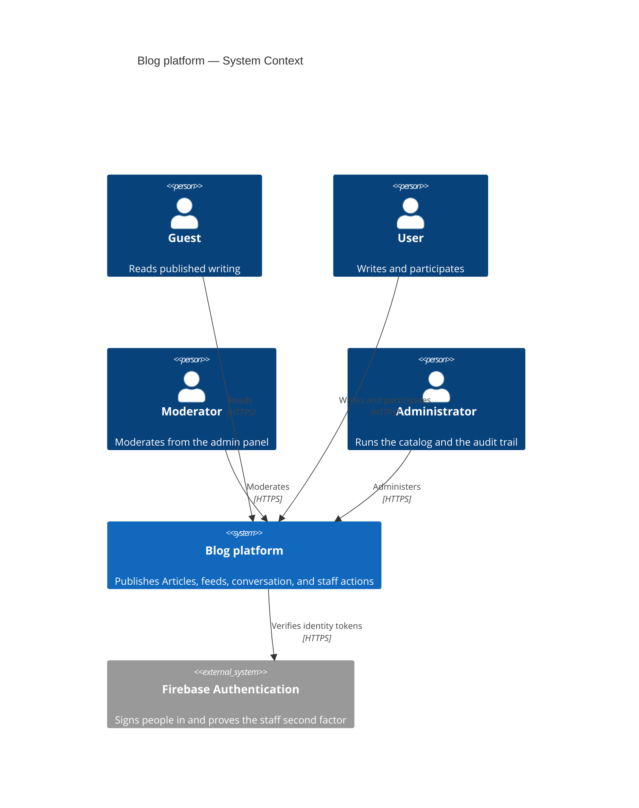
```mermaid
C4Context
    title Blog platform — System Context

    Person(guest, "Guest", "Reads published writing")
    Person(user, "User", "Writes and participates")
    Person(moderator, "Moderator", "Moderates from the admin panel")
    Person(administrator, "Administrator", "Runs the catalog and the audit trail")

    System(platform, "Blog platform", "Publishes Articles, feeds, conversation, and staff actions")
    System_Ext(firebase, "Firebase Authentication", "Signs people in and proves the staff second factor")

    Rel(guest, platform, "Reads", "HTTPS")
    Rel(user, platform, "Writes and participates", "HTTPS")
    Rel(moderator, platform, "Moderates", "HTTPS")
    Rel(administrator, platform, "Administers", "HTTPS")
    Rel(platform, firebase, "Verifies identity tokens", "HTTPS")
```

## 4. Solution strategy

**Target surfaces.** This feature owns three surfaces: `backend-service`, `web-frontend`, and `worker`. The public site and the admin panel are two deployable web apps of the one `web-frontend` surface. There is no mobile app, desktop app, or CLI product. Data stores are not surfaces.

**UI architecture.** The public site is a Next.js hybrid. Article and feed HTML are rendered on the server so a published Article URL works without client JavaScript. The editor, signed-in mutations, and live updates run in the browser. The admin panel is a Vite SPA on `admin.<domain>`, with no server-rendered HTML, because it has no search-engine requirement (`docs/adr/0001-adopt-nodejs-typescript-monorepo.md`). Both apps use HeroUI v3 semantic tokens, TanStack Query for server state, and Zustand for client state. Socket events update the Query cache. They are not a second source of truth. Public routing is the Next.js App Router with a locale prefix. Admin routing is React Router. A single combined app is already excluded by that ADR and by the spec, so this pass does not record a second ADR for it.

**Top strategic choices:**

1. **One owning service per schema, sync at the gateway, events through an outbox.** Synchronous reads and commands cross the gateway over HTTP. A write that emits a fact commits the row and an outbox row together. A worker publishes the outbox to RabbitMQ. Consumers are idempotent. This is `docs/adr/0002-own-data-per-nestjs-service.md` applied to every service this feature adds. No moderation service is added. The service list in the architecture map stays closed.
2. **Read models stay cheap.** My feed is assembled on read. Feed pages are cached in Redis and dropped when a publish, hide, or soft-remove event arrives. The gateway composes one public Article payload. The public site renders that payload to HTML. Those choices serve the cached-read goal of p95 ≤ 100 ms and the uncached-read goal of p95 ≤ 300 ms.
3. **The live path is the queue, then the socket.** The write returns when the owning row and the outbox commit. The realtime gateway consumes the event and pushes it to the open Article or the open Direct message conversation. The View count is not on that channel. This keeps write p95 ≤ 300 ms and live-update p95 ≤ 500 ms on different clocks.
4. **Staff power and reader safety sit at the edge.** Admin routes require the Firebase second-factor claim and a role read from the users service. The audit row is append-only in schema `users`. Embed and raw HTML blocks are rejected. Image bytes go to object storage on a presigned URL. A stale Article save is rejected.

Each later decision traces to one of these four. Tactical detail that would add a service, join across schemas, or push pixels from the write path contradicts this section and belongs in §11 if it ever appears.

## 5. Building block view

The backend is a set of NestJS services behind one gateway. Each service is the only writer of its schema. The public site and the admin panel are separate frontends. Workers run beside the service that owns the rows they touch. The skeleton to copy is `apps/api-gateway` (`src/main.ts` boots NestJS on Fastify and listens on `PORT`, default 3001) and the empty Drizzle entry in `packages/database/src/schema.ts`, which says table definitions are added by the owning NestJS app.

**Internal decomposition:**

```
apps/
├── api-gateway/          exists — HTTP edge, health only today
├── web/                  exists — Next.js App Router shell, no feature folders yet
├── admin/                Vite SPA, added by this feature
├── realtime/             Socket.IO gateway, added by this feature
├── users/                schema users
├── content/              schema content
├── categories/           schema categories
├── media/                schema media
├── comments/             schema comments
├── engagement/           schema engagement — Likes, Views, Bookmarks
├── social/               schema social — Follows of Users and Categories
├── feed/                 schema feed
├── messaging/            schema messages
└── notification/         schema notifications
packages/
├── database/             exists — shared Drizzle client and reversible migrations
├── contracts/            DTO and event envelope, added with the first contract
├── ui/                   HeroUI theme shared by web and admin
├── i18n/                 en, sr-Latn, ru
├── firebase/             verify the ID token and the second-factor claim
├── rabbitmq/             confirms, manual ack, retry, dead letter
├── redis/                cache, locks, sliding-window limits, counters
├── config/               typed env, process exits on invalid env
└── logger/               JSON logs with request and correlation ids
```

Inside each NestJS app the layers are a controller, a service, and a Drizzle module for that app's schema. `apps/web` grows Feature-Sliced folders (`entities`, `features`, `widgets`, `shared`) with the first screen. Business rules do not live in React components. Empty apps are not stubbed ahead of the task that needs them.

A background worker is a process of the owning service. The content outbox relay reads schema `content` only. The engagement view-flush worker reads Redis and writes schema `engagement` only.

**C4 Container (L2):**


```mermaid
C4Container
    title Blog platform — Containers

    Person(guest, "Guest")
    Person(user, "User")
    Person(moderator, "Moderator")
    Person(administrator, "Administrator")

    Container_Boundary(platform, "Blog platform") {
        Container(web, "Public site", "Next.js, React, HeroUI", "SSR Articles and feeds, editor in the browser")
        Container(adminpanel, "Admin panel", "Vite, React, HeroUI", "Moderation, catalog, roles, audit")
        Container(gateway, "API Gateway", "NestJS, Fastify", "Token check, locale, rate limits, composition, routing")
        Container(realtime, "Realtime Gateway", "NestJS, Socket.IO", "Pushes live UI updates")
        Container(users, "User Service", "NestJS", "Profiles, roles, Blocks, audit log")
        Container(content, "Content Service", "NestJS", "Drafts, publish, revisions, sanitize")
        Container(categories, "Category Service", "NestJS", "Topics and three translations")
        Container(media, "Media Service", "NestJS", "Presigned image uploads")
        Container(comments, "Comment Service", "NestJS", "Comments, replies, mentions")
        Container(engagement, "Engagement Service", "NestJS", "Likes, Views, Bookmarks")
        Container(social, "Social Service", "NestJS", "Follows of Users and Categories")
        Container(feed, "Feed Service", "NestJS", "Fresh, Popular, and My feed")
        Container(messaging, "Messaging Service", "NestJS", "Direct messages of two Users")
        Container(notification, "Notification Service", "NestJS", "In-product Notifications")
        Container(workers, "Background workers", "Node.js", "Outbox relay per schema, view flush")
    }

    ContainerDb(postgres, "PostgreSQL", "PostgreSQL 18", "One cluster, one schema per service")
    ContainerDb(redis, "Redis", "Redis 8", "Cache, dedupe, rate limits, counters")
    ContainerQueue(rabbit, "RabbitMQ", "RabbitMQ", "Domain events, at least once")
    ContainerDb(objects, "Object storage", "MinIO or S3", "Uploaded images")
    System_Ext(firebase, "Firebase Authentication", "Identity and staff second factor")

    Rel(guest, web, "Reads", "HTTPS")
    Rel(user, web, "Writes", "HTTPS")
    Rel(moderator, adminpanel, "Moderates", "HTTPS")
    Rel(administrator, adminpanel, "Administers", "HTTPS")
    Rel(web, gateway, "Calls the API", "JSON/HTTPS")
    Rel(adminpanel, gateway, "Calls the admin API", "JSON/HTTPS")
    Rel(web, realtime, "Subscribes to live updates", "WebSocket")
    Rel(gateway, users, "Routes", "HTTP")
    Rel(gateway, content, "Routes", "HTTP")
    Rel(gateway, categories, "Routes", "HTTP")
    Rel(gateway, media, "Routes", "HTTP")
    Rel(gateway, comments, "Routes", "HTTP")
    Rel(gateway, engagement, "Routes", "HTTP")
    Rel(gateway, social, "Routes", "HTTP")
    Rel(gateway, feed, "Routes", "HTTP")
    Rel(gateway, messaging, "Routes", "HTTP")
    Rel(gateway, notification, "Routes", "HTTP")
    Rel(gateway, firebase, "Verifies the ID token", "HTTPS")
    Rel(realtime, firebase, "Verifies the socket token", "HTTPS")
    Rel(users, postgres, "Reads and writes schema users", "Drizzle")
    Rel(content, postgres, "Reads and writes schema content", "Drizzle")
    Rel(categories, postgres, "Reads and writes schema categories", "Drizzle")
    Rel(media, postgres, "Reads and writes schema media", "Drizzle")
    Rel(comments, postgres, "Reads and writes schema comments", "Drizzle")
    Rel(engagement, postgres, "Reads and writes schema engagement", "Drizzle")
    Rel(social, postgres, "Reads and writes schema social", "Drizzle")
    Rel(feed, postgres, "Reads and writes schema feed", "Drizzle")
    Rel(messaging, postgres, "Reads and writes schema messages", "Drizzle")
    Rel(notification, postgres, "Reads and writes schema notifications", "Drizzle")
    Rel(workers, postgres, "Reads its own outbox and flushes view counts", "Drizzle")
    Rel(workers, rabbit, "Publishes the outbox", "AMQP")
    Rel(rabbit, feed, "Delivers domain events", "AMQP")
    Rel(rabbit, realtime, "Delivers domain events", "AMQP")
    Rel(rabbit, notification, "Delivers domain events", "AMQP")
    Rel(feed, redis, "Caches feed pages", "Redis")
    Rel(engagement, redis, "Holds view dedupe and increments", "Redis")
    Rel(workers, redis, "Reads view deltas", "Redis")
    Rel(realtime, redis, "Shares socket state", "Redis")
    Rel(media, objects, "Issues upload URLs", "S3 API")
```

## 6. Runtime view

`sequences` covers every acceptance criterion. Diagrams follow the user stories. The three Critical flow diagrams were drawn with design and are unchanged.

### Read a published article

A Guest or a User opens a published Article (SCR-03) and sees the text, the images, the Comments, and the Like, Comment, and View counts. The same viewer does not add a second View inside 30 minutes. A later worker folds recorded increments into the stored View count.

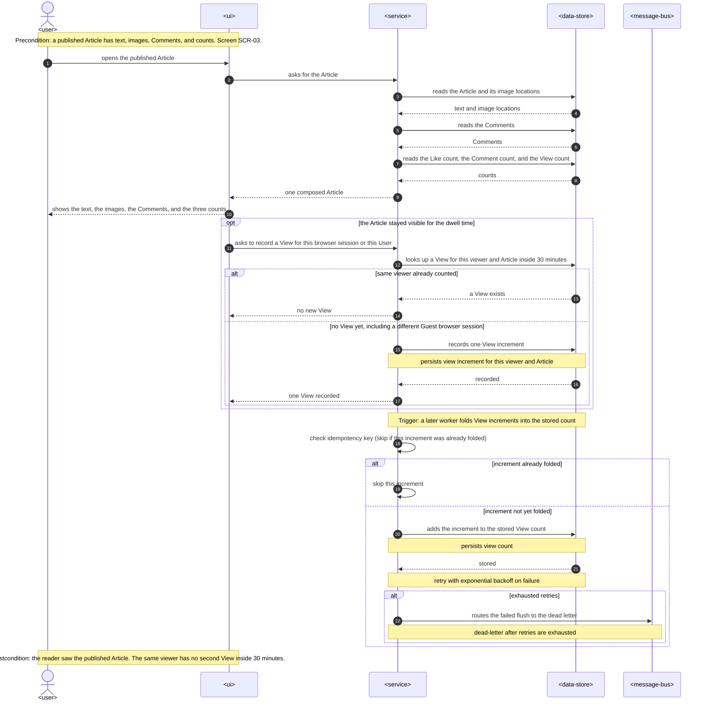
```mermaid
sequenceDiagram
    autonumber
    actor U as <user>
    participant UI as <ui>
    participant S as <service>
    participant D as <data-store>
    participant B as <message-bus>

    Note over U,UI: Precondition: a published Article has text, images, Comments, and counts. Screen SCR-03.
    U->>UI: opens the published Article
    UI->>S: asks for the Article
    S->>D: reads the Article and its image locations
    D-->>S: text and image locations
    S->>D: reads the Comments
    D-->>S: Comments
    S->>D: reads the Like count, the Comment count, and the View count
    D-->>S: counts
    S-->>UI: one composed Article
    UI-->>U: shows the text, the images, the Comments, and the three counts
    opt the Article stayed visible for the dwell time
        UI->>S: asks to record a View for this browser session or this User
        S->>D: looks up a View for this viewer and Article inside 30 minutes
        alt same viewer already counted
            D-->>S: a View exists
            S-->>UI: no new View
        else no View yet, including a different Guest browser session
            S->>D: records one View increment
            Note over S,D: persists view increment for this viewer and Article
            D-->>S: recorded
            S-->>UI: one View recorded
        end
    end
    Note over S,D: Trigger: a later worker folds View increments into the stored count
    S->>S: check idempotency key (skip if this increment was already folded)
    alt increment already folded
        S->>S: skip this increment
    else increment not yet folded
        S->>D: adds the increment to the stored View count
        Note over S,D: persists view count
        D-->>S: stored
        Note over S,D: retry with exponential backoff on failure
        alt exhausted retries
            S->>B: routes the failed flush to the dead letter
            Note over S,B: dead-letter after retries are exhausted
        end
    end
    Note over U,UI: Postcondition: the reader saw the published Article. The same viewer has no second View inside 30 minutes.
```

### Browse public feeds

A Guest opens the Fresh feed (SCR-01) and the Popular feed (SCR-02). Fresh is newest first. Popular follows the current score. Both include every Content language. My feed is not offered. A cached page is returned as stored. A miss reads published Articles and stores the page.

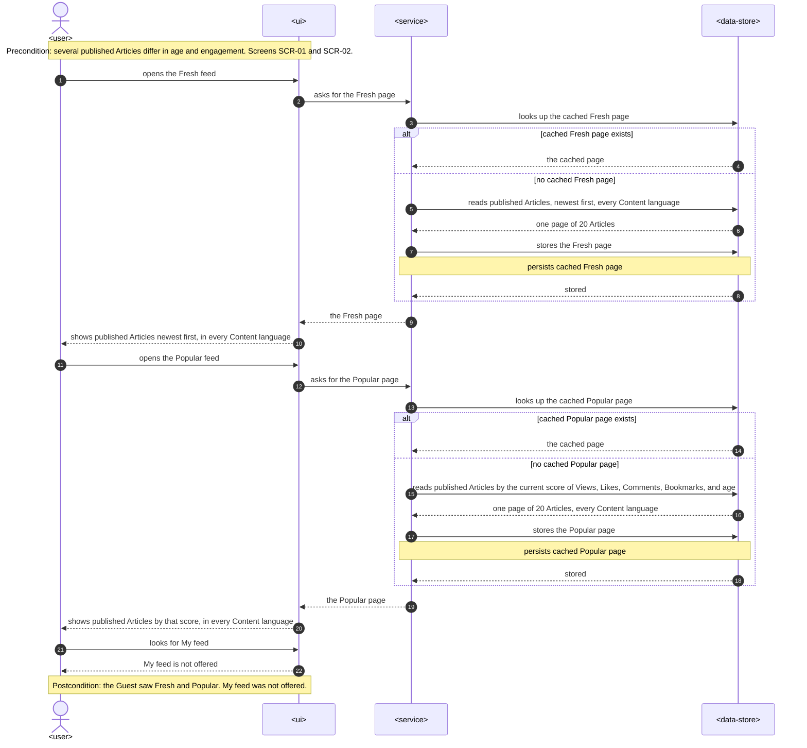
```mermaid
sequenceDiagram
    autonumber
    actor U as <user>
    participant UI as <ui>
    participant S as <service>
    participant D as <data-store>

    Note over U,UI: Precondition: several published Articles differ in age and engagement. Screens SCR-01 and SCR-02.
    U->>UI: opens the Fresh feed
    UI->>S: asks for the Fresh page
    S->>D: looks up the cached Fresh page
    alt cached Fresh page exists
        D-->>S: the cached page
    else no cached Fresh page
        S->>D: reads published Articles, newest first, every Content language
        D-->>S: one page of 20 Articles
        S->>D: stores the Fresh page
        Note over S,D: persists cached Fresh page
        D-->>S: stored
    end
    S-->>UI: the Fresh page
    UI-->>U: shows published Articles newest first, in every Content language
    U->>UI: opens the Popular feed
    UI->>S: asks for the Popular page
    S->>D: looks up the cached Popular page
    alt cached Popular page exists
        D-->>S: the cached page
    else no cached Popular page
        S->>D: reads published Articles by the current score of Views, Likes, Comments, Bookmarks, and age
        D-->>S: one page of 20 Articles, every Content language
        S->>D: stores the Popular page
        Note over S,D: persists cached Popular page
        D-->>S: stored
    end
    S-->>UI: the Popular page
    UI-->>U: shows published Articles by that score, in every Content language
    U->>UI: looks for My feed
    UI-->>U: My feed is not offered
    Note over U,UI: Postcondition: the Guest saw Fresh and Popular. My feed was not offered.
```

### Choose theme and interface language

A Guest sets Theme and Interface language in place on the public site. A Moderator or an Administrator does the same in place on the admin panel. System is the Theme before any choice. The choice is kept in the browser and applied on a later visit. A missing Interface language string is shown in English.

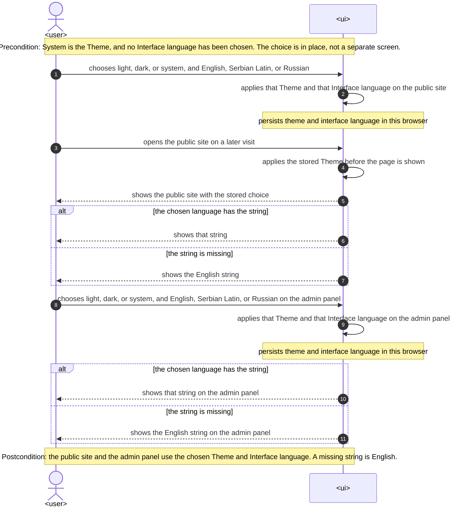
```mermaid
sequenceDiagram
    autonumber
    actor U as <user>
    participant UI as <ui>

    Note over U,UI: Precondition: System is the Theme, and no Interface language has been chosen. The choice is in place, not a separate screen.
    U->>UI: chooses light, dark, or system, and English, Serbian Latin, or Russian
    UI->>UI: applies that Theme and that Interface language on the public site
    Note over UI: persists theme and interface language in this browser
    U->>UI: opens the public site on a later visit
    UI->>UI: applies the stored Theme before the page is shown
    UI-->>U: shows the public site with the stored choice
    alt the chosen language has the string
        UI-->>U: shows that string
    else the string is missing
        UI-->>U: shows the English string
    end
    U->>UI: chooses light, dark, or system, and English, Serbian Latin, or Russian on the admin panel
    UI->>UI: applies that Theme and that Interface language on the admin panel
    Note over UI: persists theme and interface language in this browser
    alt the chosen language has the string
        UI-->>U: shows that string on the admin panel
    else the string is missing
        UI-->>U: shows the English string on the admin panel
    end
    Note over U,UI: Postcondition: the public site and the admin panel use the chosen Theme and Interface language. A missing string is English.
```

### Create and update a public profile

A person who has just signed in and has no Username chooses one and saves a public profile (SCR-04, then SCR-06, then SCR-05). A taken Username stays on profile setup. A Guest sees the Username. A later save of a Display name, a Biography, or an Avatar shows only the fields that were saved.

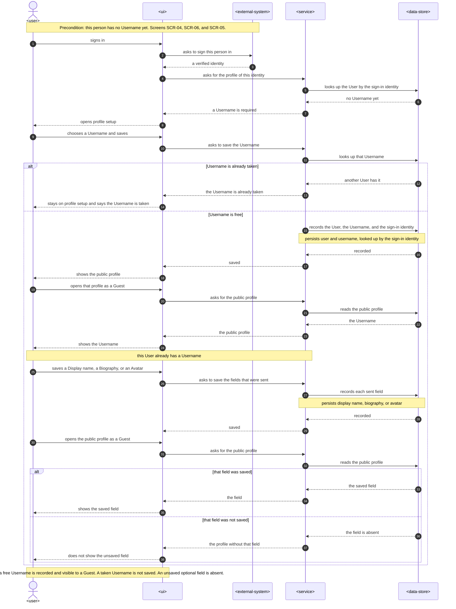
```mermaid
sequenceDiagram
    autonumber
    actor U as <user>
    participant UI as <ui>
    participant X as <external-system>
    participant S as <service>
    participant D as <data-store>

    Note over U,X: Precondition: this person has no Username yet. Screens SCR-04, SCR-06, and SCR-05.
    U->>UI: signs in
    UI->>X: asks to sign this person in
    X-->>UI: a verified identity
    UI->>S: asks for the profile of this identity
    S->>D: looks up the User by the sign-in identity
    D-->>S: no Username yet
    S-->>UI: a Username is required
    UI-->>U: opens profile setup
    U->>UI: chooses a Username and saves
    UI->>S: asks to save the Username
    S->>D: looks up that Username
    alt Username is already taken
        D-->>S: another User has it
        S-->>UI: the Username is already taken
        UI-->>U: stays on profile setup and says the Username is taken
    else Username is free
        S->>D: records the User, the Username, and the sign-in identity
        Note over S,D: persists user and username, looked up by the sign-in identity
        D-->>S: recorded
        S-->>UI: saved
        UI-->>U: shows the public profile
        U->>UI: opens that profile as a Guest
        UI->>S: asks for the public profile
        S->>D: reads the public profile
        D-->>S: the Username
        S-->>UI: the public profile
        UI-->>U: shows the Username
        Note over U,S: this User already has a Username
        U->>UI: saves a Display name, a Biography, or an Avatar
        UI->>S: asks to save the fields that were sent
        S->>D: records each sent field
        Note over S,D: persists display name, biography, or avatar
        D-->>S: recorded
        S-->>UI: saved
        U->>UI: opens the public profile as a Guest
        UI->>S: asks for the public profile
        S->>D: reads the public profile
        alt that field was saved
            D-->>S: the saved field
            S-->>UI: the field
            UI-->>U: shows the saved field
        else that field was not saved
            D-->>S: the field is absent
            S-->>UI: the profile without that field
            UI-->>U: does not show the unsaved field
        end
    end
    Note over U,UI: Postcondition: a free Username is recorded and visible to a Guest. A taken Username is not saved. An unsaved optional field is absent.
```

**Critical flow 1: Publish an Article.** The response returns when content commits the row and the outbox. Feed cache invalidation follows on the queue.

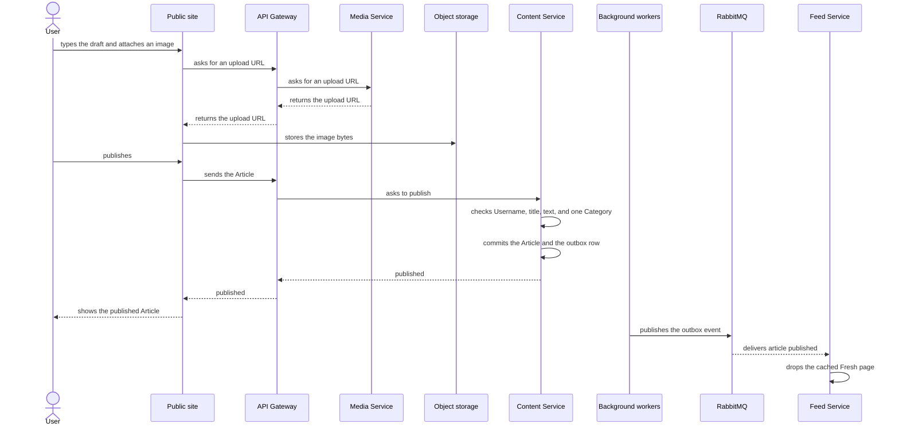
```mermaid
sequenceDiagram
    actor User
    participant Web as Public site
    participant Gateway as API Gateway
    participant Media as Media Service
    participant Objects as Object storage
    participant Content as Content Service
    participant Workers as Background workers
    participant Rabbit as RabbitMQ
    participant Feed as Feed Service

    User->>Web: types the draft and attaches an image
    Web->>Gateway: asks for an upload URL
    Gateway->>Media: asks for an upload URL
    Media-->>Gateway: returns the upload URL
    Gateway-->>Web: returns the upload URL
    Web->>Objects: stores the image bytes
    User->>Web: publishes
    Web->>Gateway: sends the Article
    Gateway->>Content: asks to publish
    Content->>Content: checks Username, title, text, and one Category
    Content->>Content: commits the Article and the outbox row
    Content-->>Gateway: published
    Gateway-->>Web: published
    Web-->>User: shows the published Article
    Workers->>Rabbit: publishes the outbox event
    Rabbit-->>Feed: delivers article published
    Feed->>Feed: drops the cached Fresh page
```

### Keep a draft and publish only when it is valid

A User with a Username keeps a draft while typing on the editor (SCR-08). The second preview is that same draft on the same screen. Publish is refused without a Username, without exactly one Category, without a title, or without text. A valid Article is published with or without an image. Anyone but the author who opens the draft sees it as unavailable and is not told that it is a draft.

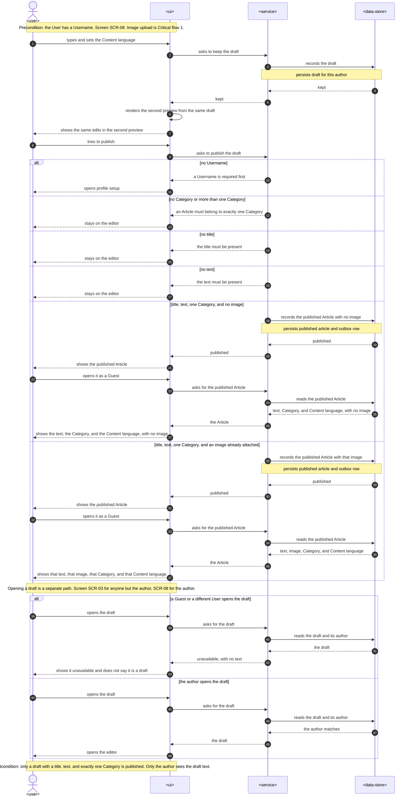
```mermaid
sequenceDiagram
    autonumber
    actor U as <user>
    participant UI as <ui>
    participant S as <service>
    participant D as <data-store>

    Note over U,UI: Precondition: the User has a Username. Screen SCR-08. Image upload is Critical flow 1.
    U->>UI: types and sets the Content language
    UI->>S: asks to keep the draft
    S->>D: records the draft
    Note over S,D: persists draft for this author
    D-->>S: kept
    S-->>UI: kept
    UI->>UI: renders the second preview from the same draft
    UI-->>U: shows the same edits in the second preview
    U->>UI: tries to publish
    UI->>S: asks to publish the draft
    alt no Username
        S-->>UI: a Username is required first
        UI-->>U: opens profile setup
    else no Category or more than one Category
        S-->>UI: an Article must belong to exactly one Category
        UI-->>U: stays on the editor
    else no title
        S-->>UI: the title must be present
        UI-->>U: stays on the editor
    else no text
        S-->>UI: the text must be present
        UI-->>U: stays on the editor
    else title, text, one Category, and no image
        S->>D: records the published Article with no image
        Note over S,D: persists published article and outbox row
        D-->>S: published
        S-->>UI: published
        UI-->>U: shows the published Article
        U->>UI: opens it as a Guest
        UI->>S: asks for the published Article
        S->>D: reads the published Article
        D-->>S: text, Category, and Content language, with no image
        S-->>UI: the Article
        UI-->>U: shows the text, the Category, and the Content language, with no image
    else title, text, one Category, and an image already attached
        S->>D: records the published Article with that image
        Note over S,D: persists published article and outbox row
        D-->>S: published
        S-->>UI: published
        UI-->>U: shows the published Article
        U->>UI: opens it as a Guest
        UI->>S: asks for the published Article
        S->>D: reads the published Article
        D-->>S: text, image, Category, and Content language
        S-->>UI: the Article
        UI-->>U: shows that text, that image, that Category, and that Content language
    end
    Note over U,UI: Opening a draft is a separate path. Screen SCR-03 for anyone but the author, SCR-08 for the author.
    alt a Guest or a different User opens the draft
        U->>UI: opens the draft
        UI->>S: asks for the draft
        S->>D: reads the draft and its author
        D-->>S: the draft
        S-->>UI: unavailable, with no text
        UI-->>U: shows it unavailable and does not say it is a draft
    else the author opens the draft
        U->>UI: opens the draft
        UI->>S: asks for the draft
        S->>D: reads the draft and its author
        D-->>S: the author matches
        S-->>UI: the draft
        UI-->>U: opens the editor
    end
    Note over U,UI: Postcondition: only a draft with a title, text, and exactly one Category is published. Only the author sees the draft text.
```

### Revise a published article

The owner changes the text of a published Article and saves (SCR-03, then SCR-08). Readers see the new text. The previous version stays recorded and is not returned as a list. A different User is refused.

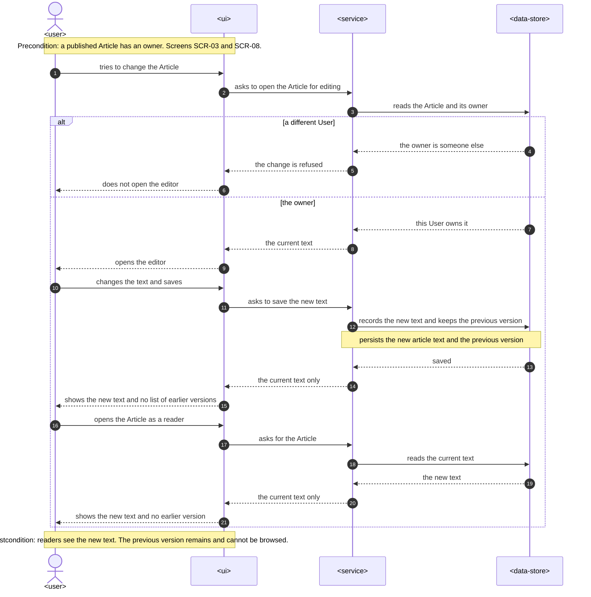
```mermaid
sequenceDiagram
    autonumber
    actor U as <user>
    participant UI as <ui>
    participant S as <service>
    participant D as <data-store>

    Note over U,UI: Precondition: a published Article has an owner. Screens SCR-03 and SCR-08.
    U->>UI: tries to change the Article
    UI->>S: asks to open the Article for editing
    S->>D: reads the Article and its owner
    alt a different User
        D-->>S: the owner is someone else
        S-->>UI: the change is refused
        UI-->>U: does not open the editor
    else the owner
        D-->>S: this User owns it
        S-->>UI: the current text
        UI-->>U: opens the editor
        U->>UI: changes the text and saves
        UI->>S: asks to save the new text
        S->>D: records the new text and keeps the previous version
        Note over S,D: persists the new article text and the previous version
        D-->>S: saved
        S-->>UI: the current text only
        UI-->>U: shows the new text and no list of earlier versions
        U->>UI: opens the Article as a reader
        UI->>S: asks for the Article
        S->>D: reads the current text
        D-->>S: the new text
        S-->>UI: the current text only
        UI-->>U: shows the new text and no earlier version
    end
    Note over U,UI: Postcondition: readers see the new text. The previous version remains and cannot be browsed.
```

### Follow and unfollow

A User follows another User from that User's public profile (SCR-05) and follows a Category from the Category screen (SCR-07). Stopping one Follow drops only that one.

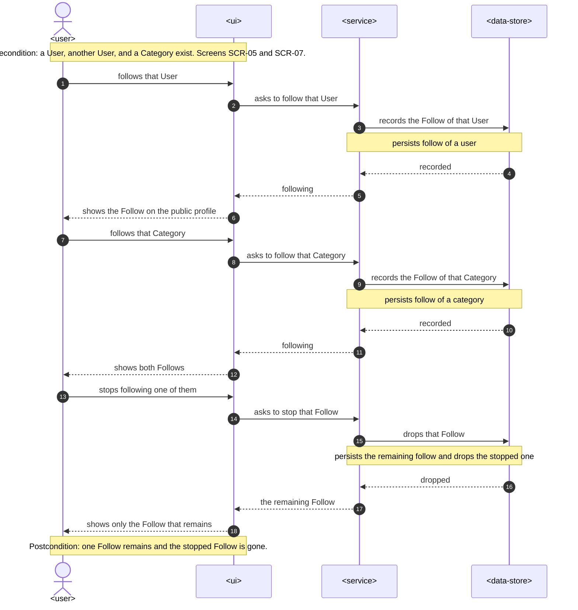
```mermaid
sequenceDiagram
    autonumber
    actor U as <user>
    participant UI as <ui>
    participant S as <service>
    participant D as <data-store>

    Note over U,UI: Precondition: a User, another User, and a Category exist. Screens SCR-05 and SCR-07.
    U->>UI: follows that User
    UI->>S: asks to follow that User
    S->>D: records the Follow of that User
    Note over S,D: persists follow of a user
    D-->>S: recorded
    S-->>UI: following
    UI-->>U: shows the Follow on the public profile
    U->>UI: follows that Category
    UI->>S: asks to follow that Category
    S->>D: records the Follow of that Category
    Note over S,D: persists follow of a category
    D-->>S: recorded
    S-->>UI: following
    UI-->>U: shows both Follows
    U->>UI: stops following one of them
    UI->>S: asks to stop that Follow
    S->>D: drops that Follow
    Note over S,D: persists the remaining follow and drops the stopped one
    D-->>S: dropped
    S-->>UI: the remaining Follow
    UI-->>U: shows only the Follow that remains
    Note over U,UI: Postcondition: one Follow remains and the stopped Follow is gone.
```

**Critical flow 3: Open My feed.** A cache hit does not recompute the page. A miss reads Follows and currently published Articles, newest first, each Article once.

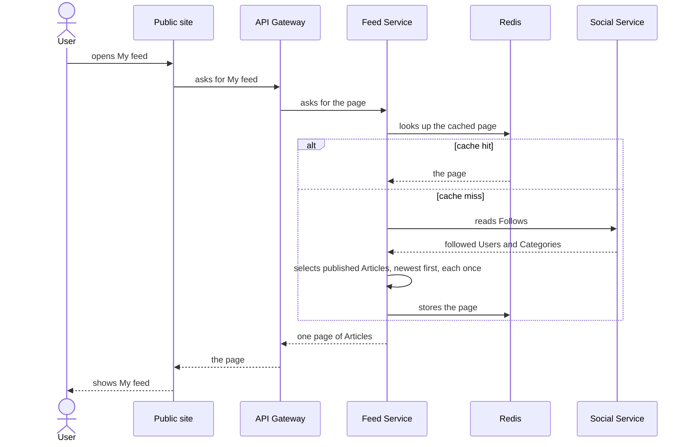
```mermaid
sequenceDiagram
    actor User
    participant Web as Public site
    participant Gateway as API Gateway
    participant Feed as Feed Service
    participant Redis as Redis
    participant Social as Social Service

    User->>Web: opens My feed
    Web->>Gateway: asks for My feed
    Gateway->>Feed: asks for the page
    Feed->>Redis: looks up the cached page
    alt cache hit
        Redis-->>Feed: the page
    else cache miss
        Feed->>Social: reads Follows
        Social-->>Feed: followed Users and Categories
        Feed->>Feed: selects published Articles, newest first, each once
        Feed->>Redis: stores the page
    end
    Feed-->>Gateway: one page of Articles
    Gateway-->>Web: the page
    Web-->>User: shows My feed
```

### Limit feeds by content language

A signed-in User sets or clears a Content language limit. Fresh, Popular, and My feed then follow that limit.

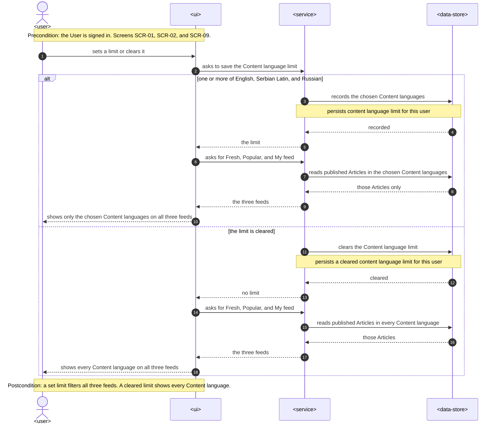
```mermaid
sequenceDiagram
    autonumber
    actor U as <user>
    participant UI as <ui>
    participant S as <service>
    participant D as <data-store>

    Note over U,UI: Precondition: the User is signed in. Screens SCR-01, SCR-02, and SCR-09.
    U->>UI: sets a limit or clears it
    UI->>S: asks to save the Content language limit
    alt one or more of English, Serbian Latin, and Russian
        S->>D: records the chosen Content languages
        Note over S,D: persists content language limit for this user
        D-->>S: recorded
        S-->>UI: the limit
        UI->>S: asks for Fresh, Popular, and My feed
        S->>D: reads published Articles in the chosen Content languages
        D-->>S: those Articles only
        S-->>UI: the three feeds
        UI-->>U: shows only the chosen Content languages on all three feeds
    else the limit is cleared
        S->>D: clears the Content language limit
        Note over S,D: persists a cleared content language limit for this user
        D-->>S: cleared
        S-->>UI: no limit
        UI->>S: asks for Fresh, Popular, and My feed
        S->>D: reads published Articles in every Content language
        D-->>S: those Articles
        S-->>UI: the three feeds
        UI-->>U: shows every Content language on all three feeds
    end
    Note over U,UI: Postcondition: a set limit filters all three feeds. A cleared limit shows every Content language.
```

### Like an article

A signed-in User Likes a published Article, then Likes it again. The second Like removes the first.

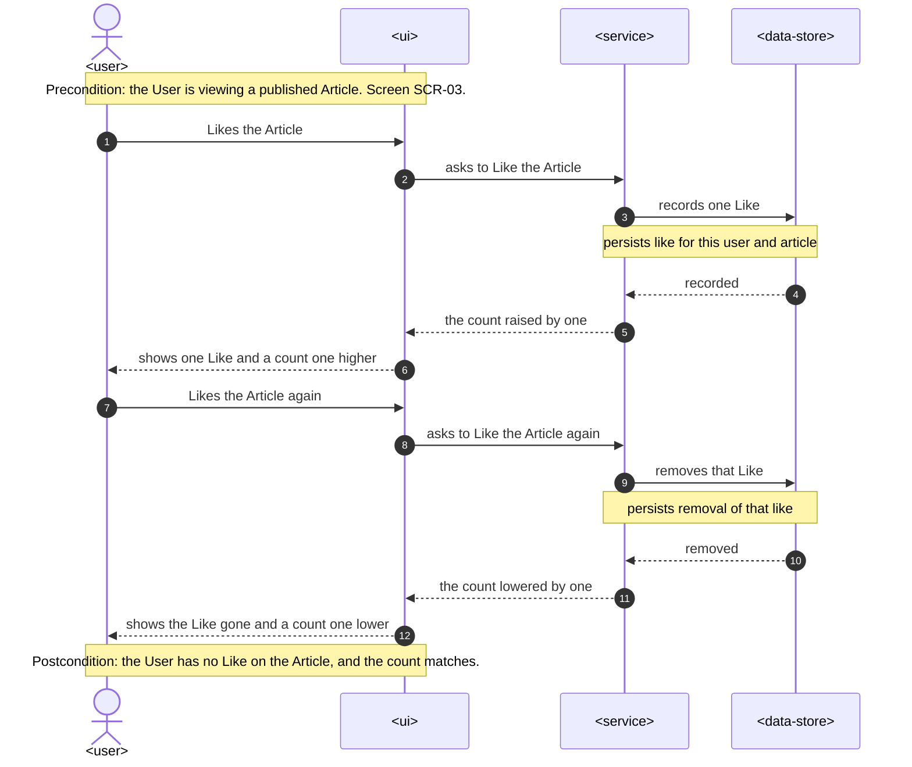
```mermaid
sequenceDiagram
    autonumber
    actor U as <user>
    participant UI as <ui>
    participant S as <service>
    participant D as <data-store>

    Note over U,UI: Precondition: the User is viewing a published Article. Screen SCR-03.
    U->>UI: Likes the Article
    UI->>S: asks to Like the Article
    S->>D: records one Like
    Note over S,D: persists like for this user and article
    D-->>S: recorded
    S-->>UI: the count raised by one
    UI-->>U: shows one Like and a count one higher
    U->>UI: Likes the Article again
    UI->>S: asks to Like the Article again
    S->>D: removes that Like
    Note over S,D: persists removal of that like
    D-->>S: removed
    S-->>UI: the count lowered by one
    UI-->>U: shows the Like gone and a count one lower
    Note over U,UI: Postcondition: the User has no Like on the Article, and the count matches.
```

### Cross-cutting: a guest tries to write

A Guest who tries to Like, Comment, Follow, Bookmark, publish, or send a Direct message is asked to sign in. The action is not recorded.

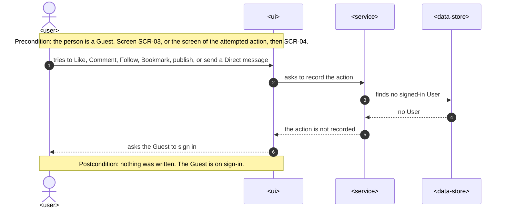
```mermaid
sequenceDiagram
    autonumber
    actor U as <user>
    participant UI as <ui>
    participant S as <service>
    participant D as <data-store>

    Note over U,UI: Precondition: the person is a Guest. Screen SCR-03, or the screen of the attempted action, then SCR-04.
    U->>UI: tries to Like, Comment, Follow, Bookmark, publish, or send a Direct message
    UI->>S: asks to record the action
    S->>D: finds no signed-in User
    D-->>S: no User
    S-->>UI: the action is not recorded
    UI-->>U: asks the Guest to sign in
    Note over U,UI: Postcondition: nothing was written. The Guest is on sign-in.
```

### Comment, reply, and mention

On a published Article that readers can still see, a Comment, a reply, a mention, and a Like on the Comment are kept. A draft, a hidden Article, or a soft-removed Article refuses the Comment.

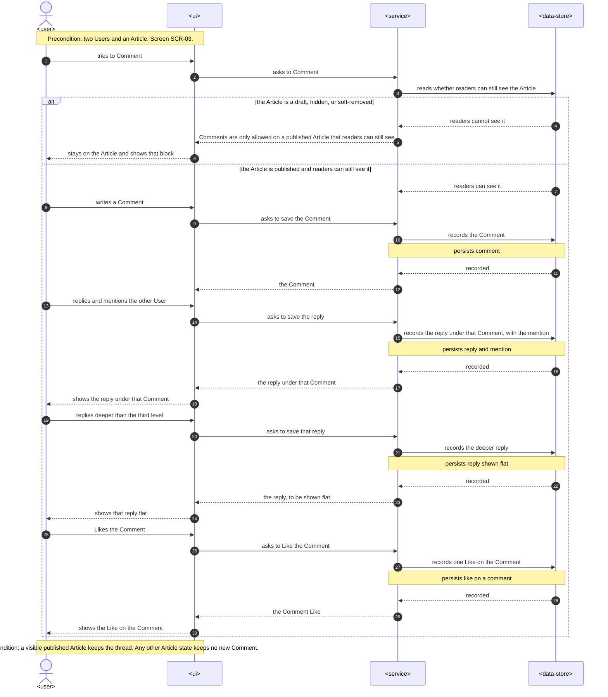
```mermaid
sequenceDiagram
    autonumber
    actor U as <user>
    participant UI as <ui>
    participant S as <service>
    participant D as <data-store>

    Note over U,UI: Precondition: two Users and an Article. Screen SCR-03.
    U->>UI: tries to Comment
    UI->>S: asks to Comment
    S->>D: reads whether readers can still see the Article
    alt the Article is a draft, hidden, or soft-removed
        D-->>S: readers cannot see it
        S-->>UI: Comments are only allowed on a published Article that readers can still see
        UI-->>U: stays on the Article and shows that block
    else the Article is published and readers can still see it
        D-->>S: readers can see it
        U->>UI: writes a Comment
        UI->>S: asks to save the Comment
        S->>D: records the Comment
        Note over S,D: persists comment
        D-->>S: recorded
        S-->>UI: the Comment
        U->>UI: replies and mentions the other User
        UI->>S: asks to save the reply
        S->>D: records the reply under that Comment, with the mention
        Note over S,D: persists reply and mention
        D-->>S: recorded
        S-->>UI: the reply under that Comment
        UI-->>U: shows the reply under that Comment
        U->>UI: replies deeper than the third level
        UI->>S: asks to save that reply
        S->>D: records the deeper reply
        Note over S,D: persists reply shown flat
        D-->>S: recorded
        S-->>UI: the reply, to be shown flat
        UI-->>U: shows that reply flat
        U->>UI: Likes the Comment
        UI->>S: asks to Like the Comment
        S->>D: records one Like on the Comment
        Note over S,D: persists like on a comment
        D-->>S: recorded
        S-->>UI: the Comment Like
        UI-->>U: shows the Like on the Comment
    end
    Note over U,UI: Postcondition: a visible published Article keeps the thread. Any other Article state keeps no new Comment.
```

### Bookmark an article

A User Bookmarks a published Article and later removes it. Only that User can open the list.

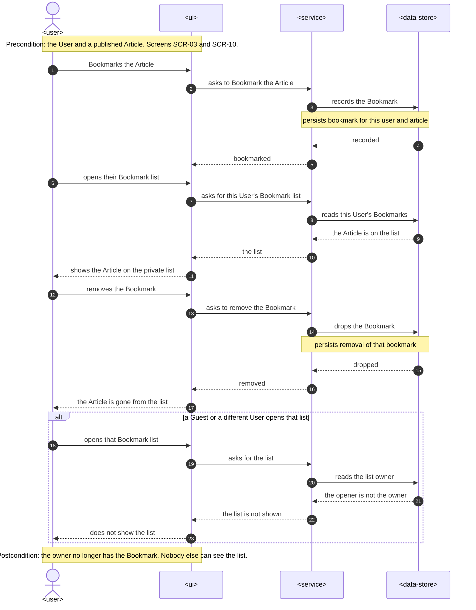
```mermaid
sequenceDiagram
    autonumber
    actor U as <user>
    participant UI as <ui>
    participant S as <service>
    participant D as <data-store>

    Note over U,UI: Precondition: the User and a published Article. Screens SCR-03 and SCR-10.
    U->>UI: Bookmarks the Article
    UI->>S: asks to Bookmark the Article
    S->>D: records the Bookmark
    Note over S,D: persists bookmark for this user and article
    D-->>S: recorded
    S-->>UI: bookmarked
    U->>UI: opens their Bookmark list
    UI->>S: asks for this User's Bookmark list
    S->>D: reads this User's Bookmarks
    D-->>S: the Article is on the list
    S-->>UI: the list
    UI-->>U: shows the Article on the private list
    U->>UI: removes the Bookmark
    UI->>S: asks to remove the Bookmark
    S->>D: drops the Bookmark
    Note over S,D: persists removal of that bookmark
    D-->>S: dropped
    S-->>UI: removed
    UI-->>U: the Article is gone from the list
    alt a Guest or a different User opens that list
        U->>UI: opens that Bookmark list
        UI->>S: asks for the list
        S->>D: reads the list owner
        D-->>S: the opener is not the owner
        S-->>UI: the list is not shown
        UI-->>U: does not show the list
    end
    Note over U,UI: Postcondition: the owner no longer has the Bookmark. Nobody else can see the list.
```

### Send a direct message

A User sends text to one other User who is away. An empty message is refused. After the recipient reads it, the sender sees that it was read.

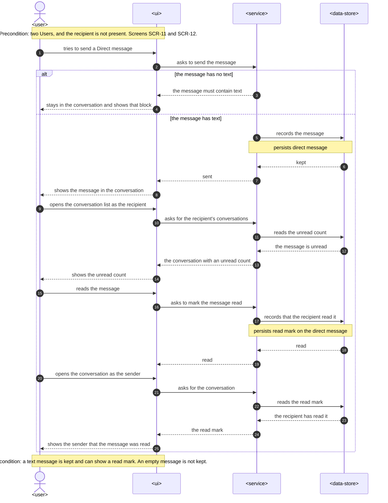
```mermaid
sequenceDiagram
    autonumber
    actor U as <user>
    participant UI as <ui>
    participant S as <service>
    participant D as <data-store>

    Note over U,UI: Precondition: two Users, and the recipient is not present. Screens SCR-11 and SCR-12.
    U->>UI: tries to send a Direct message
    UI->>S: asks to send the message
    alt the message has no text
        S-->>UI: the message must contain text
        UI-->>U: stays in the conversation and shows that block
    else the message has text
        S->>D: records the message
        Note over S,D: persists direct message
        D-->>S: kept
        S-->>UI: sent
        UI-->>U: shows the message in the conversation
        U->>UI: opens the conversation list as the recipient
        UI->>S: asks for the recipient's conversations
        S->>D: reads the unread count
        D-->>S: the message is unread
        S-->>UI: the conversation with an unread count
        UI-->>U: shows the unread count
        U->>UI: reads the message
        UI->>S: asks to mark the message read
        S->>D: records that the recipient read it
        Note over S,D: persists read mark on the direct message
        D-->>S: read
        S-->>UI: read
        U->>UI: opens the conversation as the sender
        UI->>S: asks for the conversation
        S->>D: reads the read mark
        D-->>S: the recipient has read it
        S-->>UI: the read mark
        UI-->>U: shows the sender that the message was read
    end
    Note over U,UI: Postcondition: a text message is kept and can show a read mark. An empty message is not kept.
```

### File a complaint

A User reports an Article or a Comment. A reason is required. Staff can then see the Complaint.

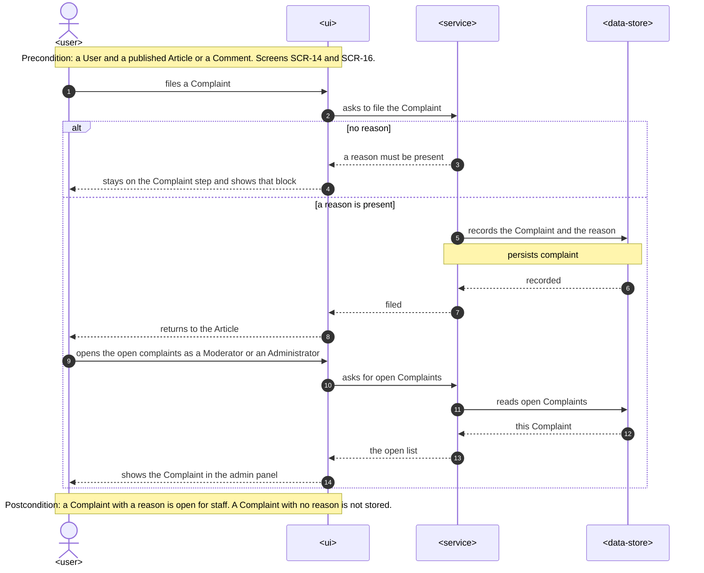
```mermaid
sequenceDiagram
    autonumber
    actor U as <user>
    participant UI as <ui>
    participant S as <service>
    participant D as <data-store>

    Note over U,UI: Precondition: a User and a published Article or a Comment. Screens SCR-14 and SCR-16.
    U->>UI: files a Complaint
    UI->>S: asks to file the Complaint
    alt no reason
        S-->>UI: a reason must be present
        UI-->>U: stays on the Complaint step and shows that block
    else a reason is present
        S->>D: records the Complaint and the reason
        Note over S,D: persists complaint
        D-->>S: recorded
        S-->>UI: filed
        UI-->>U: returns to the Article
        U->>UI: opens the open complaints as a Moderator or an Administrator
        UI->>S: asks for open Complaints
        S->>D: reads open Complaints
        D-->>S: this Complaint
        S-->>UI: the open list
        UI-->>U: shows the Complaint in the admin panel
    end
    Note over U,UI: Postcondition: a Complaint with a reason is open for staff. A Complaint with no reason is not stored.
```

### Watch activity live

A recorded Like, Comment, hide, or Direct message reaches an open screen without a reload. The View count is not pushed. A Direct message reaches only the two Users in that conversation. The handler skips an event it already processed, retries, and dead-letters when retries are exhausted.

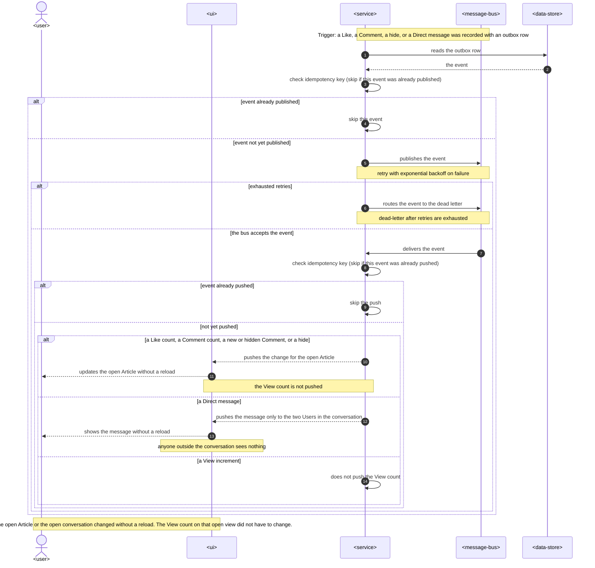
```mermaid
sequenceDiagram
    autonumber
    actor U as <user>
    participant UI as <ui>
    participant S as <service>
    participant B as <message-bus>
    participant D as <data-store>

    Note over S,B: Trigger: a Like, a Comment, a hide, or a Direct message was recorded with an outbox row
    S->>D: reads the outbox row
    D-->>S: the event
    S->>S: check idempotency key (skip if this event was already published)
    alt event already published
        S->>S: skip this event
    else event not yet published
        S->>B: publishes the event
        Note over S,B: retry with exponential backoff on failure
        alt exhausted retries
            S->>B: routes the event to the dead letter
            Note over S,B: dead-letter after retries are exhausted
        else the bus accepts the event
            B->>S: delivers the event
            S->>S: check idempotency key (skip if this event was already pushed)
            alt event already pushed
                S->>S: skip the push
            else not yet pushed
                alt a Like count, a Comment count, a new or hidden Comment, or a hide
                    S-->>UI: pushes the change for the open Article
                    UI-->>U: updates the open Article without a reload
                    Note over S,UI: the View count is not pushed
                else a Direct message
                    S-->>UI: pushes the message only to the two Users in the conversation
                    UI-->>U: shows the message without a reload
                    Note over UI: anyone outside the conversation sees nothing
                else a View increment
                    S->>S: does not push the View count
                end
            end
        end
    end
    Note over U,UI: Postcondition: the open Article or the open conversation changed without a reload. The View count on that open view did not have to change.
```

### Receive a notice

A reply, a mention, a new follower, or a new Direct message creates an in-product Notification. Opening it goes to the Article, the public profile, or the conversation. No email and no phone alert are sent.

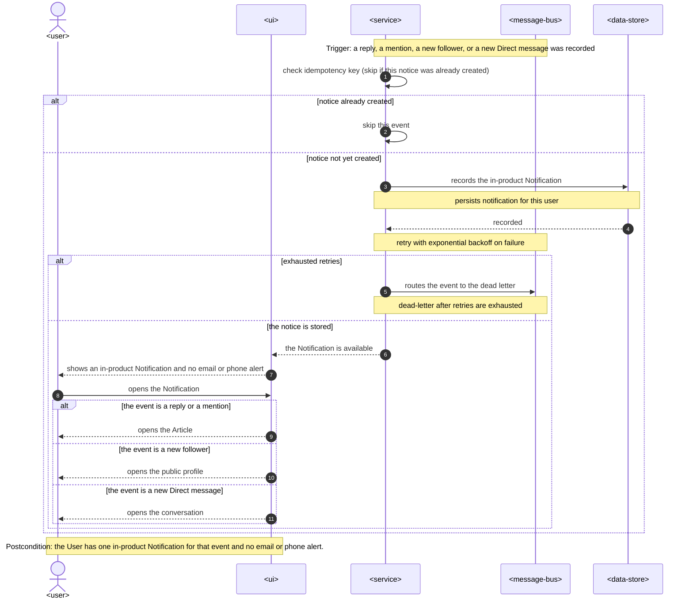
```mermaid
sequenceDiagram
    autonumber
    actor U as <user>
    participant UI as <ui>
    participant S as <service>
    participant B as <message-bus>
    participant D as <data-store>

    Note over S,B: Trigger: a reply, a mention, a new follower, or a new Direct message was recorded
    S->>S: check idempotency key (skip if this notice was already created)
    alt notice already created
        S->>S: skip this event
    else notice not yet created
        S->>D: records the in-product Notification
        Note over S,D: persists notification for this user
        D-->>S: recorded
        Note over S,B: retry with exponential backoff on failure
        alt exhausted retries
            S->>B: routes the event to the dead letter
            Note over S,B: dead-letter after retries are exhausted
        else the notice is stored
            S-->>UI: the Notification is available
            UI-->>U: shows an in-product Notification and no email or phone alert
            U->>UI: opens the Notification
            alt the event is a reply or a mention
                UI-->>U: opens the Article
            else the event is a new follower
                UI-->>U: opens the public profile
            else the event is a new Direct message
                UI-->>U: opens the conversation
            end
        end
    end
    Note over U,UI: Postcondition: the User has one in-product Notification for that event and no email or phone alert.
```

### Cross-cutting: staff gate

Staff tools stay closed until a second factor is confirmed. A person who is not a Moderator or an Administrator is not left inside the admin panel.

```mermaid
sequenceDiagram
    autonumber
    actor U as <user>
    participant UI as <ui>
    participant X as <external-system>
    participant S as <service>
    participant D as <data-store>

    Note over U,UI: Precondition: someone opens the admin panel. Screen SCR-15.
    U->>UI: tries to use a staff tool
    UI->>X: asks whether a second factor is confirmed
    alt the second factor is not confirmed
        X-->>UI: not confirmed
        UI-->>U: does not open hide, Block, Category change, role assignment, Complaint dismissal, or soft-remove
    else the second factor is confirmed
        X-->>UI: confirmed
        UI->>S: asks for this person's role
        S->>D: reads the role
        alt the person is not a Moderator or an Administrator
            D-->>S: not staff
            S-->>UI: refused
            UI-->>U: refuses and does not leave them inside the admin panel
        else the person is a Moderator or an Administrator
            D-->>S: staff
            S-->>UI: the tools are open
            UI-->>U: opens the staff tool they asked for
        end
    end
    Note over U,UI: Postcondition: only staff with a confirmed second factor reach a staff tool.
```

**Critical flow 2: Hide an Article a reader has open.** The Guest is told the Article is unavailable and is not told that staff hid it. The author still sees the text. The audit append is a second call, so it can fail after the hide is recorded (§11).

```mermaid
sequenceDiagram
    actor Moderator
    participant Admin as Admin panel
    participant Gateway as API Gateway
    participant Content as Content Service
    participant Users as User Service
    participant Workers as Background workers
    participant Rabbit as RabbitMQ
    participant Realtime as Realtime Gateway
    actor Guest

    Moderator->>Admin: hides the Article and gives a reason
    Admin->>Gateway: asks to hide
    Gateway->>Content: hides the Article
    Content->>Content: records the hide and the outbox row
    Content-->>Gateway: hidden
    Gateway->>Users: appends the audit row
    Users-->>Gateway: appended
    Gateway-->>Admin: hidden
    Admin-->>Moderator: confirms the hide
    Workers->>Rabbit: publishes the outbox event
    Rabbit-->>Realtime: delivers article hidden
    Realtime-->>Guest: shows the Article unavailable
```

The same realtime shape as flow 2 serves an open Direct message conversation, and only the two Users in it receive the push. A Like count and a Comment count use that shape too. The View count does not.

### Hide a comment and close its complaints

A Moderator or an Administrator hides a Comment and gives a reason. Readers who are not the author see it as unavailable and are not told that staff hid it. The author still sees the text. Open Complaints about that Comment leave the open list. The same outcomes apply when the hidden piece is an Article. The Article request path is Critical flow 2. A missing reason does not hide anything.

```mermaid
sequenceDiagram
    autonumber
    actor U as <user>
    participant UI as <ui>
    participant S as <service>
    participant D as <data-store>

    Note over U,UI: Precondition: a Moderator or an Administrator, a Complaint, and a Comment readers have open. Screens SCR-17, SCR-03, SCR-18, SCR-24, and SCR-16.
    U->>UI: hides the Comment
    UI->>S: asks to hide the Comment
    alt no reason
        S-->>UI: a reason must be present
        UI-->>U: stays on the Complaint and does not hide it
    else a reason is present
        S->>D: records the hide and the outbox row
        Note over S,D: persists hidden comment and outbox row
        D-->>S: hidden
        S->>D: appends the audit row with that reason
        Note over S,D: persists audit record
        D-->>S: appended
        S-->>UI: hidden
        UI-->>U: confirms the hide
        U->>UI: opens the Comment as a reader who is not the author
        UI->>S: asks for the Comment
        S->>D: reads the hide
        D-->>S: hidden
        S-->>UI: unavailable, and not why
        UI-->>U: shows it unavailable and does not say that staff hid it
        U->>UI: opens it as the author
        UI->>S: asks for the Comment as the author
        S->>D: reads the text and the hide
        D-->>S: the text, hidden from readers
        S-->>UI: the text, and that readers cannot see it
        UI-->>U: shows the author the text
        U->>UI: opens it as staff
        UI->>S: asks for the staff view
        S->>D: reads the full text
        D-->>S: the full text
        S-->>UI: the full text
        UI-->>U: shows the full text only in the admin panel
        S->>D: closes each open Complaint about that Comment
        Note over S,D: persists complaints leaving the open list
        D-->>S: closed
        S-->>UI: those Complaints have left the open list
        UI-->>U: the open list no longer shows them
        Note over U,UI: an Article hide has these same reader, author, staff, and Complaint outcomes. Its request path is Critical flow 2.
    end
    Note over U,UI: Postcondition: a reasoned hide is recorded, audited, and closed out of the open list. A hide with no reason is not recorded.
```

### Move an article to another category

A Moderator moves a published Article from one Category to one other Category. No reason is required. Readers see the new Category, and the move is on the audit trail.

```mermaid
sequenceDiagram
    autonumber
    actor U as <user>
    participant UI as <ui>
    participant S as <service>
    participant D as <data-store>

    Note over U,UI: Precondition: a Moderator and a published Article in one Category. Screens SCR-18, SCR-03, and SCR-24.
    U->>UI: moves the Article to one other Category and gives no reason
    UI->>S: asks to move the Category
    S->>D: records the new Category
    Note over S,D: persists article category
    D-->>S: moved
    S->>D: appends the audit row for the Category change
    Note over S,D: persists audit record for the category change
    D-->>S: appended
    S-->>UI: moved
    UI-->>U: confirms the move
    U->>UI: opens the Article as a reader
    UI->>S: asks for the Article
    S->>D: reads the Category
    D-->>S: the new Category
    S-->>UI: the Article in the new Category
    UI-->>U: shows the Article in the new Category
    Note over U,UI: Postcondition: the Article is in the new Category. The move is on the audit trail without a reason.
```

### Block an account and lift the block

A Moderator or an Administrator Blocks a User who is not staff, then later lifts that Block. A missing reason does not Block anyone. Articles published before the Block stay visible.

```mermaid
sequenceDiagram
    autonumber
    actor U as <user>
    participant UI as <ui>
    participant S as <service>
    participant D as <data-store>

    Note over U,UI: Precondition: staff with a confirmed second factor, and a User who is not staff. Screen SCR-19.
    U->>UI: Blocks that User
    UI->>S: asks to Block the User
    alt no reason
        S-->>UI: a reason must be present
        UI-->>U: stays on Block account and does not Block the User
    else a reason is present
        S->>D: records the Block
        Note over S,D: persists block
        D-->>S: blocked
        S->>D: appends the audit row with that reason
        Note over S,D: persists audit record
        D-->>S: appended
        S-->>UI: blocked
        UI-->>U: confirms the Block
        U->>UI: opens the public site as the blocked User
        UI->>S: asks what the blocked User may do
        S->>D: reads the Block
        D-->>S: blocked
        S-->>UI: the account is blocked
        UI-->>U: tells the User the account is blocked
        U->>UI: tries to publish, Comment, Follow, Like, Bookmark, or send a Direct message
        UI->>S: asks to record that action
        S-->>UI: refused while the Block lasts
        UI-->>U: does not record the action
        U->>UI: reads, edits their own Article, soft-removes their own Article, or files a Complaint
        UI->>S: asks to do that
        S-->>UI: allowed
        UI-->>U: allows it
        U->>UI: opens an Article published before the Block
        UI->>S: asks for that Article
        S->>D: reads the Article
        D-->>S: still published
        S-->>UI: the Article
        UI-->>U: shows the Article
        U->>UI: lifts the Block as staff
        UI->>S: asks to lift the Block
        S->>D: records the lift
        Note over S,D: persists lifted block
        D-->>S: lifted
        S-->>UI: lifted
        U->>UI: tries to publish, Comment, Follow, Like, Bookmark, or send a Direct message
        UI->>S: asks to record that action
        S-->>UI: allowed
        UI-->>U: the action is possible again
    end
    Note over U,UI: Postcondition: a reasoned Block stops participation and can be lifted. Already published Articles stay visible.
```

### Create a category

An Administrator creates a Category with English, Serbian Latin, and Russian names. It is available for new Articles.

```mermaid
sequenceDiagram
    autonumber
    actor U as <user>
    participant UI as <ui>
    participant S as <service>
    participant D as <data-store>

    Note over U,UI: Precondition: an Administrator with a confirmed second factor. Screen SCR-20.
    U->>UI: creates a Category with English, Serbian Latin, and Russian names
    UI->>S: asks to create the Category
    S->>D: records the Category and the three names
    Note over S,D: persists category and three translations
    D-->>S: recorded
    S->>D: appends the audit row for the Category change
    Note over S,D: persists audit record for the category change
    D-->>S: appended
    S-->>UI: created
    UI-->>U: shows the Category available for new Articles
    Note over U,UI: Postcondition: the Category exists in all three names.
```

### Assign a role

An Administrator gives a person exactly one role and a reason. The panel does not create the first Administrator. The only Administrator cannot demote themselves. A missing reason does not change the role.

```mermaid
sequenceDiagram
    autonumber
    actor U as <user>
    participant UI as <ui>
    participant S as <service>
    participant D as <data-store>

    Note over U,UI: Precondition: the admin panel is open. Screen SCR-21, or SCR-15 when no Administrator exists yet.
    U->>UI: tries to set a role
    UI->>S: asks to set the role
    S->>D: reads Administrators and the reason
    alt no Administrator exists yet
        D-->>S: none
        S-->>UI: the panel does not create the first Administrator
        UI-->>U: stays on the gate and creates no role
    else this change would remove the only Administrator
        D-->>S: one Administrator
        S-->>UI: one Administrator must remain
        UI-->>U: stays on roles and does not change the role
    else no reason
        D-->>S: the reason is absent
        S-->>UI: a reason must be present
        UI-->>U: stays on roles and does not change the role
    else a reason is present and another Administrator remains
        S->>D: records exactly one role and drops the previous role
        Note over S,D: persists the single role
        D-->>S: recorded
        S->>D: appends the audit row with that reason
        Note over S,D: persists audit record
        D-->>S: appended
        S-->>UI: the new role
        UI-->>U: shows that the person holds that one role and can act as it
    end
    Note over U,UI: Postcondition: a valid change leaves exactly one role. The first Administrator and the last Administrator are not removed from the panel.
```

### Change popular weights

An Administrator changes the Popular feed weights. The Popular feed then uses those weights.

```mermaid
sequenceDiagram
    autonumber
    actor U as <user>
    participant UI as <ui>
    participant S as <service>
    participant D as <data-store>

    Note over U,UI: Precondition: an Administrator with a confirmed second factor. Screens SCR-22 and SCR-02.
    U->>UI: changes the Popular feed weights
    UI->>S: asks to save the weights
    S->>D: records the weights
    Note over S,D: persists popular feed weights
    D-->>S: recorded
    S-->>UI: saved
    UI-->>U: confirms the weights
    U->>UI: opens the Popular feed
    UI->>S: asks for the Popular page
    S->>D: reads published Articles by the new weights
    D-->>S: the page
    S-->>UI: the page
    UI-->>U: shows the Popular feed using the new weights
    Note over U,UI: Postcondition: the Popular feed uses the saved weights.
```

### Cross-cutting: a moderator tries an administrator-only action

A Moderator cannot create a Category, assign a role, or change Popular feed weights.

```mermaid
sequenceDiagram
    autonumber
    actor U as <user>
    participant UI as <ui>
    participant S as <service>
    participant D as <data-store>

    Note over U,UI: Precondition: a Moderator with a confirmed second factor. Screens SCR-20, SCR-21, and SCR-22.
    U->>UI: tries to create a Category, assign a role, or change Popular feed weights
    UI->>S: asks to do that
    S->>D: reads the role
    D-->>S: Moderator
    S-->>UI: refused
    UI-->>U: does not do the action
    Note over U,UI: Postcondition: no Category, role, or weight was changed.
```

### Read platform statistics

An Administrator sees the platform figures and whether the public site is answering. A Moderator sees no figures.

```mermaid
sequenceDiagram
    autonumber
    actor U as <user>
    participant UI as <ui>
    participant S as <service>
    participant D as <data-store>

    Note over U,UI: Precondition: staff with a confirmed second factor. Screen SCR-23.
    U->>UI: opens platform statistics
    UI->>S: asks for platform statistics
    S->>D: reads the role
    alt the person is a Moderator
        D-->>S: Moderator
        S-->>UI: no platform statistics
        UI-->>U: shows no figures
    else the person is an Administrator
        D-->>S: Administrator
        S->>D: reads the figures and whether the public site is answering
        D-->>S: Users signed in today, Users signed in over the last 30 days, new Users, published Articles, Comments written, open Complaints, and whether the public site is answering
        S-->>UI: those figures
        UI-->>U: shows the six figures and whether the public site is answering
    end
    Note over U,UI: Postcondition: only an Administrator sees platform statistics.
```

### Staff soft-remove an article

An Administrator soft-removes a published Article and gives a reason. Readers no longer see it. The record remains. A missing reason does not remove it.

```mermaid
sequenceDiagram
    autonumber
    actor U as <user>
    participant UI as <ui>
    participant S as <service>
    participant D as <data-store>

    Note over U,UI: Precondition: an Administrator and a published Article. Screen SCR-18.
    U->>UI: soft-removes the Article
    UI->>S: asks to soft-remove the Article
    alt no reason
        S-->>UI: a reason must be present
        UI-->>U: stays on the staff Article and does not remove it
    else a reason is present
        S->>D: records the soft-remove and keeps the record
        Note over S,D: persists staff soft-remove
        D-->>S: removed from readers
        S->>D: appends the audit row with that reason
        Note over S,D: persists audit record
        D-->>S: appended
        S-->>UI: soft-removed
        UI-->>U: confirms it
        U->>UI: opens the Article as a reader
        UI->>S: asks for the Article
        S->>D: reads the soft-remove
        D-->>S: readers cannot see it
        S-->>UI: unavailable
        UI-->>U: the reader no longer sees it
    end
    Note over U,UI: Postcondition: a reasoned staff soft-remove hides the Article from readers and keeps the record.
```

### Dismiss a complaint

A Moderator or an Administrator dismisses a Complaint. A reason is required. The Article or Comment stays visible, and the Complaint leaves the open list.

```mermaid
sequenceDiagram
    autonumber
    actor U as <user>
    participant UI as <ui>
    participant S as <service>
    participant D as <data-store>

    Note over U,UI: Precondition: an open Complaint about a published Article or a Comment. Screen SCR-17.
    U->>UI: dismisses the Complaint
    UI->>S: asks to dismiss the Complaint
    alt no reason
        S-->>UI: a reason must be present
        UI-->>U: stays on the Complaint, which remains open
    else a reason is present
        S->>D: records the dismissal and leaves the piece visible
        Note over S,D: persists complaint dismissal
        D-->>S: dismissed
        S->>D: appends the audit row with that reason
        Note over S,D: persists audit record
        D-->>S: appended
        S-->>UI: dismissed
        UI-->>U: the piece stays visible and the Complaint has left the open list
    end
    Note over U,UI: Postcondition: a reasoned dismissal keeps the piece visible. A dismissal with no reason changes nothing.
```

### Read the audit trail

An Administrator reads every recorded staff action. A Moderator reads only their own. Staff cannot rewrite or erase the trail.

```mermaid
sequenceDiagram
    autonumber
    actor U as <user>
    participant UI as <ui>
    participant S as <service>
    participant D as <data-store>

    Note over U,UI: Precondition: hide, Block, role-change, staff soft-remove, Complaint dismissal, and Category-change rows exist. Screen SCR-24.
    U->>UI: opens the audit trail
    UI->>S: asks for the audit trail
    S->>D: reads the role and the trail
    alt the person is an Administrator
        D-->>S: every hide, Block, role change, staff soft-remove, and Complaint dismissal, each with its reason, and every Category change
        S-->>UI: the whole trail
        UI-->>U: shows every recorded action
    else the person is a Moderator
        D-->>S: only that Moderator's actions
        S-->>UI: those rows
        UI-->>U: shows only their own actions
    end
    U->>UI: tries to rewrite or erase a row
    UI->>S: asks to change the trail
    S-->>UI: refused
    UI-->>U: the trail is unchanged
    Note over U,UI: Postcondition: the trail was read according to the role and was not rewritten.
```

### Withdraw an article

The owner soft-removes their published Article. Readers see it as unavailable and are not told that the author withdrew it. It is not a Moderator hide. A different User or a Moderator cannot soft-remove it. The Moderator can still hide it with a reason.

```mermaid
sequenceDiagram
    autonumber
    actor U as <user>
    participant UI as <ui>
    participant S as <service>
    participant D as <data-store>

    Note over U,UI: Precondition: a published Article has an owner. Screens SCR-03 and SCR-18.
    U->>UI: tries to soft-remove the Article
    UI->>S: asks to soft-remove the Article
    S->>D: reads the owner
    alt a different User
        D-->>S: not the owner
        S-->>UI: refused
        UI-->>U: does not soft-remove it
    else a Moderator
        D-->>S: a Moderator, not the owner
        S-->>UI: refused
        UI-->>U: does not soft-remove it
        Note over U,UI: the Moderator can still hide it with a reason, on the hide path
    else the owner
        D-->>S: the owner
        S->>D: records the author's soft-remove and keeps the record
        Note over S,D: persists author soft-remove, not a moderator hide
        D-->>S: withdrawn
        S-->>UI: withdrawn
        UI-->>U: shows the author the text and that they withdrew it
        U->>UI: opens it as a Guest or a User who is not the author
        UI->>S: asks for the Article
        S->>D: reads the soft-remove
        D-->>S: withdrawn, not a Moderator hide
        S-->>UI: unavailable, with no text and no Comments
        UI-->>U: shows it unavailable and does not say that the author withdrew it
        U->>UI: opens it as staff
        UI->>S: asks for the staff view
        S->>D: reads the full text
        D-->>S: the full text
        S-->>UI: the full text
        UI-->>U: shows the full text only in the admin panel
    end
    Note over U,UI: Postcondition: the owner's Article is withdrawn and the record remains. Anyone else who tries to soft-remove it is refused.
```

### Flags for later stages

- The three Critical flow diagrams above use concrete container names from design. This stage left them unchanged.
- View-flush failure in "Read a published article" is routed through `<message-bus>`. The view-flush worker does not publish domain events. Data-model should not treat that dead letter as an Article event.
- Cached feed pages and Article rows share `<data-store>` on the feed diagrams. The cache is not an Article table.
- Theme and Interface language are stored in the browser. No server column.
- An Avatar on the profile is a stored field. The presigned image upload stays the Article image path.
- A stale Article save is not a branch on "Revise a published article". It is an accepted architecture decision without an acceptance criterion.
- Retry counts are not in the spec. Async flows say retries are exhausted, without a number.
- An Administrator hide uses "Hide a comment and close its complaints". An Administrator Block uses "Block an account and lift the block". Neither is a third copy of those flows.

## 7. Deployment view

Each NestJS app, the Next.js site, and the Vite admin bundle are separate deployables. Workers are processes of the owning service, one relay per schema that emits events, plus the engagement view-flush process. PostgreSQL stays one cluster. Redis, RabbitMQ, and object storage are beside it. Local compose today starts PostgreSQL 18 only. The other stores are added with the first service that needs them, not as empty infrastructure ahead of that task.

The public site and the admin panel are different origins. Admin CORS allows the admin origin only. The public bundle does not contain the admin code.

**Monitoring:**

- Server timing for write p95, cached-read p95, and uncached-read p95, on publish, Comment, Like, Direct message, feed, and Article reads.
- Time from a Like, Comment, or hide being recorded to the open Article view changing. Alert when the oldest unpublished outbox row is older than 500 ms, because that is the live-update budget.
- Monthly share of successful published-Article reads, against 99.9%.
- JSON logs with request id and correlation id on the gateway and on each service.

**Scaling thresholds:**

- One replica of each service is the starting topology.
- Add a replica of the public site or the feed service when cached-read p95 goes above 100 ms or published-Article read availability falls below 99.9%.
- Keep one PostgreSQL cluster until a service's schema must move for that same availability target. No partition key is chosen in this release.
- Feed pages hold 20 Articles. Cursor pagination is the only list shape for feeds.

The first Administrator is inserted by an operator seed in the users service before the admin panel is used. The panel has no route that creates that first Administrator.

## 8. Crosscutting concepts

Repo conventions apply. The rows below are the feature's use of them.

| Concept | Convention | Where defined |
|---|---|---|
| Logging | JSON logs with request id and correlation id | `CLAUDE.md`, `packages/logger` when added |
| Authentication | Firebase ID token verified at the gateway. Staff routes also require the second-factor claim. Public sign-in does not open admin routes | Spec §6.1, brief §6.1 and §61.2 |
| Authorization | Role is read from the users service on every admin request, not from a token claim. A User changes and soft-removes only their own Article. Bookmark lists and Direct messages are visible only to their owner | Spec §6.1 |
| Error handling | `{ "error": { "code", "params" } }`. A stale Article save uses `ARTICLE_VERSION_CONFLICT` | `CLAUDE.md`, ADR 0010 |
| ID strategy | App-generated UUIDv7. Firebase UID is a lookup key | `docs/adr/0003-use-drizzle-and-uuidv7.md` |
| Internationalisation | Interface languages `en`, `sr-Latn`, `ru`, English fallback. Content language is a separate field. A User may limit feed Content languages. A Guest has no such limit | Spec AC-04, AC-46 |
| Theme | Light, dark, or system. System is the default. The choice is stored and applied on the public site and on the admin panel. No hard-coded palette colors in feature components | Spec AC-04, AC-55 |
| Observability | Server timing on the latency rows in §10. Tracing at the gateway boundary when `packages` observability lands | §7 |
| Events | Envelope fields `eventId`, `correlationId`, `causationId`, `timestamp`, `producer`, `eventVersion`. Outbox in the owning schema. Idempotent consumers | `docs/adr/0002-own-data-per-nestjs-service.md`, ADR 0011 |
| Rate limiting | Redis sliding window at the gateway. Comments 20 per minute, Likes 60 per minute, Follows 30 per minute, Direct messages 60 per minute, Article edits 60 per minute, image attachments 20 per hour. Anonymous reads 60 per minute per visitor. An Administrator can change these limits | Spec §6.1, ADR 0009 |
| View counting | A View counts after the Article stays visible for 3 seconds. The same viewer does not add another View for 30 minutes. A Guest is the same viewer for the same browser session. A User is the same viewer when that User returns. Redis holds the dedupe key and the increment. A worker flushes the delta to schema `engagement` | Spec §6, spec §8 default accepted in this pass, ADR 0006, ADR 0012 |
| Article body | Editor.js JSON is the editable source. The content service validates and sanitizes on write, stores rendered HTML for SSR, and rejects embed and raw HTML blocks | Brief §8, ADR 0005, ADR 0007 |
| Lists | Cursor pagination. A feed page is 20 Articles | Spec §6, `docs/adr/0003-use-drizzle-and-uuidv7.md` |
| Comments | Stored as a tree with parent and depth. Replies past the third level are shown flat | Spec AC-17 |
| Reader-unavailable | A draft, a hidden Article, and a soft-removed Article are one public unavailable state. The reader is not told which. The author still sees the text and the state. Staff see the full text only in the admin panel | Spec AC-27, AC-38, AC-45 |
| Block | A blocked User cannot publish, Comment, Follow, Like, Bookmark, or send a Direct message. The User can read, edit their own Article, soft-remove their own Article, and file a Complaint. Already published Articles stay visible | Spec AC-31, AC-32 |
| Admin session | A Moderator or an Administrator signs in again after 30 idle minutes | Spec §6 |
| First Administrator | Operator seed in the users service. The panel cannot create the first one, and it cannot remove the last one | Spec AC-51, AC-52 |

The two spec §8 items that were due before design are closed here: a View waits 3 seconds of visibility, and one anonymous visitor is slowed after 60 reads per minute. Starting Popular feed weights stay open (§11).

## 9. Architecture decisions

| # | Title | Status | Section |
|---|---|---|---|
| 0001 | Assemble My feed on read | Accepted | §4 |
| 0002 | Append the staff audit log in the users schema | Accepted | §4 |
| 0003 | Compose the public Article read in the gateway | Accepted | §4 |
| 0004 | Cache feed pages in Redis | Accepted | §4 |
| 0005 | Render the draft preview on the editor screen | Accepted | §4 |
| 0006 | Leave view counts off the live channel | Accepted | §4 |
| 0007 | Reject embed and raw HTML blocks | Accepted | §4 |
| 0008 | Upload article images with presigned URLs | Accepted | §5 |
| 0009 | Count rate limits with a sliding window | Accepted | §8 |
| 0010 | Reject a stale Article save | Accepted | §8 |
| 0011 | Relay the outbox from a worker process | Accepted | §7 |
| 0012 | Flush view increments from Redis | Accepted | §8 |

ADR files live under `docs/features/blog-platform/adr/`. Foundation decisions stay in `docs/adr/0001` through `docs/adr/0003` and are constraints in §2, not rows here.

## 10. Quality requirements

Numbers below are copied from spec §6. The 1 second figures in spec §7 are release watches for the same live path. They are not a second performance target.

**QG-1. Cached read performance**

- **When:** a Guest or a User opens a feed or an Article that is already in cache.
- **Then:** latency p95 of a cached feed or Article read is ≤ 100 ms.
- **How verify:** server timing of cached reads.

**QG-2. Live update**

- **When:** a Guest or a User is looking at a published Article, and someone records a Like, a Comment count change, a new or hidden Comment, or a hide.
- **Then:** latency p95 until that open view changes is ≤ 500 ms, measured from the action being recorded to the open Article view changing. The release watch for the same path is the 1 second KPI in spec §7. The View count does not have to change on that open view.
- **How verify:** time from the action being recorded to the open Article view changing.

**QG-3. Availability of published-Article reads**

- **When:** readers request published Articles across a month.
- **Then:** availability of published-Article reads is 99.9%, as the monthly share of successful reads.
- **How verify:** monthly share of successful reads.

**QG-4. Write latency**

- **When:** a User publishes, Comments, Likes, or sends a Direct message.
- **Then:** latency p95 of that write is ≤ 300 ms.
- **How verify:** server timing of those writes.

**QG-5. Uncached read**

- **When:** a feed or Article read misses the cache.
- **Then:** latency p95 of an uncached feed or Article read is ≤ 300 ms.
- **How verify:** server timing of reads that miss the cache.

**QG-6. Draft preview**

- **When:** an author keeps a keystroke in the open draft.
- **Then:** latency p95 of draft preview is ≤ 300 ms, from that keystroke being kept to the second preview on the editor screen showing it.
- **How verify:** time from a keystroke being kept to the author's second preview showing it.

**QG-7. Largest content paint**

- **When:** a reader opens a published Article page in the field.
- **Then:** published Article page largest content paint is ≤ 2.5 s.
- **How verify:** field measurement of the published Article page.

**QG-8. Feed page size**

- **When:** a Guest or a User opens one page of a feed.
- **Then:** the page holds 20 Articles.
- **How verify:** count returned for one page of a feed.

**QG-9. View window**

- **When:** the same viewer opens an Article again inside 30 minutes.
- **Then:** the same-viewer View window is 30 minutes, and a second View inside the window is not counted.
- **How verify:** a second View from the same viewer inside the window is not counted.

**QG-10. Admin idle session**

- **When:** a Moderator or an Administrator is idle on the admin panel.
- **Then:** admin session idle is 30 minutes, after which they must sign in again.
- **How verify:** a Moderator or Administrator must sign in again after 30 idle minutes.

**QG-11. Contrast**

- **When:** body text and controls are shown in the light Theme and in the dark Theme.
- **Then:** text contrast is ≥ 4.5:1 for body text and ≥ 3:1 for large text and controls.
- **How verify:** check against WCAG 2.2 AA in light and dark.

## 11. Risks and technical debt

| Risk / debt | Severity | Mitigation | Owner |
|---|---|---|---|
| Open architectural decision: starting weights of the Popular feed score | Open question | Resolve before sdd:tasks. Until then the score treats Views, Likes, Comments, and Bookmarks as equal weights, and age lowers the score. Spec §8 already assigns this default and this due date | PM |
| Open architectural decision: release deadline | Open question | Resolve before sdd:tasks. The spec states no date, so deployment ordering in §7 has no calendar | PM |
| The hide can commit and the audit append can still fail, because they are two services and two schemas | Medium | The gateway retries the audit append. Alert when a staff command has no matching audit row. The trail stays append-only either way | Tech Lead |
| Outbox lag can miss the 500 ms live-update budget while the write itself stayed inside 300 ms | High | Alert when the oldest unpublished outbox row is older than 500 ms. The realtime gateway consumes only after the worker publishes | Tech Lead |
| A Redis failure before view flush loses increments that are not in Postgres yet | Medium | Short flush interval. Redis persistence on the view-counter keys. The durable count remains the engagement row | Tech Lead |
| Local compose has PostgreSQL only. Redis, RabbitMQ, MinIO, and the domain services are not in the workspace yet | Medium | Add each store and each app with the task that first needs it. Do not stub the full service list in the skeleton | Tech Lead |
| The architecture map still describes an empty repository at `reflects_commit` 81f9787 | Low | This SAD treats the scaffold as the brownfield and the map's target containers as the constraint. A later survey refresh can move `reflects_commit` | Tech Lead |
| Security review has not run. Staff powers, the second factor, and confidential messages are in this release | High | Spec §6.1 marks the review required. Hold release on that review | Security Lead |
| `docs/design-system.md` does not exist yet. HeroUI is a convention, not a package in the workspace | Low | `packages/ui` arrives with the first screen. Feature components use semantic tokens once that package exists | Tech Lead |

**Accepted debt (acceptable in v1, plan to fix later):**

- Earlier Article versions stay recorded and are not browsable.
- The View count on an open Article can lag. The live channel does not push it.
- Popular weights use the equal-weight default until the §11 question closes.
- Embeds and raw HTML stay rejected for this release.
- Email and phone alerts stay out. Notifications are in-product only.
- The audit row is not in the same database transaction as the staff command.

## 12. Glossary

Canonical domain terms live in repo-root `CONTEXT.md`. There is no `docs/features/blog-platform/CONTEXT.md`. The meanings below match that glossary. Technical terms at the bottom are local to this SAD.

| Term | Meaning |
|---|---|
| Administrator | A signed-in person who manages categories, users, moderation, settings, statistics, role assignment, and the audit log, and does this only from the admin panel. |
| Article | A piece of writing owned by one User, filed under exactly one Category, with its own Content language. It starts as a draft, becomes published, may be hidden by a Moderator, and may be soft-removed so readers no longer see it while the record remains. |
| Block | A Moderator or Administrator stopping a User from publishing, commenting, following, liking, bookmarking, and sending Direct messages. Already published Articles stay visible. |
| Bookmark | A private mark a User places on a published Article. Only that User can see their Bookmarks. |
| Category | A topic an Administrator names and translates into English, Serbian Latin, and Russian. An Article belongs to exactly one Category. |
| Comment | A User's public remark on a published Article. It may reply to another Comment, receive a Like, and mention a User. Replies past the third level remain stored and are shown flat. |
| Complaint | A User's report of an Article or a Comment. It stays open until a Moderator or an Administrator hides that Article or Comment, or dismisses the report and leaves the piece visible. |
| Content language | The language an Article is written in, chosen by its author from English, Serbian Latin, or Russian. |
| Direct message | A private message in a conversation of exactly two Users. |
| Fresh feed | The list of published Articles, newest first, visible to a Guest and to a User. |
| Guest | A person who is not signed in and may read published material. |
| Interface language | The language of menus, buttons, system text, and Notifications: English, Serbian Latin, or Russian. English is the fallback. |
| Like | One User's endorsement of one Article or one Comment. Repeating it removes that endorsement. |
| Moderator | A signed-in person who hides Articles and Comments, blocks Users, handles Complaints, and changes an Article's Category, only from the admin panel. |
| My feed | The list of published Articles from Users and Categories a given User follows, newest first. Only a signed-in User has this list. |
| Notification | An in-product notice to a User about a reply, a mention, a new follower, or a new Direct message. |
| Popular feed | The list of published Articles ordered by a score of Views, Likes, Comments, Bookmarks, and age. |
| Theme | The appearance choice light, dark, or system. System is the default. |
| User | A signed-in person who is both a reader and an author. |
| Username | The required public name a User chooses. No two Users share one. |
| View | A count added when an Article stays open and visible for a few seconds. The same viewer does not add another View for 30 minutes. |
| Outbox | A row written in the same database transaction as the business row, later published to RabbitMQ by a worker of that service. |
| Presigned URL | A time-limited upload URL from the media service. The browser sends image bytes to object storage with it. |
| Sliding window | A rate-limit count over the last minute that moves with time, rather than resetting on the clock minute. |
