# Epic — blog-platform

> **Spec:** [spec.md](../spec.md) · **Design:** [sad.md](../sad.md) · **Data model:** [data-model.md](../data-model.md) · **API:** [openapi.yaml](../contracts/openapi.yaml) · **ADRs:** [adr/](../adr/)

## Goal

A Guest can read published Articles in the Fresh feed and the Popular feed. A User can publish, follow, and take part in Likes, Comments, Bookmarks, Direct messages, and in-product Notifications. A Moderator can hide harmful content and Block a User from the admin panel. An Administrator can do that work as well, soft-remove an Article, and keep Categories, roles, statistics, and the audit trail.

## Scope

- **In:** `backend-service`, `web-frontend` (public Next.js site and Vite admin panel), and `worker` (outbox relay per schema, view flush). Services: users, categories, content, media, comments, engagement, social, feed, messaging, notification, plus the gateway and the realtime gateway.
- **Out:** search, recommendations, email and phone alerts, User-to-User mute, unlisted and archived Articles, Serbian Cyrillic, automatic translation, and an embed allowlist.

## Task map

```mermaid
flowchart TD
  T1["T1 Promote the users schema migration"]
  T2["T2 Promote the categories schema migration"]
  T3["T3 Promote the content schema migration"]
  T4["T4 Promote the media schema migration"]
  T5["T5 Promote the comments schema migration"]
  T6["T6 Promote the engagement schema migration"]
  T7["T7 Promote the social schema migration"]
  T8["T8 Promote the messages schema migration"]
  T9["T9 Promote the notifications schema migration"]
  T10["T10 Promote the feed schema migration"]
  T11["T11 Promote the rate-limit seed migration"]
  T12["T12 Add Redis, RabbitMQ, MinIO, and typed config"]
  T13["T13 Add Firebase verification, Redis, RabbitMQ, and the event envelope"]
  T14["T14 Record a User profile and a unique Username"]
  T15["T15 Assign one role and keep the last Administrator"]
  T16["T16 Block an account and append the staff audit trail"]
  T17["T17 Serve Categories and their three translations"]
  T18["T18 Save Article drafts with a version check and sanitized HTML"]
  T19["T19 Publish an Article and let the author withdraw it"]
  T20["T20 Keep the previous Article version on a published save"]
  T21["T21 Issue presigned image uploads"]
  T22["T22 Comment, reply, and mention on a visible Article"]
  T23["T23 Record a Complaint about an Article"]
  T24["T24 Record a Complaint about a Comment"]
  T25["T25 Like an Article, Bookmark it, and count one View"]
  T26["T26 Follow and unfollow Users and Categories"]
  T27["T27 Serve Fresh, Popular, and My feed"]
  T28["T28 Exchange Direct messages between two Users"]
  T29["T29 Deliver in-product Notifications"]
  T30["T30 Hide an Article, move its Category, and staff-remove it"]
  T31["T31 Hide a Comment and close its Complaints"]
  T32["T32 List open Complaints and dismiss one"]
  T33["T33 Compose the public Article read and refuse a Guest write"]
  T34["T34 Require the staff second factor on admin routes"]
  T35["T35 Report platform statistics to an Administrator"]
  T36["T36 Count rate limits with a sliding window"]
  T37["T37 Relay each schema outbox from its own worker"]
  T38["T38 Flush view increments from Redis"]
  T39["T39 Push live Article and Direct message updates"]
  T40["T40 Share HeroUI tokens, Theme, and Interface language"]
  T41["T41 Render the Fresh feed, the Popular feed, and a Category"]
  T42["T42 Render a published Article with Comments and live counts"]
  T43["T43 Sign in and edit a public profile"]
  T44["T44 Edit and publish a draft on one screen"]
  T45["T45 Show My feed and private Bookmarks"]
  T46["T46 Show conversations and a live thread"]
  T47["T47 Show Notifications and file a Complaint"]
  T48["T48 Open the admin panel only after a second factor"]
  T49["T49 Review Complaints and the staff Article"]
  T50["T50 Block and unblock an account from the admin panel"]
  T51["T51 Manage Categories, roles, and Popular weights"]
  T52["T52 Show platform statistics and the audit trail"]
  T1 --> T2
  T2 --> T3
  T3 --> T4
  T4 --> T5
  T5 --> T6
  T6 --> T7
  T7 --> T8
  T8 --> T9
  T9 --> T10
  T10 --> T11
  T12 --> T13
  T1 --> T14
  T13 --> T14
  T14 --> T15
  T15 --> T16
  T2 --> T17
  T13 --> T17
  T15 --> T17
  T3 --> T18
  T14 --> T18
  T17 --> T18
  T18 --> T19
  T16 --> T19
  T18 --> T20
  T4 --> T21
  T13 --> T21
  T18 --> T21
  T5 --> T22
  T13 --> T22
  T19 --> T22
  T19 --> T23
  T22 --> T24
  T6 --> T25
  T13 --> T25
  T19 --> T25
  T7 --> T26
  T14 --> T26
  T17 --> T26
  T10 --> T27
  T13 --> T27
  T19 --> T27
  T25 --> T27
  T26 --> T27
  T14 --> T27
  T8 --> T28
  T14 --> T28
  T16 --> T28
  T9 --> T29
  T13 --> T29
  T22 --> T29
  T26 --> T29
  T28 --> T29
  T16 --> T30
  T19 --> T30
  T23 --> T30
  T16 --> T31
  T22 --> T31
  T24 --> T31
  T13 --> T32
  T16 --> T32
  T23 --> T32
  T24 --> T32
  T13 --> T33
  T14 --> T33
  T19 --> T33
  T22 --> T33
  T25 --> T33
  T36 --> T33
  T15 --> T34
  T16 --> T34
  T33 --> T34
  T14 --> T35
  T19 --> T35
  T22 --> T35
  T23 --> T35
  T24 --> T35
  T34 --> T35
  T11 --> T36
  T13 --> T36
  T16 --> T36
  T13 --> T37
  T19 --> T37
  T22 --> T37
  T25 --> T37
  T26 --> T37
  T28 --> T37
  T30 --> T37
  T31 --> T37
  T25 --> T38
  T13 --> T38
  T37 --> T39
  T28 --> T39
  T30 --> T39
  T31 --> T39
  T40 --> T41
  T27 --> T41
  T17 --> T41
  T26 --> T41
  T40 --> T42
  T33 --> T42
  T39 --> T42
  T22 --> T42
  T25 --> T42
  T40 --> T43
  T14 --> T43
  T33 --> T43
  T26 --> T43
  T40 --> T44
  T18 --> T44
  T19 --> T44
  T20 --> T44
  T21 --> T44
  T40 --> T45
  T27 --> T45
  T25 --> T45
  T40 --> T46
  T28 --> T46
  T39 --> T46
  T40 --> T47
  T29 --> T47
  T23 --> T47
  T24 --> T47
  T40 --> T48
  T34 --> T48
  T48 --> T49
  T30 --> T49
  T31 --> T49
  T32 --> T49
  T48 --> T50
  T16 --> T50
  T48 --> T51
  T17 --> T51
  T15 --> T51
  T27 --> T51
  T48 --> T52
  T35 --> T52
  T16 --> T52
```

## Tasks

See [tracker.md](./tracker.md) for status. Machine contract: [tasks.json](../tasks.json).

| # | Task | Layer | Blocked by | DoD (short) |
|---|---|---|---|---|
| T1 | Promote the users schema migration | migration | — | `db:migrate` applies `01_create_users.up.sql` and `db:rollback` runs `01_create_users.down.sql` and deletes that journal row |
| T2 | Promote the categories schema migration | migration | T1 | `db:migrate` applies `02_create_categories.up.sql` and `db:rollback` runs `02_create_categories.down.sql` and deletes that journal row |
| T3 | Promote the content schema migration | migration | T2 | `db:migrate` applies `03_create_content.up.sql` and `db:rollback` runs `03_create_content.down.sql` and deletes that journal row |
| T4 | Promote the media schema migration | migration | T3 | `db:migrate` applies `04_create_media.up.sql` and `db:rollback` runs `04_create_media.down.sql` and deletes that journal row |
| T5 | Promote the comments schema migration | migration | T4 | `db:migrate` applies `05_create_comments.up.sql` and `db:rollback` runs `05_create_comments.down.sql` and deletes that journal row |
| T6 | Promote the engagement schema migration | migration | T5 | `db:migrate` applies `06_create_engagement.up.sql` and `db:rollback` runs `06_create_engagement.down.sql` and deletes that journal row |
| T7 | Promote the social schema migration | migration | T6 | `db:migrate` applies `07_create_social.up.sql` and `db:rollback` runs `07_create_social.down.sql` and deletes that journal row |
| T8 | Promote the messages schema migration | migration | T7 | `db:migrate` applies `08_create_messages.up.sql` and `db:rollback` runs `08_create_messages.down.sql` and deletes that journal row |
| T9 | Promote the notifications schema migration | migration | T8 | `db:migrate` applies `09_create_notifications.up.sql` and `db:rollback` runs `09_create_notifications.down.sql` and deletes that journal row |
| T10 | Promote the feed schema migration | migration | T9 | `db:migrate` applies `10_create_feed.up.sql` and `db:rollback` runs `10_create_feed.down.sql` and deletes that journal row |
| T11 | Promote the rate-limit seed migration | migration | T10 | `db:migrate` applies `11_seed_rate_limits.up.sql` and `db:rollback` runs `11_seed_rate_limits.down.sql` and deletes that journal row |
| T12 | Add Redis, RabbitMQ, MinIO, and typed config | wiring | — | Vitest asserts `packages/config` rejects a missing `DATABASE_URL` and a missing `REDIS_URL` |
| T13 | Add Firebase verification, Redis, RabbitMQ, and the event envelope | wiring | T12 | Vitest covers token rejection, the envelope required fields, and a logger line that includes the request id |
| T14 | Record a User profile and a unique Username | app | T1, T13 | Vitest covers AC-05, AC-06, AC-42, and AC-46: a unique Username is stored, a duplicate returns `USERNAME_TAKEN`, an unsaved field is omitted, and a cleared limit is NULL |
| T15 | Assign one role and keep the last Administrator | app | T14 | Vitest covers AC-50, AC-51, AC-52, and the reason branch of AC-35 |
| T16 | Block an account and append the staff audit trail | app | T15 | Vitest covers AC-31, AC-36, and AC-37, and asserts a Block writes no Article status change for AC-32 and AC-40 |
| T17 | Serve Categories and their three translations | app | T2, T13, T15 | Vitest covers the Category half of AC-33 and the Category refusal in AC-34 |
| T18 | Save Article drafts with a version check and sanitized HTML | app | T3, T14, T17 | Vitest covers AC-12 and AC-45, and the draft-kept half of AC-07 including a rejected embed block |
| T19 | Publish an Article and let the author withdraw it | app | T18, T16 | Vitest covers AC-08, AC-09, AC-10, AC-43, AC-44, AC-38, AC-41, and the publish refusal in AC-32 |
| T20 | Keep the previous Article version on a published save | app | T18 | Vitest covers AC-11: the live text changes, the previous version row exists, and no history endpoint is registered |
| T21 | Issue presigned image uploads | app | T4, T13, T18 | Vitest covers a presigned URL that does not include image bytes, and an attach that links a ready object for AC-07 |
| T22 | Comment, reply, and mention on a visible Article | app | T5, T13, T19 | Vitest covers AC-17 and AC-18 |
| T23 | Record a Complaint about an Article | app | T19 | Vitest covers the Article half of AC-23 and AC-24 |
| T24 | Record a Complaint about a Comment | app | T22 | Vitest covers the Comment half of AC-23 and AC-24 |
| T25 | Like an Article, Bookmark it, and count one View | app | T6, T13, T19 | Vitest covers AC-15, AC-19, AC-20, AC-02, and the Comment-like half of AC-17 |
| T26 | Follow and unfollow Users and Categories | app | T7, T14, T17 | Vitest covers AC-13 |
| T27 | Serve Fresh, Popular, and My feed | app | T10, T13, T19, T25, T26, T14 | Vitest covers AC-03, AC-14, AC-46, the weights half of AC-33, and AC-32 visibility |
| T28 | Exchange Direct messages between two Users | app | T8, T14, T16 | Vitest covers AC-21 and AC-22 |
| T29 | Deliver in-product Notifications | app | T9, T13, T22, T26, T28 | Vitest covers AC-26, including a duplicate event that does not insert a second row |
| T30 | Hide an Article, move its Category, and staff-remove it | app | T16, T19, T23 | Vitest covers AC-27 for an Article, AC-29, AC-39, AC-47, and the staff half of AC-40 and AC-41 |
| T31 | Hide a Comment and close its Complaints | app | T16, T22, T24 | Vitest covers the Comment half of AC-27 and AC-29 |
| T32 | List open Complaints and dismiss one | ports | T13, T16, T23, T24 | Vitest covers AC-48 and AC-49 |
| T33 | Compose the public Article read and refuse a Guest write | ports | T13, T14, T19, T22, T25, T36 | Vitest covers AC-01 for the composed payload and AC-16 for a Guest write |
| T34 | Require the staff second factor on admin routes | ports | T15, T16, T33 | Vitest covers AC-28 and AC-30 |
| T35 | Report platform statistics to an Administrator | ports | T14, T19, T22, T23, T24, T34 | Vitest covers AC-53 and AC-54 |
| T36 | Count rate limits with a sliding window | app | T11, T13, T16 | Vitest covers a window that blocks the 61st anonymous read and allows the action after the window slides |
| T37 | Relay each schema outbox from its own worker | infra | T13, T19, T22, T25, T26, T28, T30, T31 | Vitest covers a relay that publishes one schema's oldest row and does not select another schema |
| T38 | Flush view increments from Redis | infra | T25, T13 | Vitest covers AC-02 after a flush: one viewer produced one durable increment |
| T39 | Push live Article and Direct message updates | app | T37, T28, T30, T31 | Vitest covers AC-25: the Article room gets a Like, a Comment, and a hide, the conversation room gets a message, and a View emits nothing |
| T40 | Share HeroUI tokens, Theme, and Interface language | ui | — | Component tests cover AC-04 on the public shell: the three Themes, the three Interface languages, persistence, and English fallback |
| T41 | Render the Fresh feed, the Popular feed, and a Category | ui | T40, T27, T17, T26 | Component tests cover SCR-01, SCR-02, and SCR-07 `default`, `loading`, `empty` or `not-found`, and `error`, and AC-03's Guest chrome |
| T42 | Render a published Article with Comments and live counts | ui | T40, T33, T39, T22, T25 | Component tests cover SCR-03 `default`, `unavailable`, `author`, `live`, `comment-blocked`, and `flat-reply` |
| T43 | Sign in and edit a public profile | ui | T40, T14, T33, T26 | Component tests cover SCR-04 `default` and `error`, SCR-05 `default` and `not-found`, and SCR-06 `username-taken` |
| T44 | Edit and publish a draft on one screen | ui | T40, T18, T19, T20, T21 | Component tests cover SCR-08 `default`, `category-required`, `title-required`, `text-required`, `block-rejected`, and `version-conflict` |
| T45 | Show My feed and private Bookmarks | ui | T40, T27, T25 | Component tests cover SCR-09 and SCR-10 `default` and `empty` |
| T46 | Show conversations and a live thread | ui | T40, T28, T39 | Component tests cover SCR-11 `empty`, SCR-12 `default`, `message-invalid`, and `live` |
| T47 | Show Notifications and file a Complaint | ui | T40, T29, T23, T24 | Component tests cover SCR-13 `default` and `empty`, and SCR-14 `reason-required` |
| T48 | Open the admin panel only after a second factor | ui | T40, T34 | Component tests cover SCR-15 `default`, `refused`, and `closed`, and AC-55 Theme plus English fallback |
| T49 | Review Complaints and the staff Article | ui | T48, T30, T31, T32 | Component tests cover SCR-16 `empty`, SCR-17 `reason-required`, and SCR-18 `default`, `category-moved`, and `admin-only` |
| T50 | Block and unblock an account from the admin panel | ui | T48, T16 | Component tests cover SCR-19 `reason-required`, `blocked`, and `lifted` |
| T51 | Manage Categories, roles, and Popular weights | ui | T48, T17, T15, T27 | Component tests cover SCR-20 `translations-required` and `admin-only`, SCR-21 `last-administrator`, and SCR-22 `admin-only` |
| T52 | Show platform statistics and the audit trail | ui | T48, T35, T16 | Component tests cover SCR-23 `default` and `no-figures`, and SCR-24 `default`, `own`, and `empty` |

## Risks / Hard rules

- One schema per service. No SQL join across schemas. The gateway composes reads.
- A write that emits a fact commits the business row and the outbox row together. The broker hop is the worker, not the request.
- API errors are `code` plus `params`. The client translates `code`.
- Embed and raw HTML blocks are rejected. Image bytes go to object storage on a presigned URL.
- The View count stays off the live channel. Popular weights stay the equal-weight seed until spec §8 closes that number.
- The audit append can fail after a hide commits. The gateway retries the append. The trail stays append-only.
- Do not stub empty apps ahead of the task that needs them.
