# UX flows — blog-platform

> User flows for every UI-touching §4 user story, produced by `ux-flows` (after `clarify`, before
> `design`) and read by `design` (evidence for the target-surface + UI-architecture decisions),
> `sequences` (UI-driven flows align on SCR ids), `screens` (details every inventory row) and
> `plan-tests` (the e2e-through-UI paths). **Always markdown + mermaid `flowchart`**, whatever the
> design tool — this artifact is flow-altitude, not visual design.

## Platform decisions

- **Posture:** responsive-both — confirmed for this run. `docs/design-system.md` is absent. `docs/DESIGN.md` draws the wide reading layout first and then collapses side regions on smaller screens. These flows do not split into a phone journey and a wide journey, because no acceptance criterion distinguishes the two. Column widths, sticky regions, and the phone navigation bar stay out of this artifact (spec §3).
- **Two surfaces:** a public site and a separate admin panel. Signing in on the public site does not open the admin panel. A Moderator and an Administrator act only from the admin panel.
- **Theme and Interface language:** an in-place choice on the current surface, on the public site and on the admin panel. Not a separate destination. System is the theme before any choice. A missing Interface language string falls back to English. The choice remains on a later visit.
- **Content language limit:** an in-place control on the Fresh feed, the Popular feed, and My feed. A Guest has no such control. A cleared limit shows every Content language.
- **Complaint:** a focused step opened from an Article or a Comment, then back to that Article. Not a separate section of the site.
- **Editor:** one screen for a new draft and for revising a published Article. A second preview on that screen shows the same edits. Earlier versions stay recorded and are not browsable in this release.
- **Direct messages:** a list of conversations, then one conversation of exactly two Users.
- **Notifications:** a list the User opens. Opening a notice goes to the Article for a reply or a mention, to the public profile for a new follower, and to the conversation for a new Direct message.
- **Follow:** another User from that User's public profile. A Category from a Category screen reached from the Article that belongs to it.
- **Staff reason:** typed on the same staff screen as the action. A missing reason leaves the person on that screen and does not complete the action. Moving an Article to another Category does not ask for a reason.
- **Second factor:** a gate before any staff tool. This artifact does not choose the factor type.
- **Unavailable Article:** the Article screen, not a separate page. A reader who is not the author sees no text and no Comments, and is not told whether the piece is a draft, hidden, or withdrawn. The author still sees the text and the state. Staff see the full text only in the admin panel.
- **Design input:** the architecture map already names a public site, an admin panel, and a live-update path. These flows show only that an open Article and an open conversation change without a reload. They do not choose the transport. They also do not choose how sign-in or the second factor is proved.
- **Left open from spec §8:** how many seconds an Article must stay visible before one View is counted, the starting Popular feed weights, and the anonymous read limit. The flows do not pick those numbers.

## Screen inventory

| ID | Screen | Purpose | Entry | Exit |
|---|---|---|---|---|
| SCR-01 | Fresh feed | Published Articles, newest first | Opening the public site | An Article, the Popular feed, or My feed when signed in |
| SCR-02 | Popular feed | Published Articles by the current score | From the Fresh feed | An Article or the Fresh feed |
| SCR-03 | Article | Text, images, Comments, and counts, or the unavailable state | From a feed, a profile, a notice, or a direct open | The editor, the author's profile, the Category, the Complaint step, or sign-in |
| SCR-04 | Sign-in | Ask a Guest to sign in before a write | A refused Like, Comment, Follow, Bookmark, publish, or Direct message | Profile setup when no Username exists, otherwise back to the attempted action |
| SCR-05 | Public profile | Username and any saved public fields | From an Article's author or from a follow notice | The Article, or stay after a Follow |
| SCR-06 | Profile setup | Choose a Username and optional public fields | After sign-in with no Username, or from the User's own profile | The public profile, or stay when the Username is taken |
| SCR-07 | Category | Follow or stop following one topic | From the Category named on an Article | Back to that Article |
| SCR-08 | Editor | Draft or revise, keep the draft while typing, second preview, image, publish or save | From write, or from the author's own Article | The published Article, or stay with a block message |
| SCR-09 | My feed | Published Articles from followed Users and Categories, newest first, each once | A signed-in User opens My feed | An Article |
| SCR-10 | Bookmarks | That User's private Bookmark list | The User opens their own list | An Article, or a refusal for anyone else |
| SCR-11 | Conversation list | Conversations and unread counts | The User opens Direct messages | One conversation |
| SCR-12 | Conversation | Send text to one other User and see a read mark | From the list or from a notice | Back to the list |
| SCR-13 | Notifications | In-product notices only | The User opens notices | The Article, the public profile, or the conversation |
| SCR-14 | Complaint step | A reason for a report on an Article or a Comment | From the Article | Back to the Article |
| SCR-15 | Second-factor gate | Confirm a second factor before staff tools | Opening the admin panel | The staff screen they asked for, or stay when the factor is missing |
| SCR-16 | Open complaints | Complaints that are still open | Admin panel after the gate | One Complaint |
| SCR-17 | Complaint detail | Hide the piece or dismiss the Complaint | From the open list | The open list, the staff Article, or Block account |
| SCR-18 | Staff article | Full text for staff, Category move, staff soft-remove | From a Complaint or a staff open | The Complaint or the audit trail |
| SCR-19 | Block account | Block a User or lift that Block, with a reason | From the author on a Complaint | Back to that Complaint |
| SCR-20 | Categories | Create a Category with three names | Admin catalog | Stay, the Category is available for new Articles |
| SCR-21 | Roles | Give a person exactly one role, with a reason | Admin roles | Stay, or stay blocked when the last Administrator would be removed |
| SCR-22 | Popular weights | Change the Popular feed score weights | Admin settings | Stay, the Popular feed uses the new weights |
| SCR-23 | Statistics | The six platform figures and whether the public site is answering | An Administrator opens statistics | Stay. A Moderator sees no figures |
| SCR-24 | Audit trail | Read recorded staff actions | An Administrator or a Moderator opens the trail | Stay |

## Flows

Out of scope: none. Every §4 user story has a human on a screen. No story is backend-only.

### Flow: US-01 — Read a published article

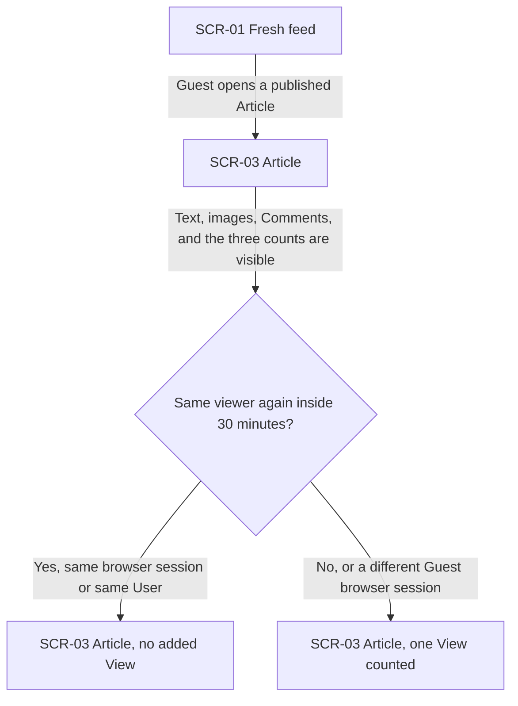
```mermaid
flowchart TD
    fresh["SCR-01 Fresh feed"]
    article["SCR-03 Article"]
    again{"Same viewer again inside 30 minutes?"}
    noView["SCR-03 Article, no added View"]
    oneView["SCR-03 Article, one View counted"]
    fresh -->|"Guest opens a published Article"| article
    article -->|"Text, images, Comments, and the three counts are visible"| again
    again -->|"Yes, same browser session or same User"| noView
    again -->|"No, or a different Guest browser session"| oneView
```

A Guest opens a published Article from the Fresh feed and sees the text, the images, the Comments, and the Like, Comment, and View counts. If that same Guest browser session, or that same User, stays on the Article or opens it again within 30 minutes, no second View is added. A different Guest browser session counts as a different viewer. How many seconds the Article must stay visible before the first View counts stays the open question in spec §8.

### Flow: US-02 — Browse public feeds

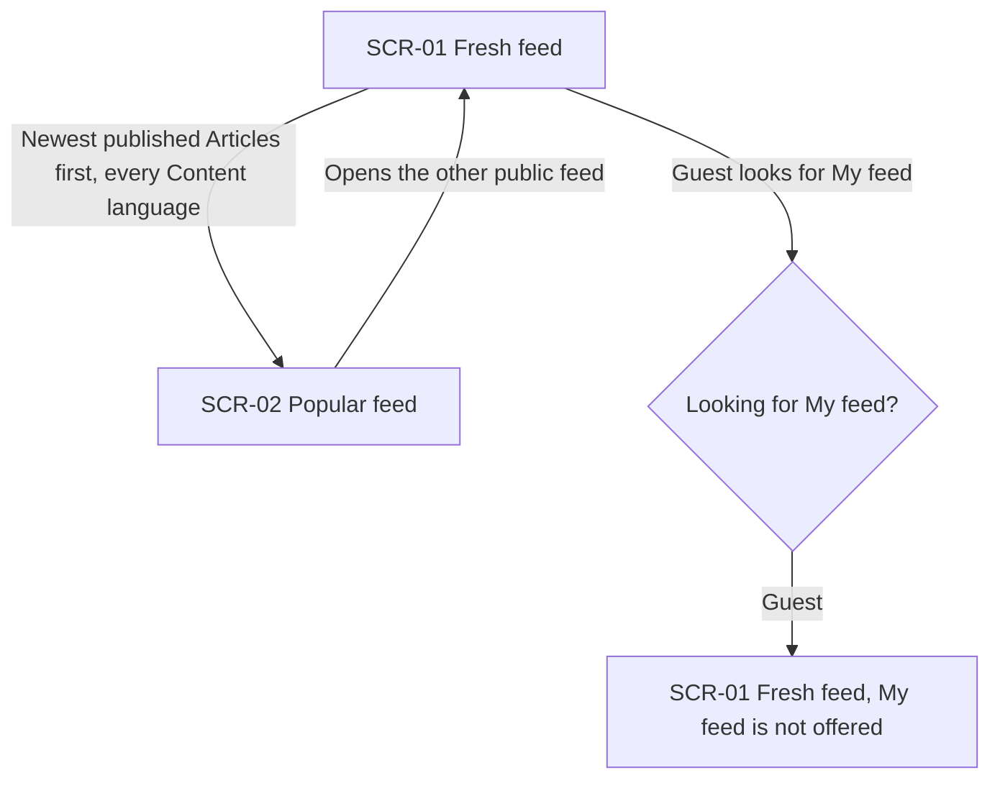
```mermaid
flowchart TD
    fresh["SCR-01 Fresh feed"]
    popular["SCR-02 Popular feed"]
    mine{"Looking for My feed?"}
    hidden["SCR-01 Fresh feed, My feed is not offered"]
    fresh -->|"Newest published Articles first, every Content language"| popular
    popular -->|"Opens the other public feed"| fresh
    fresh -->|"Guest looks for My feed"| mine
    mine -->|"Guest"| hidden
```

A Guest opens the Fresh feed and sees published Articles newest first, in every Content language, and opens the Popular feed and sees them by the current score of Views, Likes, Comments, Bookmarks, and age. My feed is not offered to the Guest.

### Flow: US-03 — Choose theme and language

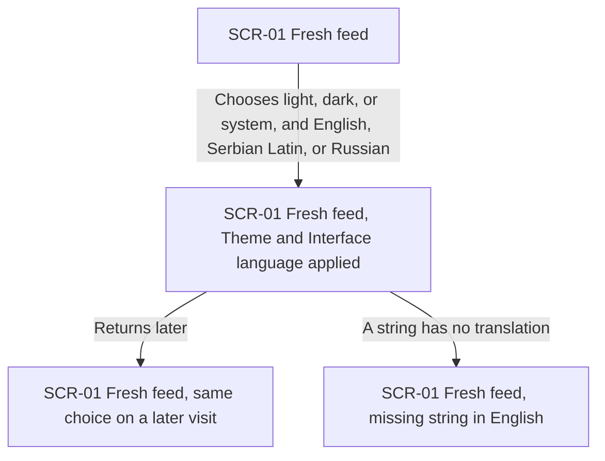
```mermaid
flowchart TD
    fresh["SCR-01 Fresh feed"]
    chosen["SCR-01 Fresh feed, Theme and Interface language applied"]
    later["SCR-01 Fresh feed, same choice on a later visit"]
    fallback["SCR-01 Fresh feed, missing string in English"]
    fresh -->|"Chooses light, dark, or system, and English, Serbian Latin, or Russian"| chosen
    chosen -->|"Returns later"| later
    chosen -->|"A string has no translation"| fallback
```

A Guest on the public site chooses a Theme among light, dark, and system, and an Interface language among English, Serbian Latin, and Russian. The public site uses that choice, and the same choice is still in effect on a later visit. System is the Theme before they choose. A missing translation is shown in English. The same kind of choice on the admin panel is Flow US-16.

### Flow: US-04 — Create a profile

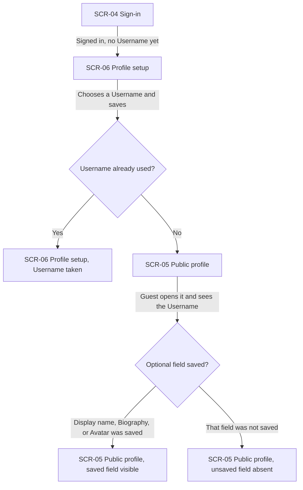
```mermaid
flowchart TD
    signin["SCR-04 Sign-in"]
    setup["SCR-06 Profile setup"]
    taken{"Username already used?"}
    blocked["SCR-06 Profile setup, Username taken"]
    profile["SCR-05 Public profile"]
    fields{"Optional field saved?"}
    shown["SCR-05 Public profile, saved field visible"]
    absent["SCR-05 Public profile, unsaved field absent"]
    signin -->|"Signed in, no Username yet"| setup
    setup -->|"Chooses a Username and saves"| taken
    taken -->|"Yes"| blocked
    taken -->|"No"| profile
    profile -->|"Guest opens it and sees the Username"| fields
    fields -->|"Display name, Biography, or Avatar was saved"| shown
    fields -->|"That field was not saved"| absent
```

A person signs in with no Username yet, chooses a Username nobody else has, and saves. A Guest can open the public profile and see that Username. If the Username is already taken, the save is blocked and the person is told it is taken. After a Username exists, saving a Display name, a Biography, or an Avatar makes that field visible to a Guest. A field that was not saved is absent on the public profile.

### Flow: US-05 — Publish an article

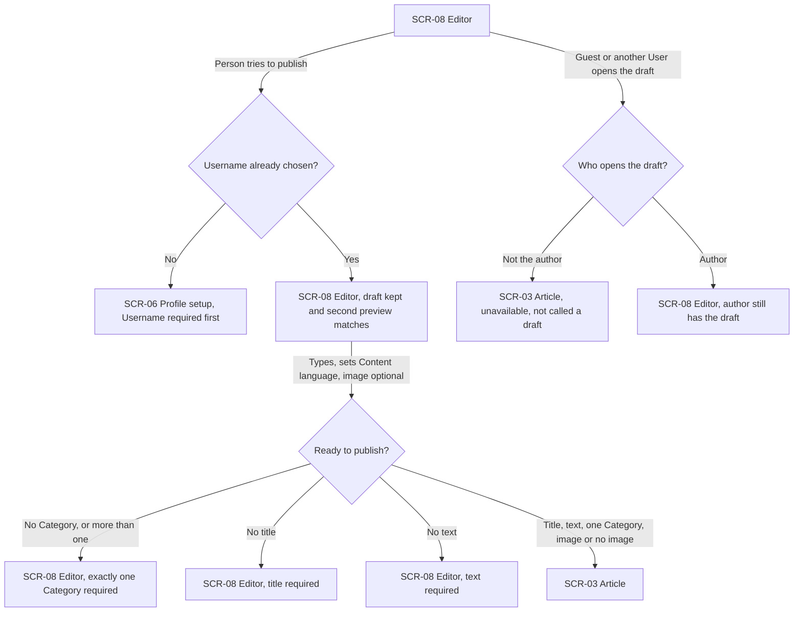
```mermaid
flowchart TD
    editor["SCR-08 Editor"]
    needName{"Username already chosen?"}
    toSetup["SCR-06 Profile setup, Username required first"]
    preview["SCR-08 Editor, draft kept and second preview matches"]
    publish{"Ready to publish?"}
    needCategory["SCR-08 Editor, exactly one Category required"]
    needTitle["SCR-08 Editor, title required"]
    needText["SCR-08 Editor, text required"]
    article["SCR-03 Article"]
    stranger{"Who opens the draft?"}
    unavailable["SCR-03 Article, unavailable, not called a draft"]
    authorDraft["SCR-08 Editor, author still has the draft"]
    editor -->|"Person tries to publish"| needName
    needName -->|"No"| toSetup
    needName -->|"Yes"| preview
    preview -->|"Types, sets Content language, image optional"| publish
    publish -->|"No Category, or more than one"| needCategory
    publish -->|"No title"| needTitle
    publish -->|"No text"| needText
    publish -->|"Title, text, one Category, image or no image"| article
    editor -->|"Guest or another User opens the draft"| stranger
    stranger -->|"Not the author"| unavailable
    stranger -->|"Author"| authorDraft
```

A User who already has a Username types in the editor. The draft is kept while they type, and the second preview shows the same edits. They set the Content language, attach an image or leave it off, choose exactly one Category, and publish. A Guest then sees that text, that image when one was attached, that Category, and that Content language. Publication is blocked when the Category is missing or there is more than one, when the title is missing, or when the text is missing, and the User is told which rule failed. A person with no Username is told a Username is required first and is sent to profile setup. A Guest or another User who opens the draft sees that it is unavailable, sees no text, and is not told it is a draft. The author can still open the draft.

### Flow: US-06 — Revise a published article

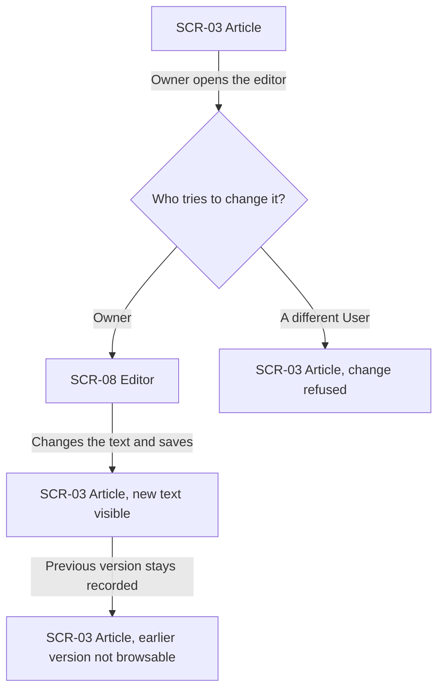
```mermaid
flowchart TD
    article["SCR-03 Article"]
    who{"Who tries to change it?"}
    editor["SCR-08 Editor"]
    saved["SCR-03 Article, new text visible"]
    kept["SCR-03 Article, earlier version not browsable"]
    refused["SCR-03 Article, change refused"]
    article -->|"Owner opens the editor"| who
    who -->|"Owner"| editor
    who -->|"A different User"| refused
    editor -->|"Changes the text and saves"| saved
    saved -->|"Previous version stays recorded"| kept
```

The owner of a published Article changes the text and saves. Readers see the new text. The previous version remains recorded, and neither readers nor the author browse earlier versions in this release. A different User who tries to change it is refused.

### Flow: US-07 — Follow authors and categories

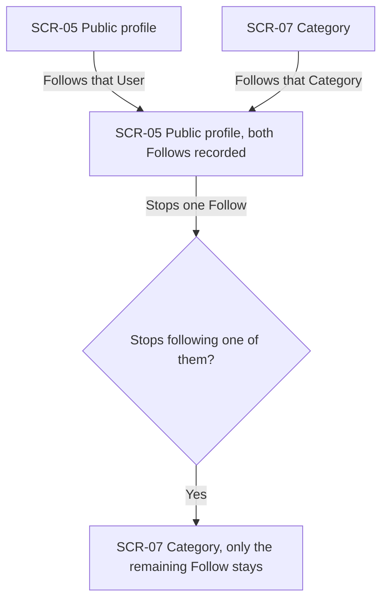
```mermaid
flowchart TD
    profile["SCR-05 Public profile"]
    category["SCR-07 Category"]
    both["SCR-05 Public profile, both Follows recorded"]
    stop{"Stops following one of them?"}
    remain["SCR-07 Category, only the remaining Follow stays"]
    profile -->|"Follows that User"| both
    category -->|"Follows that Category"| both
    both -->|"Stops one Follow"| stop
    stop -->|"Yes"| remain
```

A User follows another User from that User's public profile and follows a Category from the Category screen reached from an Article. Both Follows are recorded. When the User stops following one of them, that Follow is dropped and the other remains.

### Flow: US-08 — Read my feed

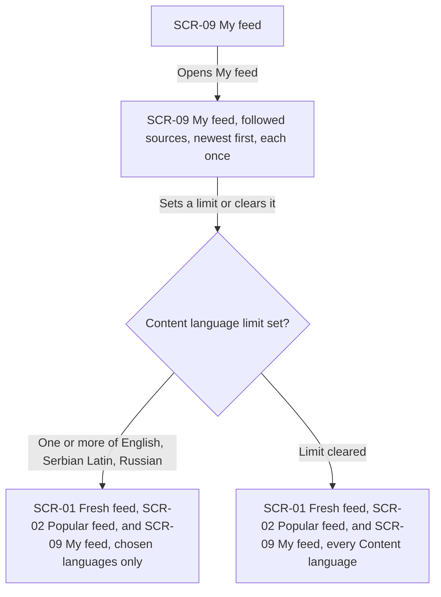
```mermaid
flowchart TD
    mine["SCR-09 My feed"]
    listed["SCR-09 My feed, followed sources, newest first, each once"]
    limit{"Content language limit set?"}
    limited["SCR-01 Fresh feed, SCR-02 Popular feed, and SCR-09 My feed, chosen languages only"]
    cleared["SCR-01 Fresh feed, SCR-02 Popular feed, and SCR-09 My feed, every Content language"]
    mine -->|"Opens My feed"| listed
    listed -->|"Sets a limit or clears it"| limit
    limit -->|"One or more of English, Serbian Latin, Russian"| limited
    limit -->|"Limit cleared"| cleared
```

A User who follows one author and one Category opens My feed and sees every currently published Article from that author and from that Category, newest first, each Article once, and does not see unrelated Articles. Setting a Content language limit to one or more of English, Serbian Latin, and Russian makes the Fresh feed, the Popular feed, and My feed show only those languages. Clearing the limit shows every Content language on all three feeds.

### Flow: US-09 — Like an article

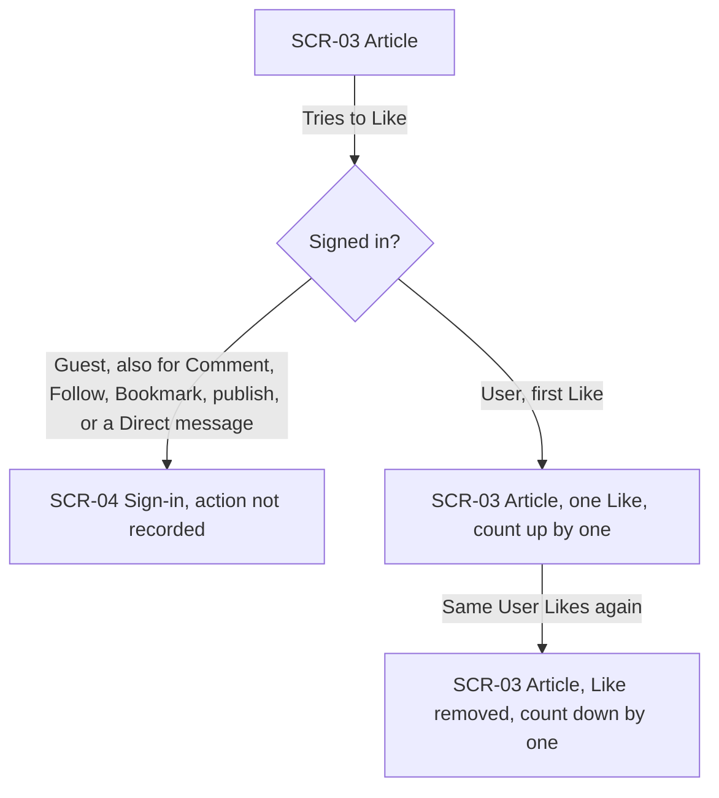
```mermaid
flowchart TD
    article["SCR-03 Article"]
    who{"Signed in?"}
    signin["SCR-04 Sign-in, action not recorded"]
    liked["SCR-03 Article, one Like, count up by one"]
    removed["SCR-03 Article, Like removed, count down by one"]
    article -->|"Tries to Like"| who
    who -->|"Guest, also for Comment, Follow, Bookmark, publish, or a Direct message"| signin
    who -->|"User, first Like"| liked
    liked -->|"Same User Likes again"| removed
```

A User viewing a published Article Likes it once. One Like is recorded and the count rises by one. Liking again removes that Like and the count falls by one. A Guest who tries to Like, Comment, Follow, Bookmark, publish, or send a Direct message does not get that action recorded and is asked to sign in.

### Flow: US-10 — Comment on an article

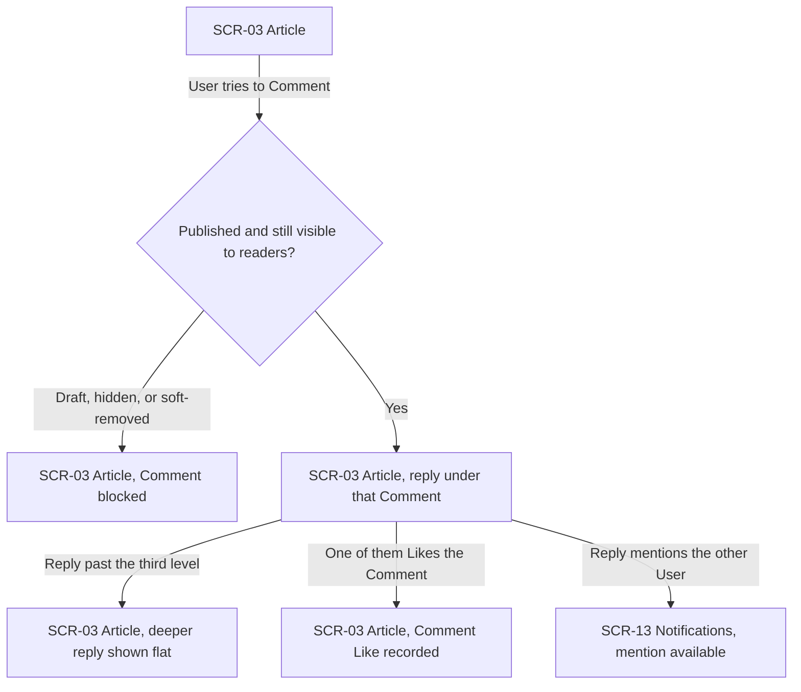
```mermaid
flowchart TD
    article["SCR-03 Article"]
    visible{"Published and still visible to readers?"}
    blocked["SCR-03 Article, Comment blocked"]
    thread["SCR-03 Article, reply under that Comment"]
    flat["SCR-03 Article, deeper reply shown flat"]
    liked["SCR-03 Article, Comment Like recorded"]
    mention["SCR-13 Notifications, mention available"]
    article -->|"User tries to Comment"| visible
    visible -->|"Draft, hidden, or soft-removed"| blocked
    visible -->|"Yes"| thread
    thread -->|"Reply past the third level"| flat
    thread -->|"One of them Likes the Comment"| liked
    thread -->|"Reply mentions the other User"| mention
```

On a published Article, one User Comments, another User replies and mentions the first, and one of them Likes the Comment. The reply stays under that Comment. A reply deeper than the third level is kept and shown flat. The mention is available to the mentioned User. On a draft, a hidden Article, or a soft-removed Article, the Comment is blocked and the User is told that Comments are only allowed on a published Article that readers can still see.

### Flow: US-11 — Bookmark an article

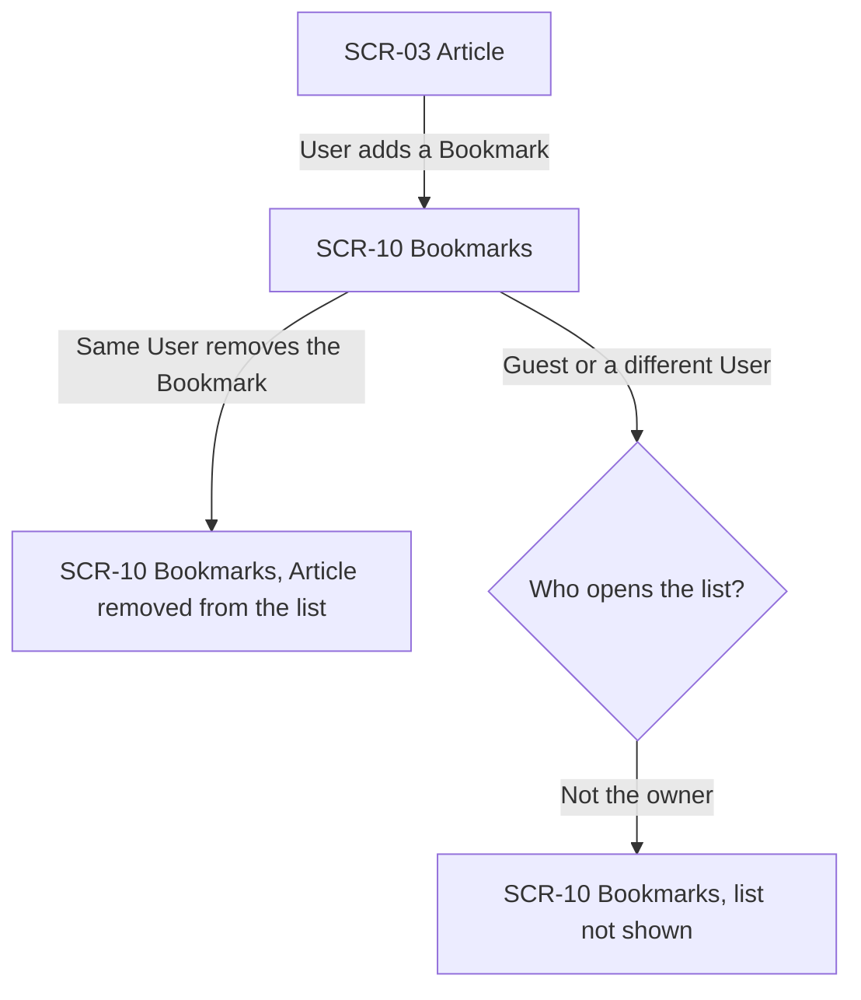
```mermaid
flowchart TD
    article["SCR-03 Article"]
    list["SCR-10 Bookmarks"]
    gone["SCR-10 Bookmarks, Article removed from the list"]
    who{"Who opens the list?"}
    refused["SCR-10 Bookmarks, list not shown"]
    article -->|"User adds a Bookmark"| list
    list -->|"Same User removes the Bookmark"| gone
    list -->|"Guest or a different User"| who
    who -->|"Not the owner"| refused
```

A User Bookmarks a published Article and later sees it on their private Bookmark list. Removing the Bookmark takes it off that list. A Guest or a different User who tries to open that list is not shown it.

### Flow: US-12 — Send a direct message

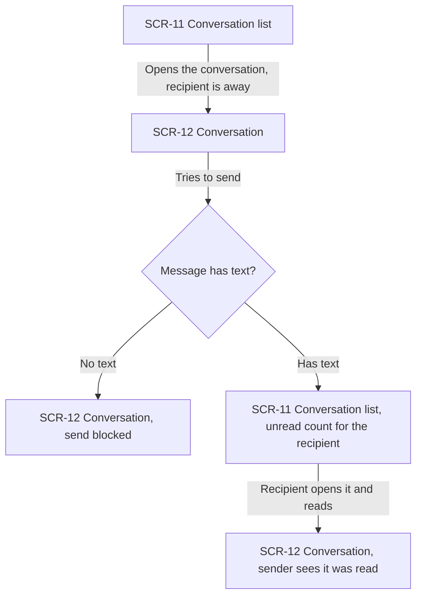
```mermaid
flowchart TD
    list["SCR-11 Conversation list"]
    talk["SCR-12 Conversation"]
    empty{"Message has text?"}
    held["SCR-12 Conversation, send blocked"]
    waiting["SCR-11 Conversation list, unread count for the recipient"]
    read["SCR-12 Conversation, sender sees it was read"]
    list -->|"Opens the conversation, recipient is away"| talk
    talk -->|"Tries to send"| empty
    empty -->|"No text"| held
    empty -->|"Has text"| waiting
    waiting -->|"Recipient opens it and reads"| read
```

A User sends a Direct message to one other User who is not currently present. The message is kept. The recipient later sees it with an unread count, and after the recipient reads it the sender sees that it was read. A message with no text is blocked, and the User is told the message must contain text.

### Flow: US-13 — Report content

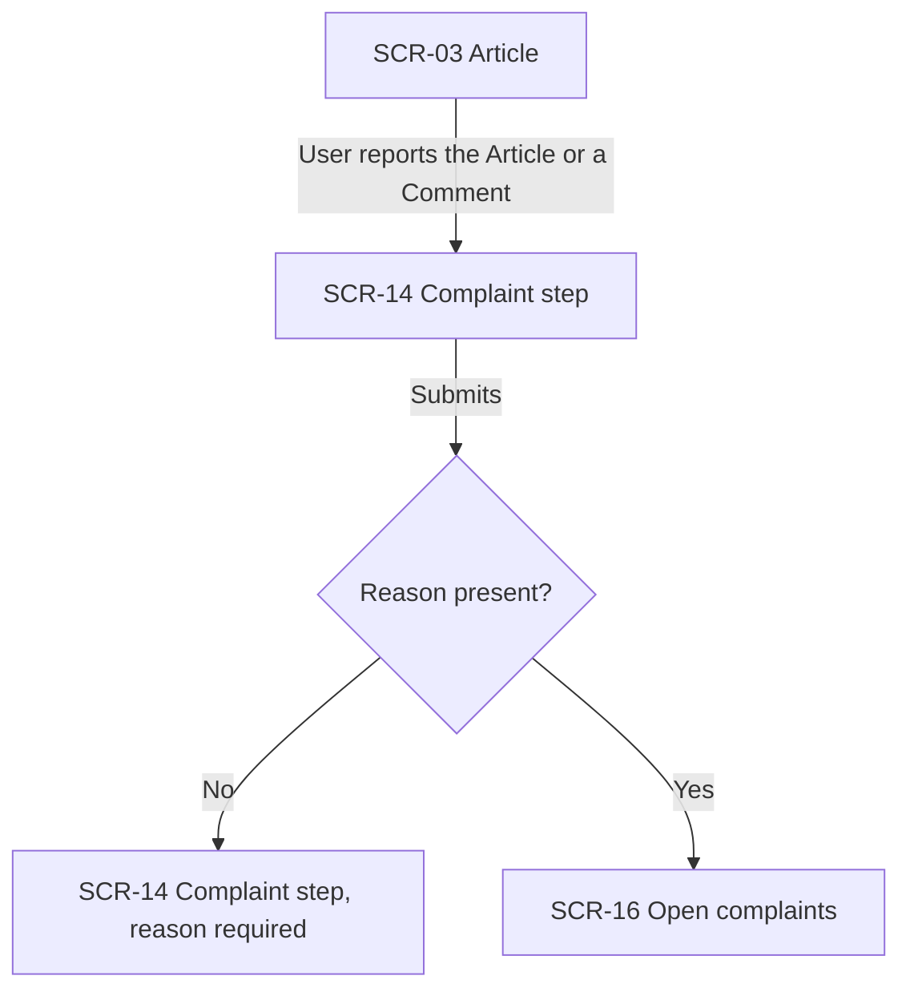
```mermaid
flowchart TD
    article["SCR-03 Article"]
    step["SCR-14 Complaint step"]
    reason{"Reason present?"}
    held["SCR-14 Complaint step, reason required"]
    queue["SCR-16 Open complaints"]
    article -->|"User reports the Article or a Comment"| step
    step -->|"Submits"| reason
    reason -->|"No"| held
    reason -->|"Yes"| queue
```

A User files a Complaint about a published Article or a Comment and gives a reason. A Moderator or an Administrator can see that Complaint in the admin panel. Submitting with no reason is blocked, and the User is told a reason must be present.

### Flow: US-14 — Watch activity live

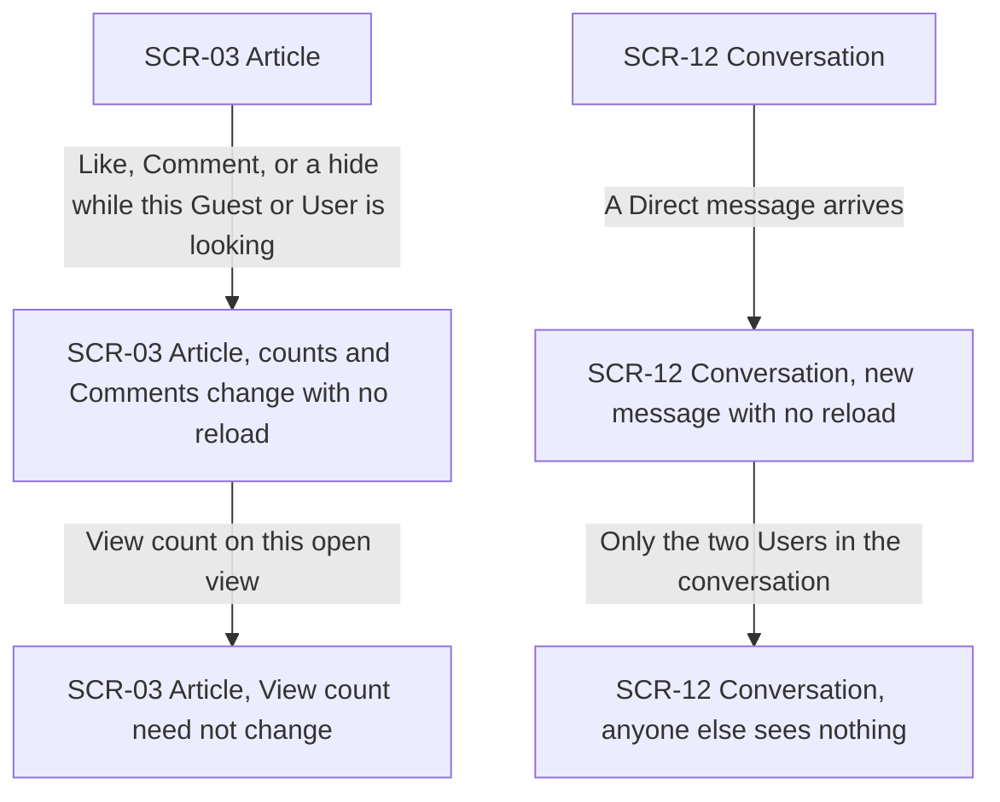
```mermaid
flowchart TD
    article["SCR-03 Article"]
    talk["SCR-12 Conversation"]
    updated["SCR-03 Article, counts and Comments change with no reload"]
    viewHeld["SCR-03 Article, View count need not change"]
    arrived["SCR-12 Conversation, new message with no reload"]
    outsider["SCR-12 Conversation, anyone else sees nothing"]
    article -->|"Like, Comment, or a hide while this Guest or User is looking"| updated
    updated -->|"View count on this open view"| viewHeld
    talk -->|"A Direct message arrives"| arrived
    arrived -->|"Only the two Users in the conversation"| outsider
```

A Guest or a User who already has a published Article open sees a new Like count, a new Comment count, a new or hidden Comment, or a hide of that Article or Comment without reloading. The View count does not have to change on that open view. A User in a Direct message conversation sees a new message without reloading. Only the two Users in that conversation see it.

### Flow: US-15 — Receive a notice

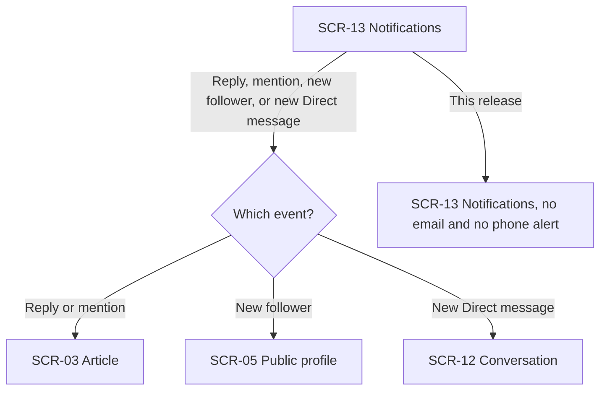
```mermaid
flowchart TD
    notes["SCR-13 Notifications"]
    kind{"Which event?"}
    article["SCR-03 Article"]
    profile["SCR-05 Public profile"]
    talk["SCR-12 Conversation"]
    quiet["SCR-13 Notifications, no email and no phone alert"]
    notes -->|"Reply, mention, new follower, or new Direct message"| kind
    kind -->|"Reply or mention"| article
    kind -->|"New follower"| profile
    kind -->|"New Direct message"| talk
    notes -->|"This release"| quiet
```

When someone replies to a User's Comment, mentions them, follows them, or sends them a Direct message, that User gets an in-product Notification and does not get an email or a phone alert. Opening the notice goes to the Article, the follower's public profile, or the conversation, matching the event.

### Flow: US-16 — Hide harmful content

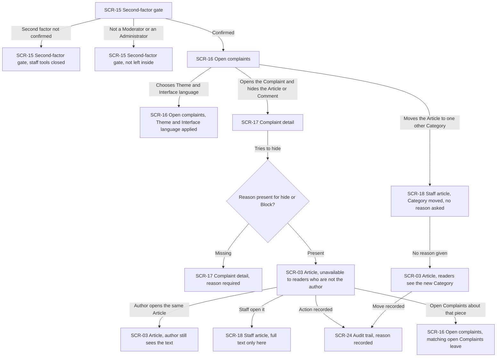
```mermaid
flowchart TD
    gate["SCR-15 Second-factor gate"]
    closed["SCR-15 Second-factor gate, staff tools closed"]
    outsider["SCR-15 Second-factor gate, not left inside"]
    queue["SCR-16 Open complaints"]
    theme["SCR-16 Open complaints, Theme and Interface language applied"]
    detail["SCR-17 Complaint detail"]
    reason{"Reason present for hide or Block?"}
    needReason["SCR-17 Complaint detail, reason required"]
    readers["SCR-03 Article, unavailable to readers who are not the author"]
    author["SCR-03 Article, author still sees the text"]
    staff["SCR-18 Staff article, full text only here"]
    trail["SCR-24 Audit trail, reason recorded"]
    cleared["SCR-16 Open complaints, matching open Complaints leave"]
    move["SCR-18 Staff article, Category moved, no reason asked"]
    seen["SCR-03 Article, readers see the new Category"]
    gate -->|"Second factor not confirmed"| closed
    gate -->|"Not a Moderator or an Administrator"| outsider
    gate -->|"Confirmed"| queue
    queue -->|"Chooses Theme and Interface language"| theme
    queue -->|"Opens the Complaint and hides the Article or Comment"| detail
    detail -->|"Tries to hide"| reason
    reason -->|"Missing"| needReason
    reason -->|"Present"| readers
    readers -->|"Author opens the same Article"| author
    readers -->|"Staff open it"| staff
    readers -->|"Action recorded"| trail
    readers -->|"Open Complaints about that piece"| cleared
    queue -->|"Moves the Article to one other Category"| move
    move -->|"No reason given"| seen
    seen -->|"Move recorded"| trail
```

A Moderator who has not confirmed a second factor cannot hide, Block, change a Category, assign a role, dismiss a Complaint, or soft-remove. A person who is not a Moderator or an Administrator is refused when they try to hide a piece or open the admin panel, and they are not left inside it. After the gate, the Moderator hides an Article or a Comment from a Complaint and gives a reason. A Guest or a User who is not the author no longer sees the text or the Comments and sees that the piece is unavailable, without being told that staff hid it. The author still sees the text and sees that readers cannot. Staff see the full text only on the staff Article. The action is on the audit trail with that reason, and each open Complaint about that Article or Comment leaves the open list. Hiding or Blocking with no reason is blocked. Moving the Article to one other Category needs no reason. Readers see the new Category, and the move is on the audit trail. On the admin panel the Moderator or Administrator chooses a Theme and an Interface language, with English as the fallback for a missing translation.

### Flow: US-17 — Block an account

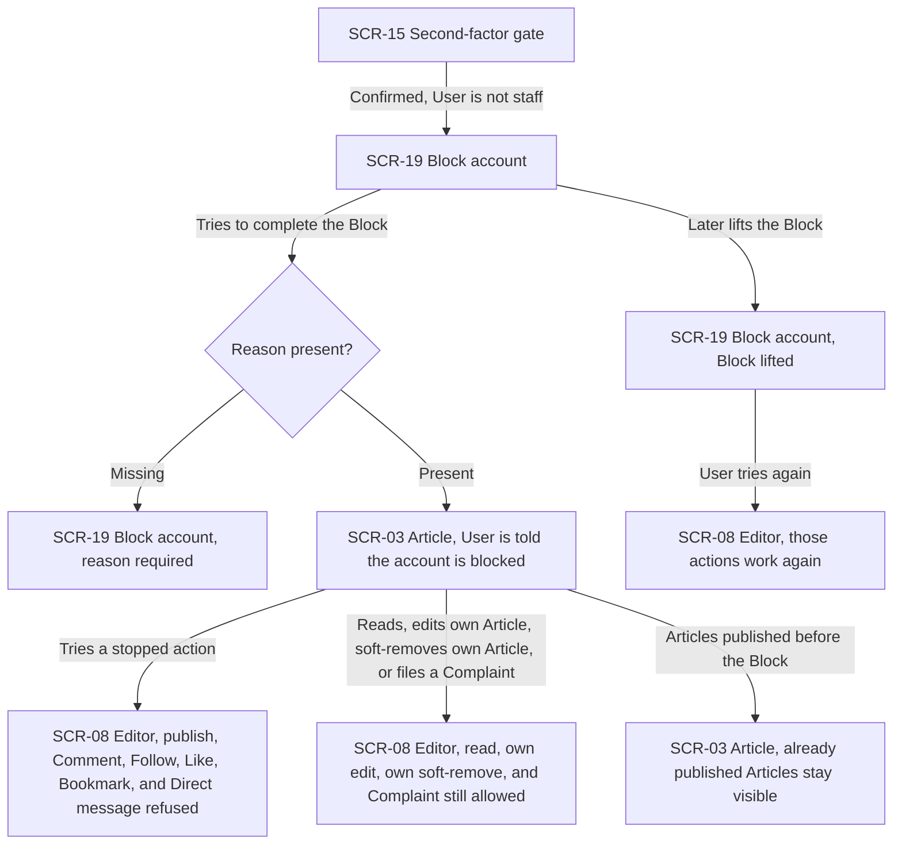
```mermaid
flowchart TD
    gate["SCR-15 Second-factor gate"]
    block["SCR-19 Block account"]
    reason{"Reason present?"}
    needReason["SCR-19 Block account, reason required"]
    told["SCR-03 Article, User is told the account is blocked"]
    refused["SCR-08 Editor, publish, Comment, Follow, Like, Bookmark, and Direct message refused"]
    allowed["SCR-08 Editor, read, own edit, own soft-remove, and Complaint still allowed"]
    visible["SCR-03 Article, already published Articles stay visible"]
    lifted["SCR-19 Block account, Block lifted"]
    restored["SCR-08 Editor, those actions work again"]
    gate -->|"Confirmed, User is not staff"| block
    block -->|"Tries to complete the Block"| reason
    reason -->|"Missing"| needReason
    reason -->|"Present"| told
    told -->|"Tries a stopped action"| refused
    told -->|"Reads, edits own Article, soft-removes own Article, or files a Complaint"| allowed
    told -->|"Articles published before the Block"| visible
    block -->|"Later lifts the Block"| lifted
    lifted -->|"User tries again"| restored
```

A Moderator Blocks a User who is not staff and gives a reason. While the Block lasts, that User is told the account is blocked and cannot publish, Comment, Follow, Like, Bookmark, or send a Direct message. The User can still read, edit their own Article, soft-remove their own Article, and file a Complaint. Articles that were already published stay visible, and new publishing is refused. A Block with no reason is not completed. After the Moderator lifts the Block, publish, Comment, Follow, Like, Bookmark, and Direct messages work again.

### Flow: US-18 — Run the catalog and roles

```mermaid
flowchart TD
    gate["SCR-15 Second-factor gate"]
    first["SCR-15 Second-factor gate, first Administrator is not created here"]
    closed["SCR-15 Second-factor gate, staff tools closed"]
    tools{"Which staff action?"}
    modCat["SCR-20 Categories, Moderator refused"]
    modRole["SCR-21 Roles, Moderator refused"]
    modWeights["SCR-22 Popular weights, Moderator refused"]
    modStats["SCR-23 Statistics, no figures for a Moderator"]
    cats["SCR-20 Categories, three names available"]
    roleReason{"Reason present, and one Administrator would remain?"}
    roleHeld["SCR-21 Roles, reason required"]
    lastHeld["SCR-21 Roles, one Administrator must remain"]
    roles["SCR-21 Roles, person holds exactly one role"]
    weights["SCR-22 Popular weights"]
    popular["SCR-02 Popular feed, new weights in use"]
    removeReason{"Reason present for staff soft-remove?"}
    removeHeld["SCR-18 Staff article, reason required"]
    removed["SCR-18 Staff article, readers no longer see it, record remains"]
    hide["SCR-17 Complaint detail, piece hidden with a reason"]
    blockedUser["SCR-19 Block account, User cannot publish or participate"]
    dismissReason{"Reason present for dismissal?"}
    dismissHeld["SCR-17 Complaint detail, Complaint stays open"]
    dismissed["SCR-17 Complaint detail, piece stays visible"]
    stats["SCR-23 Statistics, six figures"]
    trail["SCR-24 Audit trail, reason recorded"]
    gate -->|"No Administrator yet, person tries to grant themselves"| first
    gate -->|"Second factor not confirmed"| closed
    gate -->|"Second factor confirmed"| tools
    tools -->|"Moderator tries to create a Category"| modCat
    tools -->|"Moderator tries to assign a role"| modRole
    tools -->|"Moderator tries to change weights"| modWeights
    tools -->|"Moderator opens statistics"| modStats
    tools -->|"Administrator creates a Category"| cats
    tools -->|"Administrator assigns or changes a role"| roleReason
    roleReason -->|"No reason"| roleHeld
    roleReason -->|"Would remove the only Administrator"| lastHeld
    roleReason -->|"Reason present, another Administrator remains"| roles
    tools -->|"Administrator changes Popular weights"| weights
    weights -->|"Saved"| popular
    tools -->|"Administrator soft-removes an Article"| removeReason
    removeReason -->|"No reason"| removeHeld
    removeReason -->|"Reason present"| removed
    removed -->|"Recorded"| trail
    tools -->|"Administrator hides the piece"| hide
    tools -->|"Administrator Blocks the author with a reason"| blockedUser
    hide -->|"Recorded"| trail
    blockedUser -->|"Recorded"| trail
    tools -->|"Moderator or Administrator dismisses the Complaint"| dismissReason
    dismissReason -->|"No reason"| dismissHeld
    dismissReason -->|"Reason present"| dismissed
    dismissed -->|"Leaves the open list and is recorded"| trail
    tools -->|"Administrator opens platform statistics"| stats
```

A missing second factor leaves staff tools closed. An Administrator whose second factor is confirmed creates a Category with English, Serbian Latin, and Russian names, assigns the Moderator role to a User, and changes the Popular feed weights. The Category is available for new Articles in all three names, that User can act as a Moderator, and the Popular feed uses the new weights. A Moderator who tries to create a Category, assign a role, or change weights is refused, and a Moderator who opens statistics sees no platform statistics. A role change or a staff soft-remove with no reason is blocked. Setting a person to Moderator or to Administrator, or setting a Moderator or another Administrator back to User, leaves that person with exactly one role. The only Administrator cannot demote themselves. If no Administrator exists yet, the panel does not create that first one. A staff soft-remove with a reason takes the Article out of readers' sight, keeps the record, and writes the audit trail. Hiding a piece or Blocking its author, with a reason, hides the piece and stops the blocked User from publishing, Commenting, Following, Liking, Bookmarking, or sending a Direct message, and both are written on the trail. Dismissing a Complaint with a reason leaves the piece visible, takes the Complaint off the open list, and writes the trail. Dismissing with no reason is blocked and the Complaint stays open. Platform statistics show distinct Users signed in today, distinct Users signed in over the last 30 days, new Users, published Articles, Comments written, Complaints still open, and whether the public site is answering.

### Flow: US-19 — Read the audit trail

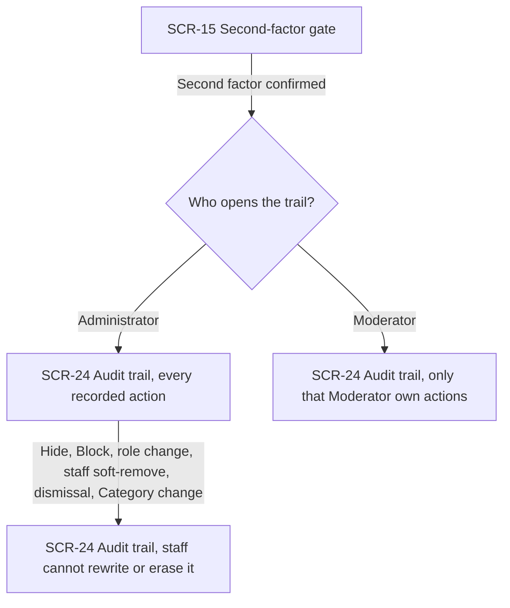
```mermaid
flowchart TD
    gate["SCR-15 Second-factor gate"]
    who{"Who opens the trail?"}
    all["SCR-24 Audit trail, every recorded action"]
    own["SCR-24 Audit trail, only that Moderator own actions"]
    locked["SCR-24 Audit trail, staff cannot rewrite or erase it"]
    gate -->|"Second factor confirmed"| who
    who -->|"Administrator"| all
    who -->|"Moderator"| own
    all -->|"Hide, Block, role change, staff soft-remove, dismissal, Category change"| locked
```

An Administrator opens the audit trail and sees every hide, Block, role change, staff soft-remove, and Complaint dismissal, each with its reason, and every Category change. Staff cannot rewrite or erase the trail. A Moderator who opens the trail sees only their own actions.

### Flow: US-20 — Withdraw an article

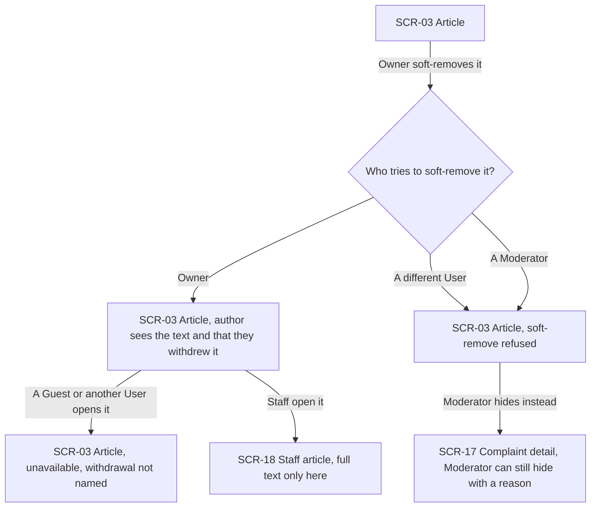
```mermaid
flowchart TD
    article["SCR-03 Article"]
    who{"Who tries to soft-remove it?"}
    authorView["SCR-03 Article, author sees the text and that they withdrew it"]
    readers["SCR-03 Article, unavailable, withdrawal not named"]
    staff["SCR-18 Staff article, full text only here"]
    refused["SCR-03 Article, soft-remove refused"]
    hide["SCR-17 Complaint detail, Moderator can still hide with a reason"]
    article -->|"Owner soft-removes it"| who
    who -->|"Owner"| authorView
    authorView -->|"A Guest or another User opens it"| readers
    authorView -->|"Staff open it"| staff
    who -->|"A different User"| refused
    who -->|"A Moderator"| refused
    refused -->|"Moderator hides instead"| hide
```

The User who owns a published Article soft-removes it. A Guest or a User who is not the author no longer sees it in the feeds or on its page, sees that it is unavailable, with no text and no Comments, and is not told that the author withdrew it. The author sees the text and sees that they withdrew it. The record remains, and the Article is not treated as hidden by a Moderator. Staff see the full text only in the admin panel. A different User, or a Moderator, who tries to soft-remove it is refused. The Moderator can still hide it with a reason.

## AC coverage

Every §5 acceptance criterion touches a human-facing screen. None are N/A.

| AC | Shown by | Notes |
|---|---|---|
| AC-01 | Flow US-01 → SCR-03 shows text, images, Comments, and the three counts | Happy path |
| AC-02 | Flow US-01 → same viewer inside 30 minutes adds no View; a different Guest browser session does | Domain invariant |
| AC-03 | Flow US-02 → Fresh newest first, Popular by score, every Content language, My feed not offered | Happy path |
| AC-04 | Flow US-03 → Theme and Interface language apply and remain; missing string falls back to English | Happy path |
| AC-05 | Flow US-04 → unique Username saved; Guest sees it on SCR-05 | Happy path |
| AC-06 | Flow US-04 → taken Username stays on SCR-06 and the save is blocked | Error |
| AC-07 | Flow US-05 → draft kept, second preview matches, Guest sees text, image, Category, and Content language | Happy path |
| AC-08 | Flow US-05 → no Category or more than one blocks publish | Domain invariant |
| AC-09 | Flow US-05 → missing title blocks publish | Error |
| AC-10 | Flow US-05 → no Username sends the person to SCR-06 | Authorization |
| AC-11 | Flow US-06 → readers see the new text; the earlier version is not browsable | Happy path |
| AC-12 | Flow US-06 → a different User is refused | Authorization |
| AC-13 | Flow US-07 → both Follows recorded, then the stopped one is dropped | Happy path |
| AC-14 | Flow US-08 → followed sources only, newest first, each Article once | Cross-context |
| AC-15 | Flow US-09 → first Like raises the count, the next Like lowers it | Happy path |
| AC-16 | Flow US-09 → Guest Like, Comment, Follow, Bookmark, publish, or Direct message is not recorded and sign-in is required | Authorization |
| AC-17 | Flow US-10 → reply stays under the Comment, a deeper reply is shown flat, the mention is available | Happy path |
| AC-18 | Flow US-10 → draft, hidden, or soft-removed blocks the Comment | Cross-context |
| AC-19 | Flow US-11 → Bookmark appears on SCR-10, then disappears when removed | Happy path |
| AC-20 | Flow US-11 → Guest or another User is not shown the list | Authorization |
| AC-21 | Flow US-12 → message kept, unread count, sender sees the read mark | Happy path |
| AC-22 | Flow US-12 → empty message stays on SCR-12 and is blocked | Error |
| AC-23 | Flow US-13 → a reason puts the Complaint on SCR-16 | Happy path |
| AC-24 | Flow US-13 → no reason stays on SCR-14 and is blocked | Error |
| AC-25 | Flow US-14 → open Article and open conversation change without a reload; View count need not; outsiders see no Direct message | Happy path |
| AC-26 | Flow US-15 → in-product notice only; opening it goes to the Article, profile, or conversation | Happy path |
| AC-27 | Flow US-16 → readers see unavailable, the author still sees the text, staff see SCR-18, the trail records the reason, open Complaints leave SCR-16 | Happy path |
| AC-28 | Flow US-16 → a non-staff person is refused and is not left inside the admin panel | Authorization |
| AC-29 | Flow US-16 → hide or Block with no reason is blocked | Domain invariant |
| AC-30 | Flow US-16 → missing second factor closes every listed staff tool | Authorization |
| AC-31 | Flow US-17 → blocked User is told, stopped actions fail, read and own-Article actions remain, lift restores the stopped actions | Happy path |
| AC-32 | Flow US-17 → already published Articles stay on SCR-03; new publish is refused | Cross-context |
| AC-33 | Flow US-18 → three Category names, Moderator role, Popular weights reach SCR-02 | Happy path |
| AC-34 | Flow US-18 → Moderator is refused on SCR-20, SCR-21, and SCR-22 | Authorization |
| AC-35 | Flow US-18 → role change or staff soft-remove with no reason is blocked | Domain invariant |
| AC-36 | Flow US-19 → Administrator sees every listed action with its reason, including Category changes, and the trail cannot be rewritten | Happy path |
| AC-37 | Flow US-19 → Moderator sees only their own actions | Authorization |
| AC-38 | Flow US-20 → readers see unavailable and are not told the author withdrew it; the author sees the text; staff see SCR-18; it is not a Moderator hide | Happy path |
| AC-39 | Flow US-18 → staff soft-remove with a reason hides the Article from readers, keeps the record, and writes SCR-24 | Happy path |
| AC-40 | Flow US-18 → Administrator hide or Block with a reason hides the piece, stops the User, and writes SCR-24 | Happy path |
| AC-41 | Flow US-20 → another User or a Moderator is refused; the Moderator can still hide from SCR-17 | Authorization |
| AC-42 | Flow US-04 → a saved Display name, Biography, or Avatar is visible; an unsaved field is absent | Happy path |
| AC-43 | Flow US-05 → publish with no image still reaches SCR-03 with text and no image | Domain invariant |
| AC-44 | Flow US-05 → missing text blocks publish | Error |
| AC-45 | Flow US-05 → Guest or another User sees the draft as unavailable and is not told it is a draft; the author still opens SCR-08 | Authorization |
| AC-46 | Flow US-08 → a limit filters SCR-01, SCR-02, and SCR-09; clearing it shows every Content language | Cross-context |
| AC-47 | Flow US-16 → Category move on SCR-18 needs no reason, readers see it on SCR-03, and SCR-24 records the move | Happy path |
| AC-48 | Flow US-18 → dismissal with a reason leaves the piece visible, clears the open Complaint, and writes SCR-24 | Happy path |
| AC-49 | Flow US-18 → dismissal with no reason stays on SCR-17 and the Complaint stays open | Error |
| AC-50 | Flow US-18 → the person holds exactly one of User, Moderator, or Administrator | Happy path |
| AC-51 | Flow US-18 → the only Administrator cannot demote themselves | Domain invariant |
| AC-52 | Flow US-18 → the panel does not create the first Administrator | Domain invariant |
| AC-53 | Flow US-18 → SCR-23 shows the six figures and whether the public site is answering | Happy path |
| AC-54 | Flow US-18 → a Moderator on SCR-23 sees no platform statistics | Authorization |
| AC-55 | Flow US-16 → admin Theme and Interface language apply, with English fallback | Happy path |
